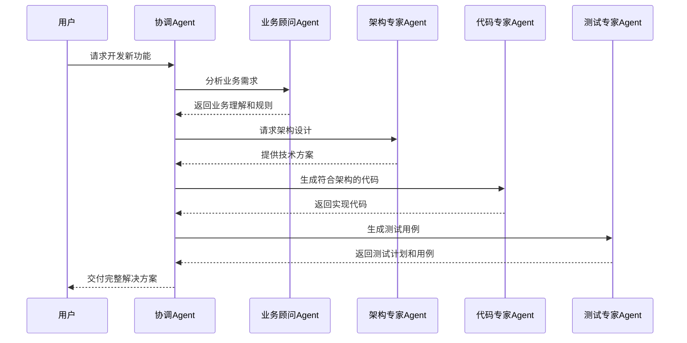
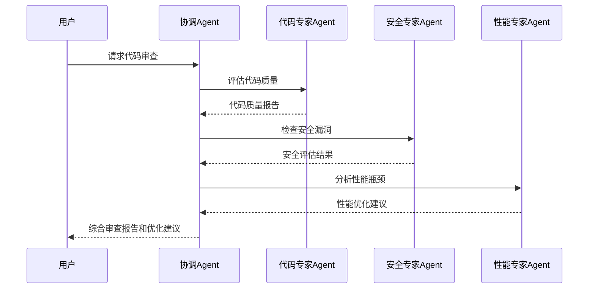

# 业务知识库与AI生态整合

## 1. 知识生态整合战略

### 1.1 整合愿景

将公司业务知识库与AI编程工具生态无缝连接，打造智能、自适应的企业级知识赋能系统，实现：

- **知识智能化**：从静态文档库到动态智能知识服务
- **业务上下文理解**：AI工具能够理解公司特有的业务语境和技术栈
- **个性化辅助**：基于开发者角色、项目情境提供定制化AI编程支持
- **知识传承自动化**：降低知识传递门槛，加速新员工融入
- **持续进化**：业务知识与AI能力协同成长的生态系统

### 1.2 核心概念定义

- **业务知识库**：公司积累的业务领域知识、技术架构、代码规范、最佳实践等专有知识的集合
- **Agent**：具备特定能力和专业领域知识的AI代理，能够执行特定任务并与其他Agent协作
- **MCP（Multi-agent Collaboration Protocol）**：多Agent协作协议，支持复杂业务场景下的智能任务编排和处理
- **知识增强编程**：通过融合企业知识的AI编程体验，超越通用AI编程工具的辅助效果

## 2. 业务知识库梳理与准备

### 2.1 知识资源识别与分类

| 知识类型 | 资源形式 | 价值评估 | 优先级 |
|---------|---------|---------|-------|
| **业务领域知识** | 业务文档、流程图、术语表 | 高（业务理解基础） | 最高 |
| **技术架构** | 架构文档、设计方案、技术选型说明 | 高（技术决策依据） | 最高 |
| **代码资产** | 代码库、组件库、API文档 | 高（直接可用资源） | 高 |
| **规范与标准** | 编码规范、设计规范、安全标准 | 高（合规性保障） | 高 |
| **解决方案库** | 问题解决记录、技术难点攻克案例 | 中（经验复用） | 中 |
| **历史项目资料** | 项目文档、评审记录、复盘报告 | 中（经验教训） | 中 |
| **培训材料** | 内部培训PPT、教程视频、指南 | 中（知识传授） | 中 |
| **常见问题** | FAQ、故障处理手册、知识库 | 中（快速解决问题） | 中 |

### 2.2 知识资源加工流程

1. **知识审核**：评估现有文档质量、完整性和时效性
2. **知识结构化**：将非结构化内容转化为结构化数据
3. **知识标注**：添加元数据、关联关系和上下文信息
4. **知识分块**：将大型文档分解为适合AI处理的知识块
5. **知识更新机制**：建立定期更新和检查机制

### 2.3 知识图谱构建

- **实体抽取**：识别业务领域核心概念和实体
- **关系构建**：建立实体间的关系网络
- **属性补充**：为实体和关系添加属性信息
- **图谱可视化**：提供直观的知识体系呈现
- **查询接口**：支持复杂语义查询的接口设计

## 3. Agent架构设计

### 3.1 专业Agent角色定义

| Agent类型 | 核心能力 | 知识领域 | 主要职责 |
|----------|---------|---------|---------|
| **业务顾问Agent** | 业务理解、需求分析 | 业务规则、流程、术语 | 需求理解、业务逻辑验证 |
| **架构专家Agent** | 系统设计、架构评估 | 企业架构、技术标准 | 架构建议、技术选型 |
| **代码专家Agent** | 代码生成、重构 | 代码库、最佳实践 | 高质量代码生成、代码审查 |
| **测试专家Agent** | 测试设计、质量分析 | 测试用例、质量标准 | 测试生成、缺陷预测 |
| **安全专家Agent** | 安全审查、漏洞检测 | 安全策略、合规要求 | 安全检查、修复建议 |
| **集成专家Agent** | 系统集成、API应用 | API文档、集成模式 | 集成代码生成、兼容性检查 |
| **文档专家Agent** | 文档生成、规范检查 | 文档模板、标准 | 代码文档化、知识沉淀 |
| **协调Agent** | 任务管理、冲突解决 | 开发流程、协作规则 | 编排其他Agent、结果整合 |

### 3.2 Agent能力矩阵

```
┌─────────────────┬───────────────┬───────────────┬───────────────┬───────────────┐
│                 │ 知识库访问能力  │ 推理分析能力   │ 代码处理能力   │ 协作能力      │
├─────────────────┼───────────────┼───────────────┼───────────────┼───────────────┤
│ 业务顾问Agent   │ ●●●●●         │ ●●●●          │ ●●            │ ●●●           │
│ 架构专家Agent   │ ●●●●          │ ●●●●●         │ ●●●           │ ●●●●          │
│ 代码专家Agent   │ ●●●           │ ●●●           │ ●●●●●         │ ●●            │
│ 测试专家Agent   │ ●●●           │ ●●●●          │ ●●●●          │ ●●            │
│ 安全专家Agent   │ ●●●●          │ ●●●●          │ ●●●           │ ●●            │
│ 集成专家Agent   │ ●●●●          │ ●●●           │ ●●●●          │ ●●●●          │
│ 文档专家Agent   │ ●●●●          │ ●●            │ ●●            │ ●●●           │
│ 协调Agent       │ ●●●           │ ●●●           │ ●●            │ ●●●●●         │
└─────────────────┴───────────────┴───────────────┴───────────────┴───────────────┘
```

### 3.3 Agent实现方式

#### 3.3.1 基础Agent框架

- **核心组件**：
  - 知识检索器：高效访问和查询企业知识库
  - 上下文管理器：维护多轮交互的上下文信息
  - 推理引擎：基于知识和查询执行推理
  - 行动执行器：执行具体行动（代码生成、文档查询等）
  - 反馈学习器：从用户反馈中持续优化

- **技术选型**：
  - 基础模型：企业级大语言模型（如GPT-4/Claude系列或国产通义/文心等）
  - 向量数据库：存储企业知识的嵌入表示
  - RAG技术：检索增强生成实现知识库增强
  - 微调技术：针对特定领域的模型适应性优化

#### 3.3.2 Agent功能实现层次

1. **基础增强层**：知识库检索增强的单一Agent
2. **专业分工层**：基于不同领域知识的专业Agent
3. **协作决策层**：基于MCP的多Agent协作系统

## 4. MCP多Agent协作框架

### 4.1 协作模型设计

#### 4.1.1 协作模式

- **串行协作**：Agent按预定顺序依次工作（例如：需求分析→架构设计→代码实现→测试）
- **并行协作**：多Agent同时处理不同方面（例如：同时进行安全检查和性能优化）
- **专家咨询**：主Agent在必要时咨询专家Agent（例如：代码Agent咨询安全Agent）
- **团队协作**：多Agent共同解决复杂问题，由协调Agent分配任务和整合结果

#### 4.1.2 通信协议

- **标准化消息格式**：统一的请求-响应格式
- **上下文共享机制**：Agent间高效共享信息
- **冲突解决协议**：处理Agent间意见不一致的机制
- **优先级和紧急度**：任务优先级管理机制

### 4.2 协作场景示例

#### 4.2.1 业务功能开发



#### 4.2.2 代码审查优化



### 4.3 任务编排与决策流程

- **任务分解**：将复杂请求分解为子任务
- **Agent选择**：基于任务特性选择最合适的Agent
- **执行监控**：追踪任务执行状态和进度
- **结果整合**：汇总多Agent结果形成最终解决方案
- **反馈学习**：从执行过程中学习改进编排策略

## 5. 技术实现方案

### 5.1 知识库整合架构

```
┌───────────────────────────────────────────────────────────┐
│                      应用层                                │
│  ┌──────────────┐  ┌──────────────┐  ┌──────────────┐     │
│  │  IDE插件      │  │ Web控制台    │  │ CLI工具      │     │
│  └──────────────┘  └──────────────┘  └──────────────┘     │
├───────────────────────────────────────────────────────────┤
│                      服务层                                │
│  ┌──────────────┐  ┌──────────────┐  ┌──────────────┐     │
│  │ Agent服务    │  │ 协作编排服务  │  │ 知识管理服务  │     │
│  └──────────────┘  └──────────────┘  └──────────────┘     │
├───────────────────────────────────────────────────────────┤
│                      基础设施层                            │
│  ┌──────────────┐  ┌──────────────┐  ┌──────────────┐     │
│  │ 大语言模型    │  │ 向量数据库    │  │ 知识图谱      │     │
│  └──────────────┘  └──────────────┘  └──────────────┘     │
└───────────────────────────────────────────────────────────┘
```

### 5.2 数据流设计

1. **知识摄入流**：
   - 文档处理 → 内容提取 → 质量检查 → 结构化转换 → 向量化存储

2. **查询处理流**：
   - 用户查询 → 查询理解 → 知识检索 → 上下文融合 → 响应生成

3. **Agent协作流**：
   - 任务接收 → 任务分解 → Agent分配 → 并行/串行执行 → 结果整合 → 最终响应

### 5.3 核心技术组件

#### 5.3.1 知识处理组件

- **文档处理器**：支持多种格式文档的提取和处理
- **语义索引器**：创建知识内容的语义索引
- **链接分析器**：分析文档间引用和关联关系
- **知识更新管道**：自动化知识库更新流程

#### 5.3.2 Agent核心组件

- **检索器**：高效检索相关知识
- **规划器**：分解问题并制定解决方案
- **执行器**：执行具体任务
- **反馈收集器**：收集并学习用户反馈

#### 5.3.3 协作编排组件

- **协作控制器**：管理多Agent工作流
- **状态管理器**：维护协作状态和上下文
- **冲突解决器**：处理Agent间的冲突和矛盾
- **结果整合器**：整合多Agent输出形成一致响应

### 5.4 部署架构

#### 5.4.1 本地部署方案

- **硬件需求**：高性能GPU服务器集群
- **网络架构**：内部安全网络，无外部依赖
- **安全措施**：严格访问控制，数据加密
- **扩展策略**：基于负载的水平扩展

#### 5.4.2 混合部署方案

- **本地组件**：知识库、向量存储、安全敏感处理
- **云端组件**：大规模语言模型API调用
- **安全策略**：数据脱敏、令牌管理、加密通道
- **成本优化**：动态资源分配，按需扩展

## 6. 实施路径规划

### 6.1 阶段划分与里程碑

| 阶段 | 时间范围 | 关键目标 | 交付物 |
|-----|---------|---------|-------|
| **准备阶段** | 1-2个月 | 知识梳理、架构设计 | 知识地图、技术方案 |
| **原型阶段** | 2-3个月 | 单Agent实现、基础整合 | 原型系统、概念验证 |
| **构建阶段** | 3-4个月 | 多Agent实现、MCP框架构建 | 基础功能平台 |
| **优化阶段** | 2-3个月 | 性能优化、体验提升 | 生产就绪系统 |
| **推广阶段** | 持续进行 | 落地应用、持续改进 | 成功案例、最佳实践 |

### 6.2 试点项目选择标准

- **业务价值**：项目对业务的重要性和价值
- **知识密度**：项目涉及的企业知识广度和深度
- **团队接受度**：团队对AI技术的熟悉和接受程度
- **可衡量性**：项目成效的可量化程度
- **风险可控**：项目实施风险和影响范围

### 6.3 推广策略

- **阶段性扩展**：从单一团队到多团队再到全公司
- **成功案例驱动**：以实际成功案例推动更广泛采用
- **培训赋能**：建立完善的培训体系支持应用
- **持续优化**：基于反馈持续完善系统能力
- **文化建设**：培养知识共享和AI协作的企业文化

## 7. 价值评估与ROI分析

### 7.1 直接价值评估指标

| 价值维度 | 具体指标 | 期望提升 | 衡量方法 |
|---------|---------|---------|---------|
| **开发效率** | 代码生成速度 | 提升40% | 同等功能开发时间对比 |
| | 问题解决时间 | 减少30% | 平均解决问题时间跟踪 |
| | 重复工作减少 | 减少50% | 工作日志分析 |
| **代码质量** | 缺陷率 | 降低25% | 每千行代码缺陷数 |
| | 代码一致性 | 提升35% | 代码规范符合度 |
| | 技术债务 | 减少20% | 静态分析度量 |
| **知识传承** | 新员工上手时间 | 减少40% | 达到生产力标准的时间 |
| | 知识查询效率 | 提升60% | 信息获取平均时间 |
| | 团队知识共享 | 提升50% | 知识利用度评估 |

### 7.2 间接价值评估

- **创新能力**：通过降低技术障碍促进创新
- **员工满意度**：减少重复工作，专注高价值活动
- **决策质量**：基于更全面知识的更好决策
- **风险降低**：减少知识孤岛和人员依赖风险
- **市场响应速度**：加速从需求到交付的全流程

### 7.3 投资回报计算模型

- **投资成本**：
  - 初始开发成本
  - 知识库准备成本
  - 基础设施成本
  - 运维成本
  - 培训成本

- **收益估算**：
  - 直接人力成本节约
  - 质量提升带来的返工减少
  - 更快上市时间带来的业务价值
  - 知识资产价值提升

- **ROI计算**：(总收益 - 总成本) / 总成本

## 8. 安全与合规保障

### 8.1 数据安全措施

- **知识库访问控制**：基于角色的精细权限控制
- **敏感信息保护**：自动识别和脱敏处理
- **数据加密策略**：存储和传输全流程加密
- **访问审计**：完整的访问日志和异常监控
- **安全隔离**：关键系统和数据的网络隔离

### 8.2 合规性设计

- **知识产权保护**：确保知识使用符合许可
- **AI生成内容管理**：明确标识AI生成内容
- **责任追溯机制**：保持决策和生成内容的可追溯性
- **隐私合规**：符合数据隐私法规要求
- **行业法规适配**：针对特定行业的合规调整

### 8.3 伦理考量

- **透明度原则**：清晰标识AI参与程度
- **人机协作平衡**：保持适当的人工监督和决策权
- **偏见监控**：定期评估和减少系统偏见
- **持续教育**：对AI能力边界的正确认知培养
- **反馈机制**：允许质疑和纠正AI输出

## 9. 案例研究与最佳实践

### 9.1 内部研发辅助案例

**场景**：企业核心产品开发

**应用方式**：
- 业务知识增强的代码助手
- 架构一致性自动检查
- 企业最佳实践推荐

**成果**：
- 开发速度提升45%
- 新员工生产力提升60%
- 代码一致性提高50%
- 架构偏离减少35%

### 9.2 客户支持智能化案例

**场景**：产品技术支持

**应用方式**：
- 产品知识库赋能的支持Agent
- 问题诊断与解决方案推荐
- 技术文档智能检索与生成

**成果**：
- 问题解决时间减少30%
- 一次解决率提高25%
- 支持团队效率提升40%
- 客户满意度提升15%

### 9.3 最佳实践总结

- **知识质量优先**：高质量结构化知识是基础
- **渐进式实施**：从简单场景开始，逐步扩展
- **持续反馈循环**：建立用户反馈和系统优化闭环
- **平衡人机协作**：保持适当的人工监督和干预
- **知识更新机制**：建立知识库持续更新的长效机制

## 10. 未来发展与演进路线

### 10.1 技术演进方向

- **自主学习能力**：从静态知识到动态学习
- **跨模态知识融合**：整合文本、图像、视频等多模态知识
- **主动知识更新**：系统主动识别知识缺口并提示更新
- **领域特定优化**：针对特定业务领域的深度优化
- **复杂推理能力**：增强复杂业务场景的推理能力

### 10.2 应用扩展领域

- **需求工程**：从业务需求自动转化为技术方案
- **系统设计**：辅助架构设计和评估
- **DevOps增强**：智能化运维和监控
- **创新孵化**：辅助产品创新和验证
- **知识挖掘**：从历史项目中提取隐含知识

### 10.3 长期愿景

- 构建真正理解企业业务和技术体系的AI协作伙伴
- 实现知识在组织内的无障碍流动和智能应用
- 打造持续进化的企业智能体，成为组织记忆和智慧的载体
- 形成人员、知识和AI三位一体的新型研发生态系统

## 附录：实施清单与资源

### A. 技术栈选择参考

- **基础模型**：GPT-4/Claude/文心一言/通义千问
- **向量数据库**：Pinecone/Milvus/Weaviate/Qdrant
- **知识图谱**：Neo4j/Dgraph/JanusGraph
- **Agent框架**：LangChain/AutoGPT/BabyAGI/MetaGPT

### B. 知识库准备清单

- 业务领域术语表
- 企业架构文档
- 技术栈指南
- 编码规范和最佳实践
- 常见问题解决方案
- 核心系统文档
- API文档和使用示例
- 业务流程图谱

### C. 试点评估表

- 项目范围和目标
- 知识覆盖评估
- 团队准备度评估
- 价值预期和衡量指标
- 风险识别和管理计划
- 实施时间线
- 资源需求（人员、技术、预算）
- 成功标准和评估方法 