# AI开发规范体系 V1.2

## 1. 代码生成规范
### 1.1 元数据标识
```java
// @AI-Generated [模型标识]-[版本号]
// [安全等级] [生成时间] [责任人]
// 示例：
// @AI-Generated DeepSeek-Coder-33B-v2
// SECURITY LEVEL 2 2024-03-20T14:30:00 @lijl
public class DataProcessor {
  // ...生成代码...
}
```

**标识规范要求**：
| 字段            | 格式要求                      | 校验规则               |
|----------------|-----------------------------|----------------------|
| 模型标识         | 品牌-类型-版本               | 正则：^[A-Za-z0-9_-]+$|
| 安全等级         | LEVEL 1~5                   | 数字范围校验           |
| 时间戳          | ISO 8601格式                | 自动生成              |

### 1.2 代码审查标准
#### 自动化审查流程
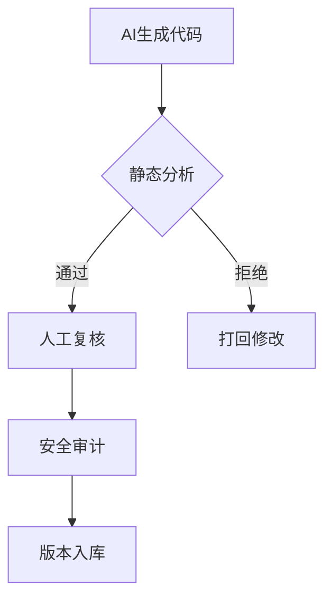

**审查维度**：
1. 安全审计项：
   - 硬编码凭证检测（正则：`(?i)(password|api[ _-]?key)`）
   - 不安全函数调用（如eval()、system()）
   - 未处理的异常分支

2. 性能基准要求：
```table
| 指标类型        | 核心服务要求         | 普通服务要求         | 测试方法          |
|----------------|---------------------|---------------------|------------------|
| 响应时间       | ≤200ms              | ≤500ms              | JMH基准测试       |
| 内存消耗       | ≤512MB              | ≤1GB                | Profiler监控      |
| 代码复杂度     | Cyclomatic≤15       | Cyclomatic≤20       | SonarQube扫描     |
```

## 2. 模型使用规范
### 2.1 场景分级
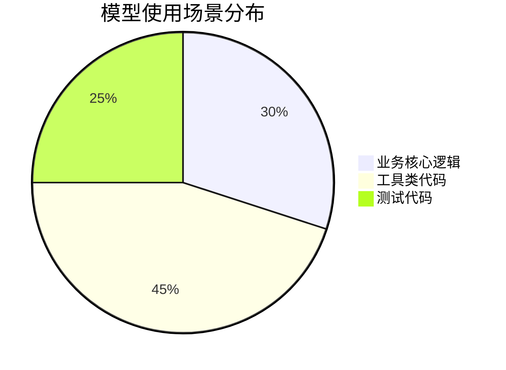

### 2.2 提示词规范
**结构化提示词模板**：
```json
{
  "context": {
    "project": "电商支付系统",
    "module": "订单处理",
    "tech_stack": ["Java 17", "Spring Boot 3"]
  },
  "requirements": [
    "实现金额校验逻辑",
    "支持多币种转换",
    "满足PCI-DSS标准"
  ],
  "constraints": {
    "performance": "TPS≥1000",
    "security": "LEVEL 3"
  }
}
```

## 3. 安全开发规范
### 3.1 禁止生成范围
```python
# 安全黑名单检测示例
def check_blacklist(code):
    blacklist = [
        r'crypto\.AES\.new\(.*?mode=crypto\.AES\.MODE_ECB\)',
        r'System\.exit\(',
        r'exec\(.*?shell=True'
    ]
    for pattern in blacklist:
        if re.search(pattern, code):
            raise SecurityViolationError(f"禁止使用危险模式: {pattern}")
```

### 3.2 数据脱敏规则
| 数据类型       | 脱敏方法                  | 示例                 |
|---------------|--------------------------|---------------------|
| 用户身份信息   | 保留首尾字符掩码          | 张三 → 张**         |
| 支付信息       | AES-GCM加密存储           | 622888 → ENC(Abx#...)|
| 系统密钥       | 使用Vault动态获取          | API_KEY → ${vault:prod/key}|

## 4. 知识管理规范
### 4.1 代码知识库
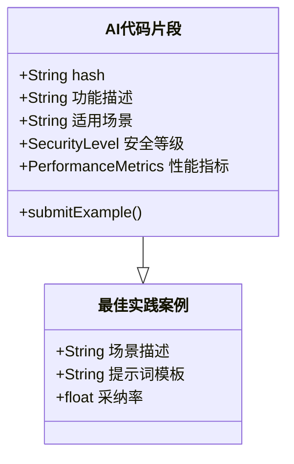


### 5.1 Java开发规范
#### 代码标识示例
```java
// @AI-DeepSeek-Coder-Java
// @SECURITY-LEVEL 3
// @GENERATED 2024-03-20T14:30:00
public class PaymentService {
    /**
     * @AI-MODIFIED 2024-03-20T15:00:00
     * @REVIEWER liujl
     */
    public BigDecimal currencyConvert(...) {
        // [AI-TODO] 需补充汇率接口异常处理
    }
}
```

**审查重点**：
1. 企业级规范：
   - 必须使用Checkstyle验证（配置见`deepseek-checkstyle.xml`）
   - 禁止使用Apache Commons等GPL协议库
2. 安全要求：
   ```xml
   <!-- 必须包含的安全依赖 -->
   <dependency>
       <groupId>com.deepseek.security</groupId>
       <artifactId>crypto-core</artifactId>
       <version>2.3</version>
   </dependency>
   ```

### 5.2 Python开发规范
#### 代码标识示例
```python
# @AI-DeepSeek-Coder-Python 
# @SECURITY-LEVEL 2
# @GENERATED 2024-03-20
def data_clean(raw: pd.DataFrame) -> pd.DataFrame:
    """AI生成的数据清洗函数"""
    # [AI-WARNING] 需添加空值处理逻辑
    return raw.drop_duplicates()
```

**特殊要求**：
```table
| 检查项          | 标准                          | 检测工具          |
|----------------|-----------------------------|------------------|
| 类型提示        | 必须100%覆盖                 | mypy             |
| 敏感数据处理    | 必须使用@secure_data装饰器    | bandit           |
| 第三方依赖      | 需通过SBOM审核               | cyclonedx-bom    |
```

### 5.3 Go开发规范
#### 代码标识示例
```go
// @AI-DeepSeek-Coder-Go 
// @SECURITY-LEVEL 4
// @GENERATED 2024-03-20
func ProcessOrder(ctx context.Context, req *pb.OrderReq) (*pb.OrderResp, error) {
    // [AI-NOTE] 需添加分布式锁控制
    return &pb.OrderResp{Code: 200}, nil
}
```

**并发规范**：
```mermaid
graph LR
    A[AI生成并发代码] --> B{协程数量>10?}
    B -->|是| C[必须使用rate.Limiter]
    B -->|否| D[至少添加recover()]
    C --> E[提交安全审查]
    D --> E
```

### 5.4 前端开发规范（TypeScript）
#### 代码标识示例
```typescript
// @AI-DeepSeek-Coder-TS 
// @SECURITY-LEVEL 2
// @GENERATED 2024-03-20
const fetchUserData = async (): Promise<User[]> => {
  // [AI-CAUTION] 需添加CORS配置
  return axios.get('/api/users');
}
```

**质量要求**：
1. 必须通过ESLint检测（配置见`.deepseek-eslintrc`）
2. 敏感操作必须使用防抖装饰器：
```typescript
@debounce(300)
async function submitPayment() {
  // ...
}
```

### 5.5 SQL生成规范
```sql
/* @AI-DeepSeek-Coder-SQL 
   @SECURITY-LEVEL 3 */
CREATE VIEW user_summary AS
-- [AI-WARNING] 需添加行级安全策略
SELECT id, COUNT(*) FROM orders;
```

**审查清单**：
- [ ] 索引建议是否合理
- [ ] WHERE条件是否带分区键
- [ ] 敏感字段是否脱敏
- [ ] 执行计划成本评估

## 配套工具链
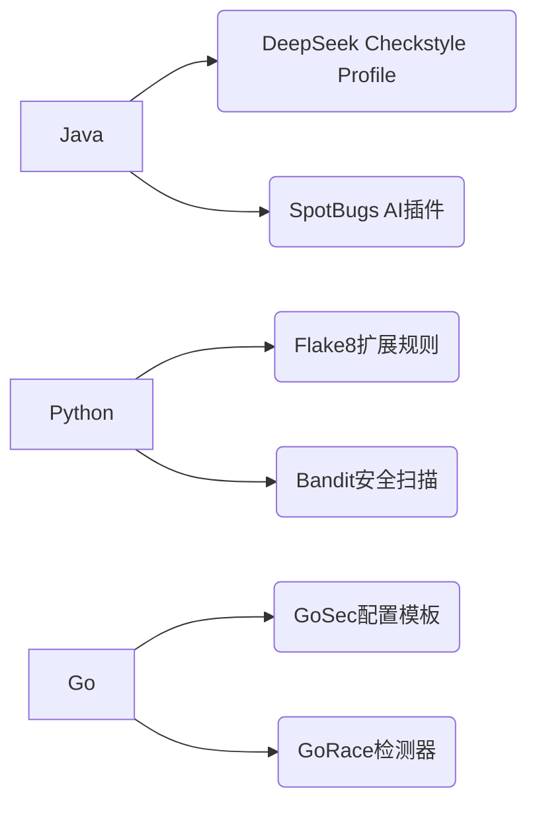
## 5.6 C++开发规范
### 代码标识示例
```cpp
// @AI-DeepSeek-Coder-Cpp
// @SECURITY-LEVEL 4
// @GENERATED 2024-03-20
class MemoryPool {
public:
    // [AI-WARNING] 需添加线程安全注解
    void* allocate(size_t size);
};
```

**安全要求**：
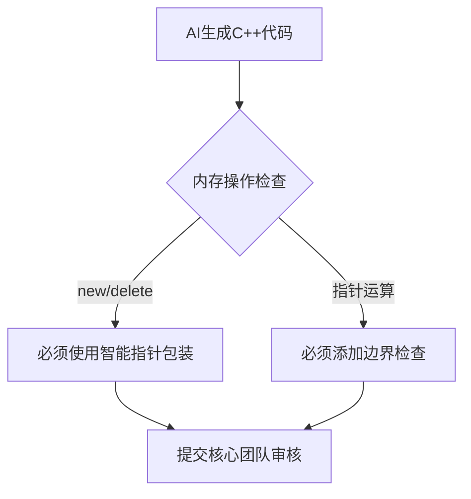

**审查清单**：
- [ ] 遵循RAII原则
- [ ] 异常安全等级标注
- [ ] 静态分析通过CppCoreCheck
- [ ] 性能测试报告（perf+火焰图）

## 5.7 Rust开发规范
### 代码标识示例
```rust
// @AI-DeepSeek-Coder-Rust
// @SECURITY-LEVEL 2
// @GENERATED 2024-03-20
async fn process_stream(stream: TcpStream) -> Result<()> {
    // [AI-TODO] 添加超时控制
    let mut buf = [0; 1024];
    stream.read(&mut buf).await?;
    Ok(())
}
```

**所有权规范**：
```table
| 场景                | 要求                          | 检测工具          |
|--------------------|-----------------------------|------------------|
| 跨线程共享          | 必须使用Arc<Mutex<T>>        | clippy           |
| 异步运行时          | 统一使用tokio                | cargo-audit      |
| unsafe代码         | 需安全委员会特批             | rustc安全检查     |
```

## 5.8 基础设施即代码规范
### Terraform示例
```hcl
# @AI-DeepSeek-Coder-Terraform
# @SECURITY-LEVEL 3
resource "aws_s3_bucket" "data_lake" {
  # [AI-CAUTION] 需启用版本控制
  bucket = "deepseek-data-${var.env}"
}
```

**审计要点**：
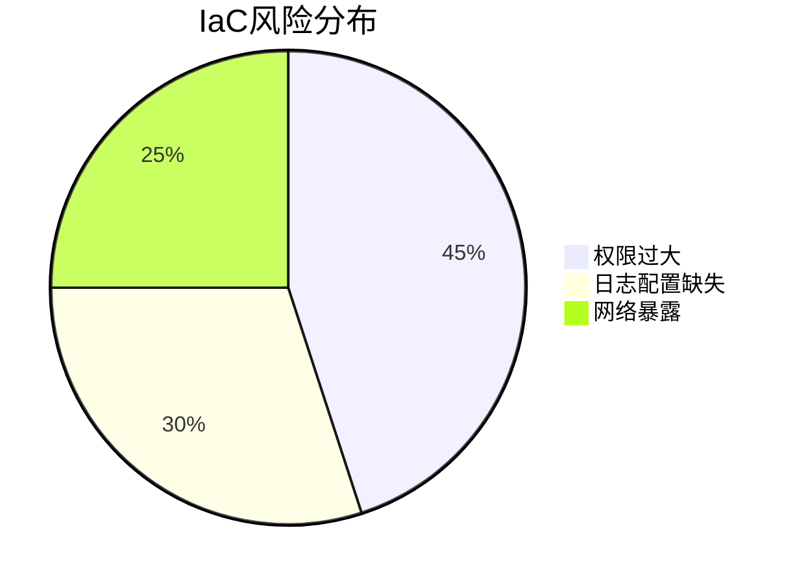

## 5.9 Kubernetes规范
### YAML标识示例
```yaml
# @AI-DeepSeek-Coder-K8s
# @SECURITY-LEVEL 3
apiVersion: apps/v1
kind: Deployment
spec:
  replicas: 3 # [AI-SUGGEST] 根据负载测试调整
  securityContext:
    readOnlyRootFilesystem: true
```

**安全基线**：
```table
| 检查项                  | 标准                          | 工具              |
|------------------------|-----------------------------|------------------|
| Pod安全策略            | 必须满足Baseline级别         | kube-bench       |
| 资源限制               | 必须设置requests/limits      | Datree           |
| 镜像来源               | 仅允许私有仓库               | Trivy+准入控制器  |
```

## 5.10 API设计规范
### OpenAPI示例
```yaml
# @AI-DeepSeek-Coder-OpenAPI
# @SECURITY-LEVEL 2
paths:
  /users/{id}:
    get:
      parameters:
        - name: id
          in: path
          required: true
          schema:
            type: string
            format: uuid # [AI-WARNING] 需添加格式校验
```

**设计原则**：
1. 必须符合Google API设计规范
2. 敏感操作必须包含幂等头
3. 响应时间分级：
   ```mermaid
   flowchart LR
       A[查询类API] --> B[<200ms]
       C[计算类API] --> D[<500ms]
       E[批处理API] --> F[<5s]
   ```

## 配套检测工具链升级
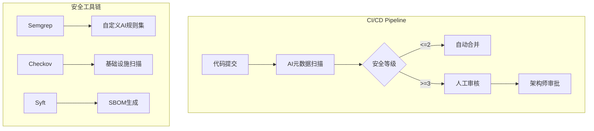
## 5.11 移动端开发规范
### Swift/iOS 规范
```swift
// @AI-DeepSeek-Coder-Swift
// @SECURITY-LEVEL 2
// @GENERATED 2024-03-20
class PaymentHandler {
    /// [AI-WARNING] 需添加Apple Pay状态监听
    func processApplePay() {
        // 生成的核心支付逻辑
    }
}
```

**安全要求**：
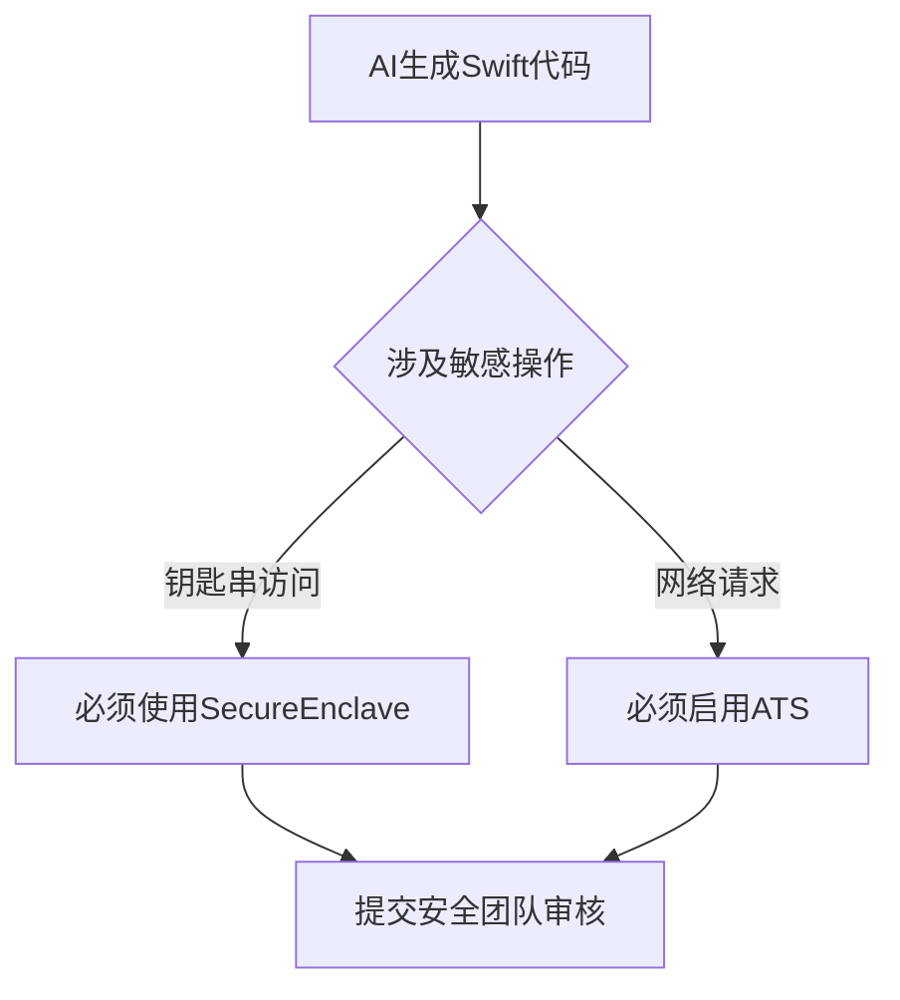

### Kotlin/Android 规范
```kotlin
// @AI-DeepSeek-Coder-Kotlin
// @SECURITY-LEVEL 3
// @GENERATED 2024-03-20
fun fetchUserData(): Flow<Result> {
    // [AI-TODO] 添加Jetpack Paging支持
    return flow { emit(dao.getUsers()) }
}
```

**审查清单**：
- [ ] 使用DataStore替代SharedPreferences
- [ ] 敏感权限动态申请检查
- [ ] 混淆规则有效性验证
- [ ] 启动时间性能基准（<800ms）

## 5.12 数据科学规范
### Python/Pandas 示例
```python
# @AI-DeepSeek-Coder-DataScience
# @SECURITY-LEVEL 4
# @GENERATED 2024-03-20
def process_sensitive_data(df: pd.DataFrame) -> pd.DataFrame:
    """ 
    [AI-CAUTION] 需进行K-匿名化处理
    数据列：姓名, 年龄, 疾病代码, 邮政编码
    """
    return df.groupby(['年龄', '邮政编码']).filter(lambda x: len(x) >= 5)
```

**脱敏标准**：
```table
| 数据类型       | 处理方法                     | 工具              |
|---------------|----------------------------|------------------|
| 直接标识符     | 完全删除或哈希化             | Faker            |
| 准标识符       | 泛化（年龄→年龄段）           | pandas-cut       |
| 敏感属性       | 差分隐私处理                 | OpenDP           |
```

### SQL分析规范
```sql
/* @AI-DeepSeek-Coder-BI 
   @SECURITY-LEVEL 3 */
WITH user_analysis AS (
    SELECT 
        user_id,
        COUNT(order_id) AS order_count,
        SUM(amount) AS total_spent -- [AI-WARNING] 需进行数据掩码
    FROM orders
    WHERE country = 'CN' -- [AI-SUGGEST] 添加分区过滤
    GROUP BY 1
)
SELECT * FROM user_analysis
```

**性能规范**：
```math
\text{查询复杂度评分} = \frac{\text{JOIN数量} \times \text{扫描行数}}{\text{索引使用率}} \leq 50
```

## 5.13 测试代码规范
### 单元测试生成标准
```java
// @AI-DeepSeek-Test-Java
// @COVERAGE-TARGET 85%
class PaymentServiceTest {
    @Test
    void testCurrencyConvert() {
        // [AI-TODO] 添加边界值测试
        assertEquals(100, service.convert(USD, CNY, 14.5));
    }
}
```

**覆盖率要求**：
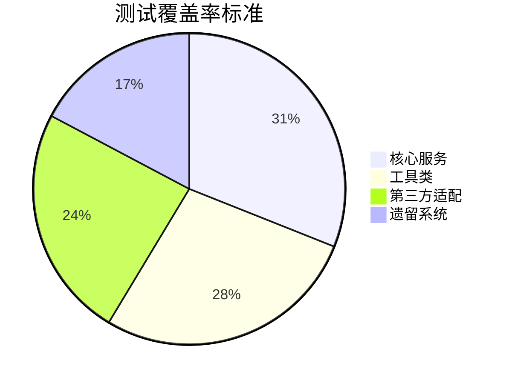

### 压力测试规范
```yaml
# @AI-DeepSeek-Test-Load
# @TPS-TARGET 1500
scenarios:
  - name: checkout_api
    steps:
      - action: http://api/checkout
        method: POST
        think_time: 500ms
        payload: "@checkout.json"
    load_profile:
      - duration: 10m
        users: 100
        spawn_rate: 10/s
```

## 5.14 文档生成规范
### API文档标准
```typescript
// @AI-DeepSeek-Doc-OpenAPI
/**
 * @summary 用户注册接口
 * @securityLevel 2
 * @AI-Generated 2024-03-20
 * @example_response
 * {
 *   "userId": "d7a8f9",
 *   "status": "success"
 * }
 */
app.post('/register', (req, res) => {
  // [AI-TODO] 添加手机验证码校验
});
```

**文档质量指标**：
```table
| 指标            | 标准                          | 检测工具          |
|----------------|-----------------------------|------------------|
| 接口描述完整性  | 100%接口有@summary描述        | Swagger-Stats    |
| 示例覆盖率      | ≥80%的接口有@example_response | Spectral         |
| 修订记录        | 保留最近3个版本变更说明        | Git日志分析       |
```

## 配套工具升级方案
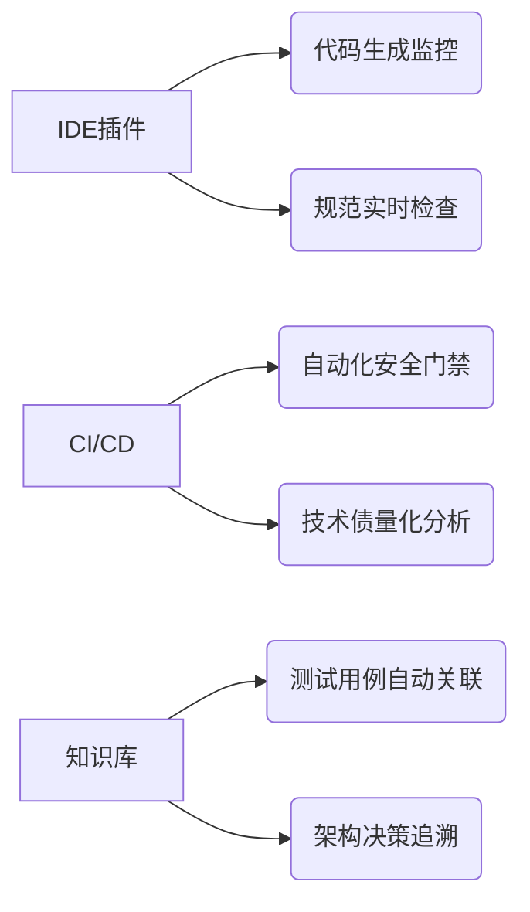


## 6. 架构设计规范

### 6.1 C4模型实施标准
#### 元数据标识
```plantuml
@startuml
' @AI-Arch-DeepSeek
' @C4-Level 3
' @SECURITY-LEVEL 2
!include C4_Context.puml

System_Boundary(system, "电商系统") {
    Person(user, "消费者", "通过Web和APP购物")
    System(orders, "订单服务", "AI生成的核心服务")
    System_Ext(payment, "支付网关", "第三方支付系统")
}

Rel(user, orders, "提交订单")
Rel(orders, payment, "调用支付")
@enduml
```

**标识规范**：
```table
| 标签              | 说明                          | 示例值            |
|-------------------|-----------------------------|------------------|
| @AI-Arch-DeepSeek | 架构图生成标识                | 必填              |
| @C4-Level         | 设计层级（1-Context,2-Container等） | 2               |
| @Reviewer         | 架构审核人                   | @arch_team       |
```

### 6.2 AI辅助设计原则
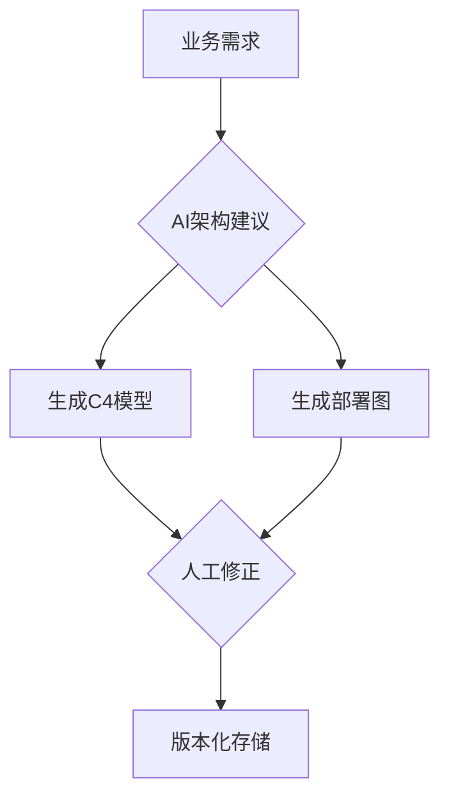

**设计约束**：
1. 必须符合《DeepSeek架构守则》第3版
2. 微服务粒度标准：
   ```math
   \text{服务复杂度} = \frac{\text{代码行数} \times \text{依赖数}}{\text{API数量}} \leq 150
   ```
3. 跨服务调用必须包含熔断机制

### 6.3 架构图审查流程
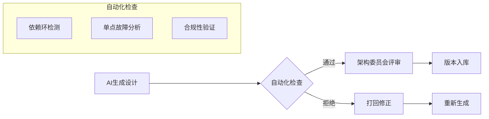

**审查清单**：
- [ ] 是否包含故障隔离设计
- [ ] 服务依赖是否符合架构分区原则
- [ ] 容量预估是否基于历史数据
- [ ] 是否包含降级开关设计

### 6.4 架构即代码规范
#### Terraform模块示例
```hcl
# @AI-Arch-DeepSeek-Terraform
module "ai_generated_arch" {
  source  = "deepseek-modules/ai-arch/aws"
  version = "1.2.0"

  # [AI-WARNING] 需验证可用区分布
  azs         = ["us-east-1a", "us-east-1b"]
  vpc_cidr    = "10.0.0.0/16"
  
  services = {
    order_service = {
      instance_type = "c6g.2xlarge"
      min_size      = 2
      max_size      = 5
    }
  }
}
```

**验证标准**：
```table
| 检查项          | 工具              | 通过标准            |
|----------------|------------------|-------------------|
| 资源拓扑        | ArchUnit         | 符合架构蓝图        |
| 安全基线        | Checkov          | 零高危漏洞          |
| 成本预估        | Infracost        | 不超预算20%         |
```

### 6.5 架构知识库规范
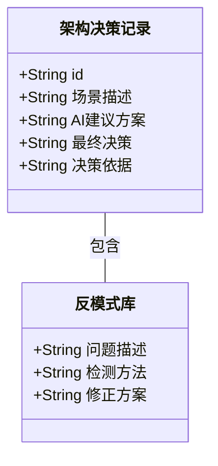

### 6.6 工具链集成
```bash
# 架构验证CI流水线示例
ARCH_CHECK_TEMPLATE=$(cat <<EOF
- name: AI Architecture Validation
  uses: deepseek-ai/arch-validator@v2
  with:
    c4_level: 3
    allowed_patterns: |
      service_*.tf
      diagram_*.puml
    forbidden_resources:
      - aws_db_instance.single_node
EOF
)
```

## 7. 技术债管理规范

### 7.1 技术债分类标准
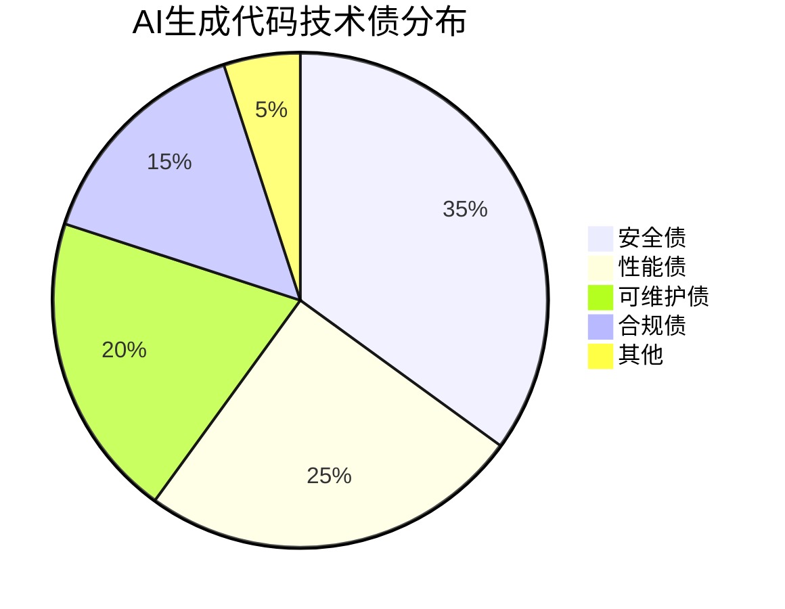

**债务等级定义**：
```table
| 等级 | 响应时限 | 影响范围          | 示例场景                  |
|------|----------|-------------------|-------------------------|
| S1   | 24小时   | 生产环境运行故障    | 内存泄漏导致服务崩溃       |
| S2   | 72小时   | 核心功能缺陷       | 支付金额计算错误          |
| S3   | 2周      | 可维护性问题       | 缺乏单元测试覆盖          |
| S4   | 1季度    | 优化类问题         | 代码复杂度偏高但功能正常    |
```

### 7.2 技术债追踪机制
#### 代码标注示例
```java
// @TECH-DEBT S2-20240320
// [原因] AI生成的分布式锁实现缺少续期机制
// [责任人] @liujl 
// [到期日] 2024-03-27
public class DistributedLock {
    public void lock() {
        // ...生成代码...
    }
}
```

**追踪看板规范**：
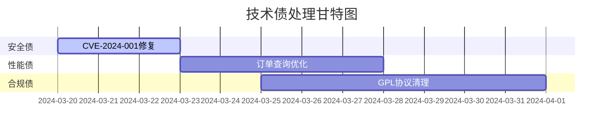

### 7.3 技术债量化模型
```math
\text{技术债指数} = \frac{\sum (权重_i \times 数量_i)}{\text{代码总量}} \times 1000
```
其中：
- 权重系数：
  ```table
  | 债务等级 | 权重 |
  |----------|------|
  | S1       | 10   |
  | S2       | 5    |
  | S3       | 2    |
  | S4       | 1    |
  ```

### 7.4 技术债偿还流程
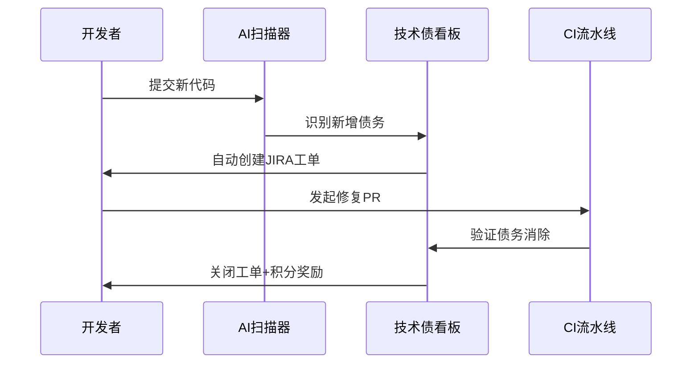

### 7.5 技术债预防机制
#### 代码生成约束
```python
# AI代码生成约束检查
def check_tech_debt(code):
    constraints = {
        'max_cyclomatic': 15,
        'min_test_coverage': 80,
        'disallowed_patterns': [
            r'Thread\.sleep\(\d+\)',
            r'SELECT \* FROM',
            r'eval\('
        ]
    }
    # 返回违规项列表
    return validate(code, constraints)
```

**质量门禁标准**：
```table
| 指标            | 阈值   | 检测工具          | 阻断策略          |
|----------------|-------|------------------|------------------|
| 代码异味        | ≤5    | SonarQube        | MR禁止合并        |
| 测试覆盖率      | ≥70%  | JaCoCo           | 警告但允许合并     |
| 安全漏洞        | 0高危 | Trivy            | 立即终止流水线     |
```

### 7.6 技术债知识库
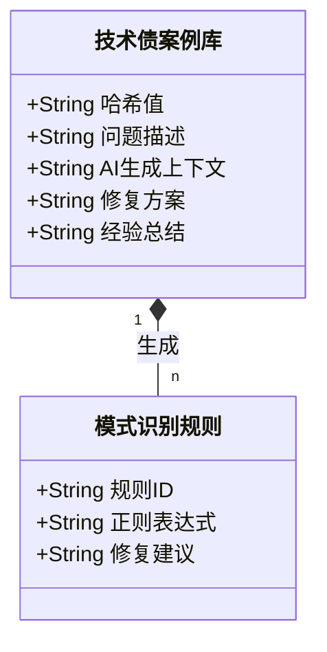

### 7.7 技术债激励机制
```json
{
  "激励策略": {
    "即时奖励": {
      "S1修复": "+50积分",
      "S2修复": "+30积分"
    },
    "惩罚机制": {
      "超期未处理": "每日-10积分",
      "债务新增率>10%": "冻结生成权限3天"
    },
    "兑换机制": {
      "1000积分": "1天带薪假",
      "5000积分": "参加国际会议资格"
    }
  }
}
```

## 配套工具链升级
```bash
# 技术债扫描CI配置示例
tech_debt_check:
  stage: analysis
  image: deepseek/tech-debt-scanner:v2
  script:
    - scan --lang java --threshold B
  artifacts:
    reports:
      tech_debt: gl-tech-debt.json
  rules:
    - if: $CI_PIPELINE_SOURCE == "merge_request_event"
```

## 8. 接口兼容性规范

### 8.1 接口设计原则
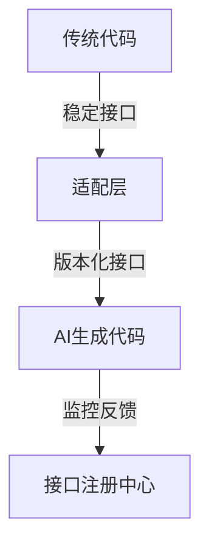

**核心原则**：
1. 单向依赖：AI代码必须通过适配层访问传统系统
2. 防腐层设计：适配层需实现接口版本管理和协议转换
3. 变更传播：接口变更必须通过服务注册中心广播

### 8.2 接口定义规范
#### REST API示例
```java
// 传统代码接口（稳定层）
@RestController
public class LegacyController {
    /**
     * @StableAPI v1.2
     * @AI-Callable
     */
    @PostMapping("/v1.2/orders")
    public ResponseEntity<Order> createOrder(@Valid @RequestBody OrderRequest request) {
        // ...传统实现...
    }
}

// AI生成代码适配层
@FeignClient(name = "order-service", url = "${adaptor.url}")
public interface OrderServiceAdapter {
    /**
     * @AI-Generated
     * @VersionMapping 1.2->2.0
     */
    @PostMapping("/v2/orders")
    OrderResponse createOrderV2(@RequestBody AIOrderRequest request);
}
```

**版本映射规则**：
```table
| 传统版本 | AI适配版本 | 转换规则                    | 状态     |
|---------|------------|---------------------------|----------|
| v1.2    | v2.0       | 自动添加currency字段默认值  | 已发布   |
| v1.1    | v2.0       | 需要手动映射region字段      | 已废弃   |
```

### 8.3 数据交换规范
#### Protobuf定义
```protobuf
// 传统系统数据格式
message LegacyUser {
  int32 id = 1;
  string name = 2;
}

// AI生成代码数据格式（必须包含兼容注解）
message AIUser {
  option (compatibility.legacy_name) = "LegacyUser";
  
  int32 id = 1 [(compatibility.field_map) = "LegacyUser.id"];
  string user_name = 2 [(compatibility.field_map) = "LegacyUser.name"];
  string email = 3 [(compatibility.default) = "unknown@deepseek.com"];
}
```

**兼容性要求**：
```math
\text{兼容度} = \frac{\text{匹配字段数}}{\text{Max(传统字段数, AI字段数)}} \geq 0.8
```

### 8.4 错误处理规范
#### 错误码映射表
```mermaid
stateDiagram-v2
    [*] --> AI_System
    AI_System --> Legacy_System: E001: 参数校验失败
    Legacy_System --> AI_System: E1001: InvalidParameter
    AI_System --> [*]: E999: 未知错误
    
    note right of AI_System
    错误码转换规则：
    E001 → E1001
    E002 → E1002
    E999 → E1999
    end note
```

**错误处理要求**：
1. AI代码必须实现错误包装器：
```python
class AIErrorWrapper:
    @classmethod
    def convert_error(cls, legacy_error):
        return {
            1001: ("E001", 400),
            1002: ("E002", 401)
        }.get(legacy_error.code, ("E999", 500))
```

### 8.5 接口测试规范
#### 测试用例模板
```yaml
- name: 订单创建接口兼容性测试
  desc: 验证v1.2到v2.0的自动转换
  request:
    url: /v2/orders
    method: POST
    body: 
      user_id: 123
      items: [{id: 1, qty: 2}]
  expect:
    legacy_mapping:
      path: /v1.2/orders
      body:
        userId: 123
        productList: 
          - productId: 1 
            quantity: 2
    status: 201
```

**测试覆盖率要求**：
```mermaid
pie
    title 接口测试覆盖率
    "正向用例" : 40
    "异常用例" : 35
    "边界用例" : 15
    "性能用例" : 10
```

### 8.6 接口监控规范
#### Prometheus指标定义
```go
// 接口健康度指标
var AIInterfaceRequests = prometheus.NewCounterVec(
    prometheus.CounterOpts{
        Name: "ai_interface_requests_total",
        Help: "Total AI interface requests",
    },
    []string{"interface", "version", "status"},
)

// 兼容性异常检测
type CompatibilityAlert struct {
    Interface   string `json:"interface"`
    ErrorCode   string `json:"error_code"`
    LegacyTrace string `json:"legacy_trace"`
}
```

**监控阈值**：
```table
| 指标                | 警告阈值     | 严重阈值     | 检测周期 |
|---------------------|-------------|-------------|---------|
| 兼容性错误率        | >1%         | >5%         | 5m      |
| 数据转换耗时        | >200ms      | >500ms      | 1m      |
| 版本映射失败次数    | 10次/分钟   | 50次/分钟   | 实时     |
```

### 8.7 接口演进规范
```mermaid
graph LR
    A[传统接口v1] --> B[AI适配层v1]
    B --> C[AI实现v1]
    A --> D[AI适配层v2]
    D --> E[AI实现v2]
    B -.->|弃用通知| F[监控告警]
```

**版本生命周期**：
```gantt
    title 接口版本生命周期
    dateFormat  YYYY-MM-DD
    section v1.x
    活跃期     :active, 2024-03-01, 60d
    维护期     :         2024-05-01, 30d
    废弃期     :         2024-06-01, 14d
    section v2.0
    开发期     :done, 2024-02-01, 20d
    测试期     :done, 2024-02-21, 10d
    发布期     :active, 2024-03-01, 30d
```

## 9. 应急响应规范

### 9.1 恶意代码应急流程
```mermaid
sequenceDiagram
    participant 监控系统
    participant 安全网关
    participant 版本控制
    participant 应急小组
    
    监控系统->>安全网关: 检测到可疑代码模式
    安全网关->>版本控制: 自动锁定相关提交
    安全网关->>应急小组: 发送L1级警报
    应急小组->>版本控制: 执行代码回滚
    应急小组->>安全网关: 启动深度扫描
    安全网关->>监控系统: 提交行为分析报告
    应急小组->>所有开发者: 发布安全通告
```

**事件分级标准**：
```table
| 等级 | 特征描述                     | 响应时限 | 处置权限       |
|------|----------------------------|----------|---------------|
| L1   | 确认的恶意代码执行           | 15分钟   | 安全委员会     |
| L2   | 高风险漏洞生成               | 1小时    | 架构师团队     |
| L3   | 中风险不规范代码             | 4小时    | 技术负责人     |
```

### 9.2 自动阻断机制
#### Git Hooks示例
```bash
#!/bin/bash
# pre-receive hook

AI_RISK_PATTERNS=(
    "base64_decode.*system("
    "curl.*-X POST.*127.0.0.1"
    "eval\(.*unserialize\("
)

while read oldrev newrev refname; do
    for pattern in "${AI_RISK_PATTERNS[@]}"; do
        if git diff $oldrev $newrev | grep -qE "$pattern"; then
            echo "BLOCKED: 检测到恶意代码模式 '$pattern'"
            exit 1
        fi
    done
done
```

**阻断规则库更新机制**：
```mermaid
graph TD
    A[安全情报源] --> B(规则生成器)
    B --> C[自动测试环境]
    C -->|验证通过| D[生产规则库]
    C -->|误报| E[人工审核队列]
    E --> F[规则调优]
    F --> C
```

### 9.3 事件处置手册
#### 处置步骤模板
```markdown
# 事件ID：AI-INC-20240320-001

## 1. 事件概况
- 发现时间：2024-03-20 14:30
- 影响范围：订单服务v2.1.3
- 风险等级：L1

## 2. 处置记录
| 时间       | 操作                         | 执行人   | 结果       |
|------------|----------------------------|----------|-----------|
| 14:32      | 代码提交锁定                 | 系统自动 | 成功      |
| 14:35      | 服务实例隔离                 | 运维团队 | 完成      |
| 14:40      | 漏洞分析                     | 安全团队 | 确认RCE漏洞|
| 14:45      | 版本回滚至v2.1.2             | 发布团队 | 成功      |

## 3. 根本原因
```python
# 恶意代码片段
def process_input(input):
    decoded = base64.b64decode(input)  # [AI-RISK] 未经验证的输入解码
    return eval(decoded)               # [AI-RISK] 危险函数调用
```

## 4. 改进措施
1. 更新AI生成规则库（PR#123）
2. 加强base64解码使用场景审查
3. 增加eval函数调用白名单机制
```

### 9.4 应急工具链
```mermaid
flowchart LR
    A[代码仓库] --> B{AI安全扫描器}
    B -->|通过| C[正常流程]
    B -->|阻断| D[沙箱分析]
    D --> E[人工研判]
    E -->|误报| F[规则调优]
    E -->|确认| G[事件响应]
    
    subgraph 应急工具箱
        H[代码追溯工具]
        I[影响面分析]
        J[热修复生成器]
    end
    G --> H
    G --> I
    G --> J
```

### 9.5 演练计划
```gantt
    title 年度应急演练计划
    dateFormat  YYYY-MM-DD
    section 第一季度
    桌面推演       :done, 2024-01-15, 7d
    section 第二季度
    红蓝对抗       :active, 2024-04-01, 14d
    section 第三季度
    全链路压测     :2024-07-01, 21d
    section 第四季度
    多团队联合演练 :2024-10-01, 30d
```

**演练评估标准**：
```math
\text{应急成熟度} = \frac{\text{检测时间} + \text{处置时间} + \text{恢复时间}}{3} \leq 1 \text{小时}
```

### 9.6 法律合规流程
```mermaid
graph TD
    A[事件确认] --> B{数据泄露?}
    B -->|是| C[法务团队介入]
    C --> D[监管报告]
    C --> E[用户通知]
    B -->|否| F[内部归档]
    
    D --> G[72小时内报监管部门]
    E --> H[根据GDPR第33条]
```


## 附录A：术语定义
- **AI-Generated Code**：通过大模型生成的超过30%逻辑的代码单元
- **安全等级1**：可公开的通用工具类代码
- **安全等级3**：涉及内部业务逻辑的核心代码

## 附录B：修订记录
| 版本  | 修订内容                  | 日期       | 审核人 |
|-------|--------------------------|------------|--------|