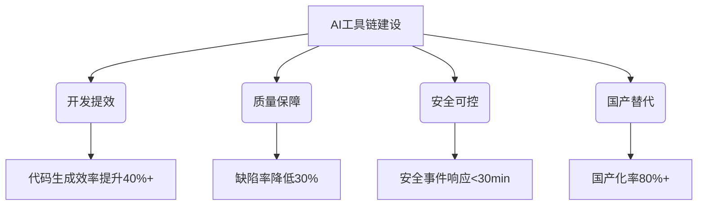
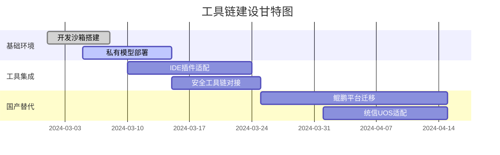
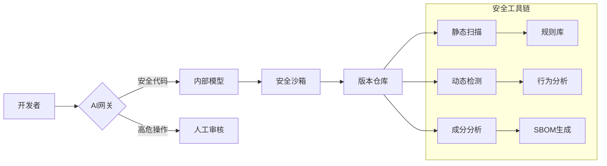
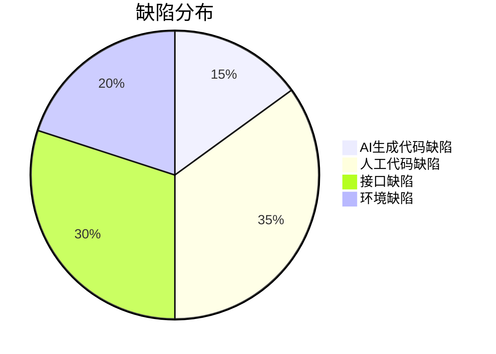
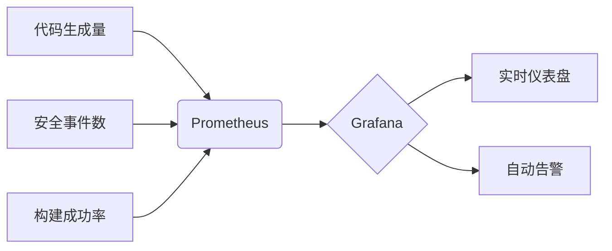
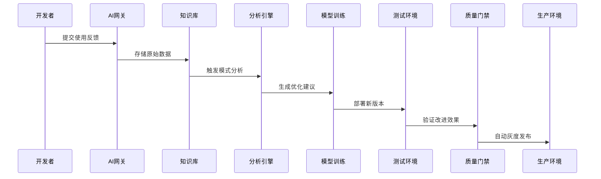
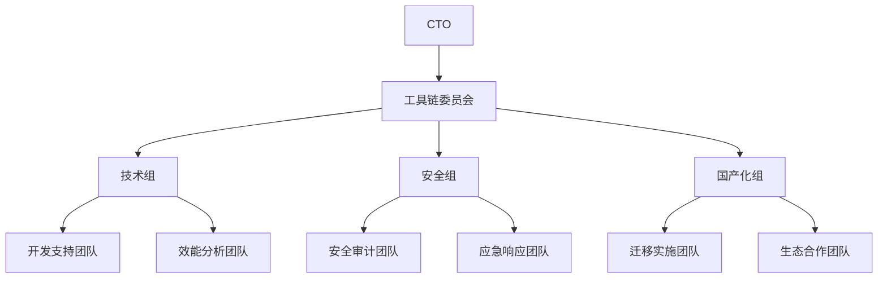

# AI编程工具链建设方案

## 一、建设目标


## 二、工具选型矩阵
### 1. 核心工具对比
| 工具类型       | 国际方案          | 国内替代方案      | 选型标准                              |
|---------------|-------------------|-------------------|-------------------------------------|
| IDE插件       | GitHub Copilot    | DeepSeek Coder    | 支持私有化部署+代码规范检查            |
| 代码生成引擎   | OpenAI Codex      | 深言代码大模型      | 中文注释理解率>90%                   |
| 安全扫描       | SonarQube         | 奇安信代码卫士      | 信创认证+AI漏洞规则库                 |
| CI/CD         | Jenkins           | 蓝鲸CI            | 支持国产CPU+自动化编排                |

### 2. 选型评估公式
```math
\text{工具评分} = 0.4 \times \text{功能覆盖度} + 0.3 \times \text{安全合规} + 0.2 \times \text{国产适配} + 0.1 \times \text{成本}
```

## 三、实施路线图


## 四、安全防护体系
### 1. 分层防护架构


### 2. 安全工具配置示例
```yaml
# security-policy.yaml
ai_security:
  static_scan:
    enable: true
    ruleset: "deepseek-security-rules-v3"
    fail_threshold: high
  
  runtime_protection:
    memory_limit: 512MB
    syscall_filter: ["exec", "fork"]
  
  data_guard:
    pattern: 
      - "\d{4}-\d{4}-\d{4}-\d{4}" # 银行卡号
      - "[A-Za-z0-9]{24}"         # MongoDB ID
    action: mask
```

## 五、国产化替代路径
### 1. 技术栈迁移计划
| 原技术栈       | 替代方案        | 过渡策略                      | 完成度 |
|---------------|----------------|-----------------------------|--------|
| x86架构        | 鲲鹏920         | 双轨运行+性能调优             | 70%    |
| CentOS        | 麒麟V10         | 容器化迁移                   | 90%    |
| MySQL         | 达梦数据库       | 数据同步+兼容层               | 60%    |

### 2. 信创适配方案
```dockerfile
# 国产化基础镜像
FROM kylin:v10-sp2
RUN yum install -y \
   deepseek-coder-kunpeng \
   dm8-client \
   uos-ide-plugins
   
ENV LD_LIBRARY_PATH=/opt/kunpeng/libs:$LD_LIBRARY_PATH
```

## 六、工具链集成规范
### 1. IDE插件配置
```json
{
  "deepseek.coder": {
    "modelEndpoint": "http://10.1.1.100:8080",
    "securityRules": {
      "forbidPatterns": ["System.exit", "eval("],
      "requireAnnotations": ["@AI-Generated"]
    },
    "codeStyle": {
      "java": "deepseek-java.xml",
      "python": "PEP8"
    }
  }
}
```

### 2. CI/CD流水线
```groovy
pipeline {
    agent { label 'kunpeng' }
    stages {
        stage('AI生成') {
            steps {
                aiCodeGen(model: 'deepseek-33b', prompt: '生成用户服务CRUD')
            }
        }
        stage('安全扫描') {
            steps {
                sh 'deepseek-scan --level strict'
            }
            post {
                failure {
                    aiSecurityAlert('发现高危漏洞')
                }
            }
        }
        stage('国产化构建') {
            steps {
                buildARMImage('Dockerfile.kunpeng')
            }
        }
    }
}
```

## 七、维护更新机制
### 1. 更新策略矩阵
| 组件类型       | 更新频率   | 回滚窗口   | 测试要求          |
|---------------|------------|------------|-------------------|
| 核心模型       | 季度更新   | <4小时     | 全量回归+性能基准  |
| 安全规则       | 月度更新   | <1小时     | 漏洞验证测试       |
| IDE插件       | 双周更新   | <30分钟    | 冒烟测试           |

### 2. 灰度发布流程
```python
def canary_release(user):
    # 灰度发布决策算法
    weight = 0.3*user.skill_level + 0.4*user.project_impact + 0.3*user.usage_freq
    if weight > 0.8:
        return '第一批次（5%）'
    elif weight > 0.6:
        return '第二批次（15%）'
    else:
        return '第三批次（80%）'
```

## 八、配套资源
1. [工具链部署checklist](/checklists/工具部署清单.md)
2. [国产化适配指南](/docs/plan/06-国产化替代路径.md)
3. [安全规则库管理规范](/docs/plan/03-安全工具链.md)

## 九、工具链性能指标

### 1. 效率提升基准
```math
\begin{aligned}
\text{代码生成率} &= \frac{\text{AI生成代码行数}}{\text{总代码行数}} \times 100\% \geq 40\% \\
\text{审查效率} &= \frac{\text{传统审查时间}}{\text{AI辅助审查时间}} \geq 2.5\times \\
\text{部署频率} &= \frac{\text{发布次数}}{\text{单位时间}} \geq 3\times \text{(同比)}
\end{aligned}
```

### 2. 质量保障指标


## 十、开发者支持体系

### 1. 智能辅助矩阵
| 场景           | 支持工具                | 功能亮点                      |
|----------------|-----------------------|-----------------------------|
| 代码生成       | DeepSeek Coder        | 支持私有知识库的上下文理解        |
| 调试优化       | AI Debugger           | 异常模式自动识别+修复建议         |
| 文档生成       | DocGen AI             | 自动生成OpenAPI+架构图          |
| 技术债管理     | TechDebt Tracker      | 技术债可视化+自动生成偿还计划      |

### 2. 本地开发环境配置
```bash
# 初始化开发环境脚本
#!/bin/bash
# 安装基础工具链
sudo apt-get install -y docker-ce=5:20.10.24~3-0~ubuntu-focal \
                        deepseek-coder-cli=2.1.3

# 配置AI开发沙箱
docker run -d --name ai-sandbox \
  -v /var/run/docker.sock:/var/run/docker.sock \
  -v ${HOME}/.config:/root/.config \
  deepseek/ai-dev-env:3.2 \
  --model-endpoint http://10.1.1.100:8080 \
  --security-level 3
```

## 十一、工具链监控体系

### 1. 监控指标看板


### 2. 告警规则示例
```yaml
alert_rules:
  - alert: HighRiskCodeGenerated
    expr: sum(ai_code_risk_level{severity="high"}) by (service) > 0
    for: 5m
    labels:
      severity: critical
    annotations:
      summary: "高风险代码生成告警 {{ $labels.service }}"
      description: "检测到高风险代码生成，请立即人工审查"

  - alert: ModelPerformanceDegrade
    expr: rate(ai_model_inference_duration_seconds[5m]) > 0.5
    labels:
      severity: warning
    annotations:
      summary: "模型推理性能下降"
      description: "模型推理延迟超过阈值，当前值 {{ $value }}s"
```

## 十二、持续改进机制

### 1. 反馈闭环流程


### 2. 优化迭代策略
```math
\text{优化优先级} = 0.4 \times \text{使用频率} + 0.3 \times \text{投诉次数} + 0.2 \times \text{安全风险} + 0.1 \times \text{战略权重}
```

## 十三、实施保障措施

### 1. 组织架构


### 2. 培训认证体系
| 认证等级 | 培训内容                  | 考核标准                | 有效期 |
|---------|-------------------------|-----------------------|--------|
| L1      | 基础工具使用              | 通过在线测验+10个实操案例 | 1年    |
| L2      | 安全开发规范              | 代码审计实战+漏洞修复     | 2年    |
| L3      | 模型调优与工具链维护       | 项目实战+性能优化报告     | 3年    |

---
**附件**：
1. [工具链部署checklist](/checklists/工具部署清单.md)
2. [安全扫描规则库](/security-rules/v3)
3. [国产化适配测试报告](/reports/信创适配-2024Q1.pdf)

**版本更新记录**：
- v2.0 2024-03-25 新增性能指标与监控体系
- v1.2 2024-03-23 完善国产化迁移方案
- v1.1 2024-03-21 增加安全工具链配置
- v1.0 2024-03-20 初始版本发布
