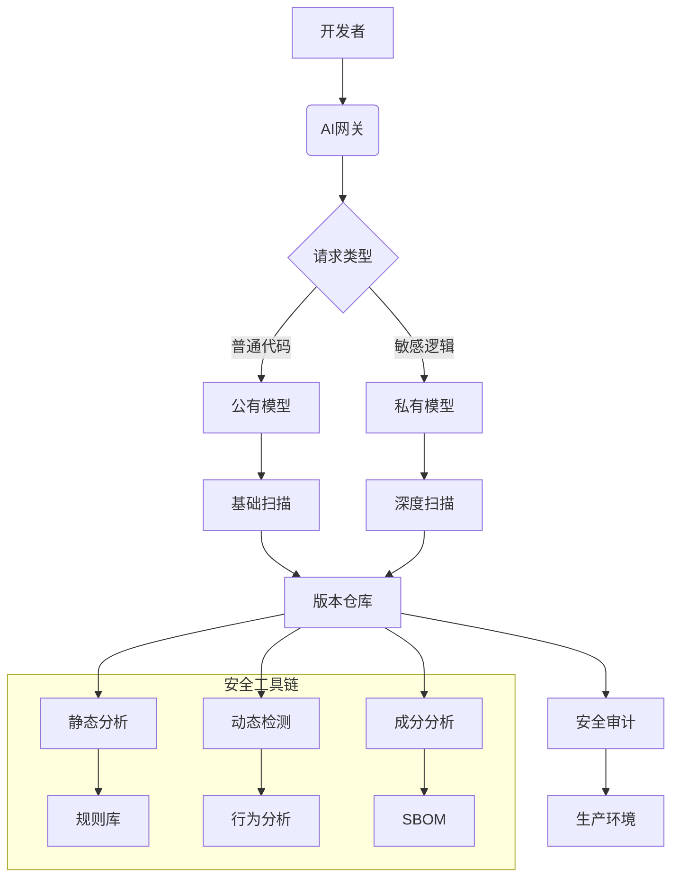
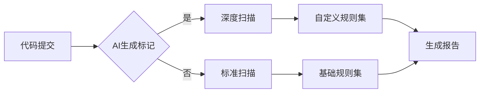
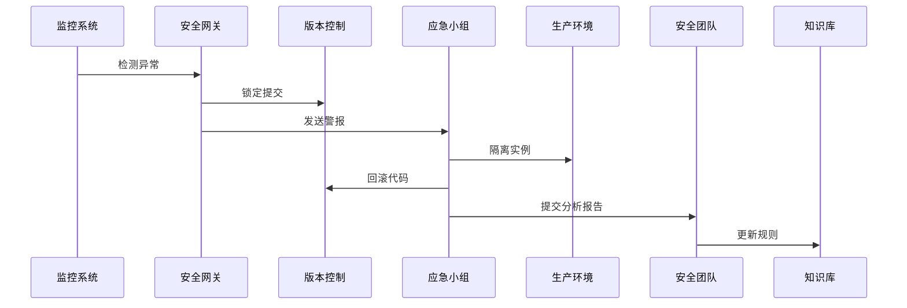

# AI代码安全防护体系

## 一、安全防护架构


## 二、安全防护层级

### 1. 代码生成安全
#### 输入过滤机制
```python
def sanitize_input(prompt: str) -> str:
    # 过滤敏感关键词
    blacklist = ["API_KEY", "password", "root"]
    for word in blacklist:
        prompt = prompt.replace(word, "[REDACTED]")
    
    # 限制提示词长度
    if len(prompt) > 1000:
        raise SecurityException("提示词过长")
    
    return prompt
```

#### 输出检测规则
```yaml
# security-rules.yaml
code_generation:
  forbidden_patterns:
    - "System.exit("
    - "eval("
    - "Runtime.getRuntime().exec"
  required_annotations:
    - "@AI-Generated"
    - "@SecurityLevel"
  data_validation:
    regex_checks:
      - pattern: "\d{4}-\d{4}-\d{4}-\d{4}"
        description: "银行卡号"
      - pattern: "[A-Za-z0-9]{24}"
        description: "MongoDB ID"
```

### 2. 代码存储安全
#### 仓库安全配置
```bash
# 预提交钩子示例
#!/bin/sh
# 检查AI生成标识
if git diff --cached | grep -qE '@AI-Generated'; then
    echo "检测到AI生成代码，触发深度扫描..."
    deepseek-scan --strict || exit 1
fi

# 检查敏感信息
if git diff --cached | grep -qE 'API_KEY|PASSWORD'; then
    echo "错误：提交包含敏感信息"
    exit 1
fi
```

### 3. 运行时安全
#### 安全沙箱配置
```dockerfile
# Dockerfile.security
FROM deepseek/base:secure

# 限制权限
RUN useradd -ms /bin/bash appuser
USER appuser

# 资源限制
CMD ["python", "app.py"]
```

#### 运行时监控
```yaml
# 运行时安全策略
runtime_protection:
  memory_limit: 512MB
  cpu_quota: 0.5
  syscall_filter:
    allowed:
      - read
      - write
      - stat
    blocked:
      - execve
      - fork
  network_policy:
    inbound: deny
    outbound: 
      - "api.deepseek.com:443"
```

## 三、安全检测体系

### 1. 静态代码分析


### 2. 动态行为分析
```python
# 动态检测脚本
def monitor_behavior():
    with ProcessMonitor() as pm:
        pm.track_syscalls(['exec', 'fork'])
        pm.track_files(['/etc/passwd', '/var/log'])
        
        alerts = pm.run_detection()
        for alert in alerts:
            send_alert(f"异常行为: {alert}")
```

### 3. 成分分析
```bash
# SBOM生成示例
deepseek-sbom generate \
  --input ./target/app.jar \
  --format cyclonedx \
  --output sbom.json
  
# 漏洞扫描
trivy sbom sbom.json
```

## 四、应急响应机制

### 1. 事件分级标准
| 等级 | 标准描述                     | 响应时限 | 处置团队       |
|------|----------------------------|----------|---------------|
| L1   | 确认的恶意代码执行           | 15分钟   | 安全应急小组   |
| L2   | 高风险漏洞利用               | 1小时    | 安全团队       |
| L3   | 中风险安全隐患               | 4小时    | 开发团队       |

### 2. 应急响应流程


## 五、安全培训体系

### 1. 培训课程矩阵
| 课程级别 | 课程内容                    | 考核方式               | 有效期 |
|---------|---------------------------|-----------------------|--------|
| 初级    | AI代码安全基础              | 在线测验+代码审查      | 1年    |
| 中级    | 安全提示词工程              | 案例分析与漏洞修复     | 2年    |
| 高级    | 安全模型调优与规则开发       | 项目实战+论文评审      | 3年    |

### 2. 持续学习机制
```math
\text{年度安全积分} = \sum (\text{课程学分} \times \text{难度系数}) \geq 20
```

## 六、合规与审计

### 1. 合规检查清单
- [ ] GDPR数据保护条款合规
- [ ] 网络安全等级保护2.0
- [ ] 信创安全基线标准
- [ ] 开源许可证合规性

### 2. 审计日志配置
```yaml
# 审计策略
audit:
  code_generation:
    enabled: true
    retention: 3y
  model_access:
    fields:
      - timestamp
      - user
      - model
      - prompt_hash
    retention: 1y
  security_events:
    severity: medium+
    retention: permanent
```

---
**版本记录**：
- v1.2 2024-03-25 新增运行时安全策略
- v1.1 2024-03-23 完善应急响应流程
- v1.0 2024-03-20 初始版本

```
