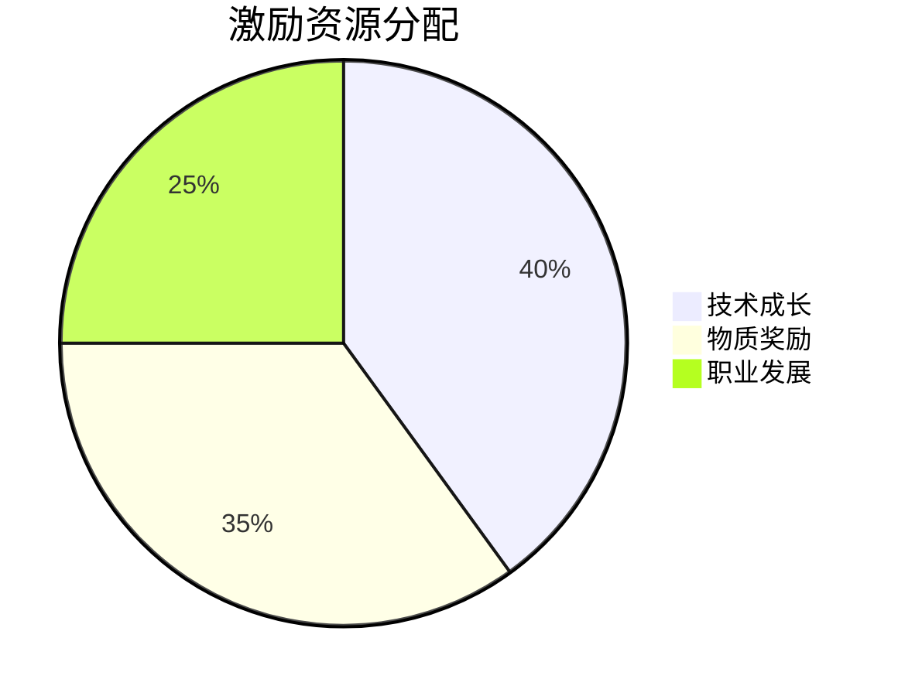
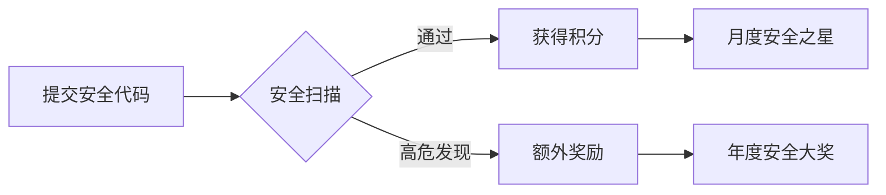
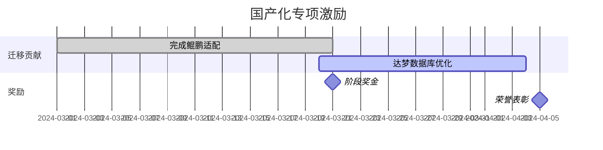
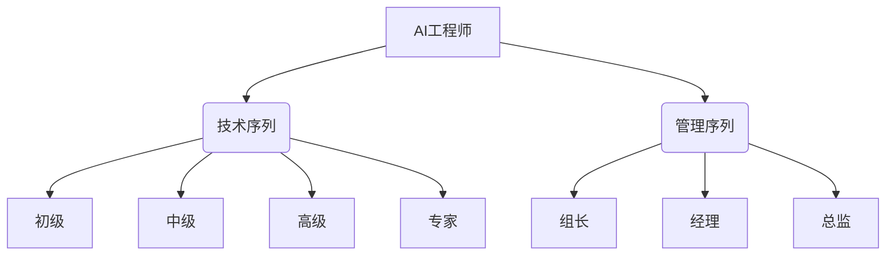

# AI人才激励与能力发展计划

## 一、三维激励体系


## 二、技能认证体系
### 1. 能力矩阵
| 等级 | 能力标准                          | 认证方式               | 权益                  |
|------|-----------------------------------|----------------------|-----------------------|
| L1   | 能完成基础代码生成与解释          | 在线测验+代码评审      | 开通高级AI工具权限      |
| L2   | 能优化复杂提示词并调试模型输出     | 案例答辩+效果评估      | 参与重点项目+季度奖金   |
| L3   | 具备模型微调与领域适配能力         | 项目实战+性能基准测试  | 技术序列晋升+带团队资格 |

### 2. 认证与工具链联动
```java
// 权限自动授予示例
public class AccessControl {
    public void grantPrivileges(User user) {
        if (user.getLevel() >= 2) {
            aiTool.enableFeature("secure-code-review");
            aiTool.setModelAccess("deepseek-33b-private");
        }
    }
}
```

## 三、贡献积分系统
### 1. 积分获取规则
| 贡献类型         | 积分规则                          | 示例场景                  |
|------------------|-----------------------------------|--------------------------|
| 代码质量贡献      | +1分/千行无缺陷代码                | 通过安全审查的AI生成代码    |
| 安全漏洞发现      | +50分/高危漏洞                    | 发现模型生成代码中的RCE漏洞 |
| 工具链改进        | +30分/被采纳的PR                  | 开发IDE插件安全检测功能     |
| 知识共享         | +10分/篇优质技术文档               | 编写《AI代码审计指南》      |

### 2. 积分兑换机制
```json
{
  "兑换目录": [
    {
      "item": "极客装备",
      "options": [
        {"name": "机械键盘", "points": 2000},
        {"name": "4K显示器", "points": 5000}
      ]
    },
    {
      "item": "学习资源",
      "options": [
        {"name": "国际会议通行证", "points": 8000},
        {"name": "专家1对1指导", "points": 3000}
      ]
    }
  ]
}
```

## 四、专项激励计划
### 1. 安全卫士计划


**安全奖励机制**：
- 连续3个月无安全事件：+15%季度奖金
- 发现高危漏洞：+5000元/例
- 提出安全工具改进：+2分/采纳建议

### 2. 国产化先锋项目


**奖励标准**：
- 主导组件迁移：+0.5%项目奖金池/组件
- 性能优化超基准：+30%超额收益分成
- 通过信创认证：团队旅游奖励

## 五、职业发展通道
### 1. 双序列晋升


### 2. 能力发展资源
```yaml
# 学习路径配置
learning_path:
  - stage: 初级
    courses:
      - "AI代码生成规范"
      - "安全编码基础"
    projects:
      - "工具类模块开发"
      
  - stage: 中级
    courses:
      - "提示词工程"
      - "模型微调实战"
    projects:
      - "核心服务开发"
```

## 六、团队活力计划
### 1. 创新大赛机制
```python
def competition_scoring(project):
    score = 0.4 * project.innovation + \
            0.3 * project.tech_depth + \
            0.2 * project.business_value + \
            0.1 * team_collaboration
    return score
```

**年度赛事**：
- AI代码质量锦标赛（Q2）
- 极客马拉松（Q4）
- 安全攻防演练（Q3）

### 2. 知识共享激励
| 贡献类型       | 奖励机制                          |
|----------------|-----------------------------------|
| 技术文章       | 阅读量每1k +10分，最高500分        |
| 内部培训       | 每小时+200分，满意度>90%额外+50%  |
| 开源项目       | Star数每100 +50分                 |

---
**附件**：
1. [技能认证考试大纲](/exams/ai-engineer-cert.md)
2. [积分管理系统API文档](/apis/point-system-v1.yaml)
3. [年度赛事日历](/calendar/2024-competitions.ics)

**版本控制**：
- v1.2 2024-03-25 增加国产化专项激励
- v1.1 2024-03-22 完善安全卫士计划
- v1.0 2024-03-20 初始版本 