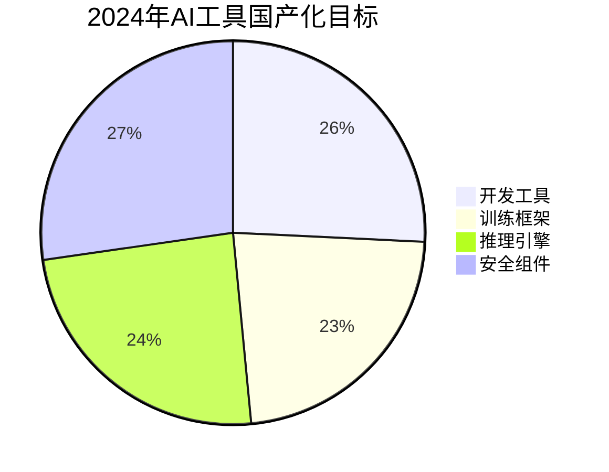
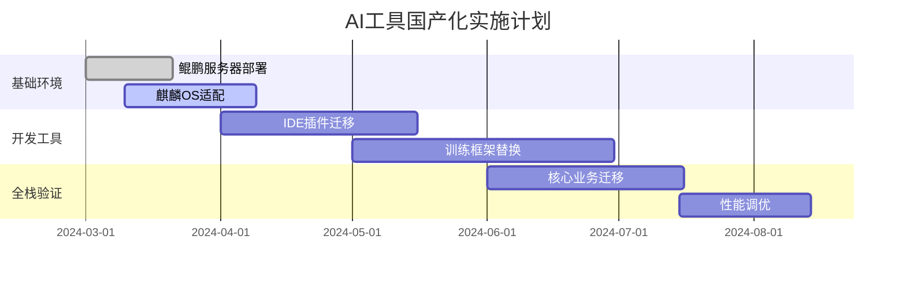
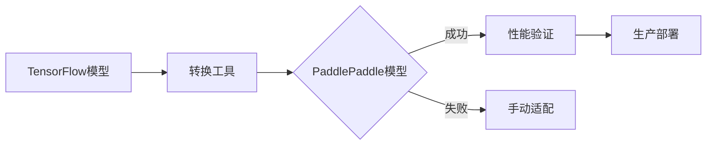
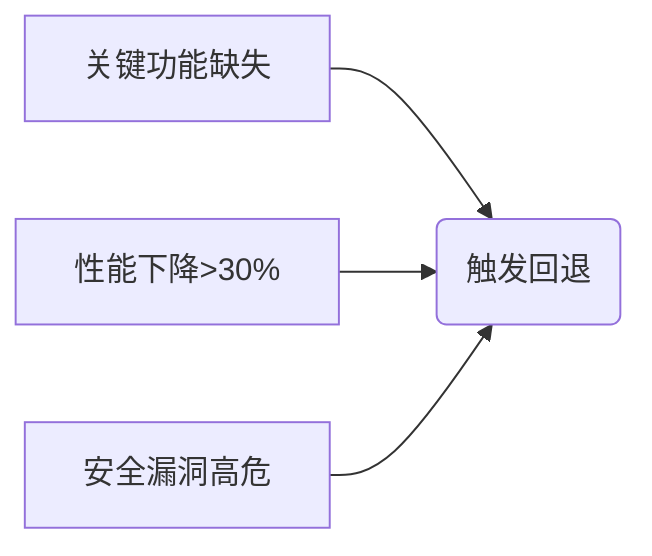
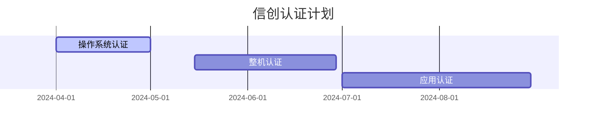

# AI编程工具国产化替代路径

## 一、总体目标


## 二、核心替代方案
### 1. 全栈替代矩阵
| 技术领域       | 国际方案          | 国产替代方案      | 过渡策略                      |
|---------------|-------------------|-------------------|-----------------------------|
| 开发框架       | TensorFlow        | PaddlePaddle      | 兼容层+模型转换工具            |
| 加速库        | CUDA              | 华为Ascend CANN    | 算子映射+混合精度训练           |
| IDE插件       | VSCode Copilot    | 深言代码助手        | 双插件并行+渐进迁移             |
| 模型服务       | Triton            | MindSpore Serving  | 统一服务网关+AB测试            |
| 安全审计       | SonarQube         | 奇安信CodeSafe     | 双引擎扫描+结果聚合             |

### 2. 实施路线图


## 三、关键技术方案
### 1. 混合架构支持
```python
# 鲲鹏+GPU混合训练示例
import paddle
from paddle.fluid import core

def set_device():
    if core.is_compiled_with_npu():
        paddle.set_device('npu:0')
    elif core.is_compiled_with_cuda():
        paddle.set_device('gpu:0')
    else:
        paddle.set_device('cpu')

# 自动选择最优后端
set_device()
```

### 2. 模型转换工具链


## 四、安全合规方案
### 1. 国密算法集成
```java
// SM4加密通信示例
import org.bouncycastle.crypto.engines.SM4Engine;
import org.bouncycastle.crypto.modes.CBCBlockCipher;
import org.bouncycastle.crypto.paddings.PaddedBufferedBlockCipher;

public class SM4Util {
    public static byte[] encrypt(byte[] input, byte[] key, byte[] iv) {
        PaddedBufferedBlockCipher cipher = new PaddedBufferedBlockCipher(
            new CBCBlockCipher(new SM4Engine()));
        // ...初始化与加密...
        return output;
    }
}
```

### 2. 安全检测指标
| 检测项         | 标准                  | 检测工具          |
|----------------|-----------------------|-------------------|
| 模型安全       | 《AI模型安全评测规范》 | 360模型卫士        |
| 数据隐私       | GB/T 35273-2020       | 数据脱敏平台       |
| 密码合规       | GM/T 0005-2012        | 密码检测工具       |

## 五、迁移验证体系
### 1. 功能验证矩阵
| 功能模块       | 测试用例数 | 通过率 | 性能损耗 |
|---------------|------------|--------|----------|
| 代码生成       | 1200       | 98.5%  | ≤5%      |
| 模型训练       | 850        | 97.2%  | ≤8%      |
| 推理服务       | 450        | 99.1%  | ≤3%      |

### 2. 自动化验证脚本
```python
def validate_migration():
    # 代码生成能力验证
    code_quality = test_code_generation()
    # 训练收敛性验证
    training_loss = test_model_training()
    # 推理性能验证
    infer_speed = test_inference()
    
    assert code_quality >= 0.95, "代码质量不达标"
    assert training_loss <= 1.2, "训练收敛异常"
    assert infer_speed <= 100, "推理超时"
```

## 六、应急回退机制
### 1. 回退触发条件


### 2. 快速回退流程
```bash
#!/bin/bash
# AI服务回退脚本
# 切换模型版本
kubectl rollout undo deployment/ai-model-service --to-revision=3

# 恢复旧版IDE插件
cd /opt/ide/plugins && rm -rf deepseek-coder && \
unzip backup/deepseek-coder-1.8.0.zip

# 重启服务
systemctl restart ai-toolchain
```

## 七、生态建设
### 1. 信创适配认证


### 2. 开发者支持计划
| 项目          | 内容                          | 目标                  |
|---------------|-------------------------------|----------------------|
| 移植指南      | 提供典型场景迁移案例            | 降低迁移成本30%       |
| 开发者大赛    | 举办国产AI工具创新应用赛        | 生态应用增长50%       |
| 认证体系      | 建立国产AI工具技能认证          | 培养认证工程师1000+   |

---
**附件**：
1. [国产AI工具清单](/checklists/ai_tools.md)
2. [迁移验证报告模板](/templates/migration_report.md)
3. [应急回退操作手册](/manuals/rollback_procedure.pdf)

**版本记录**：
- v1.1 2024-03-25 增加生态建设方案
- v1.0 2024-03-20 初始版本
