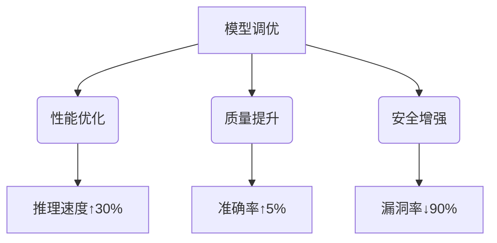
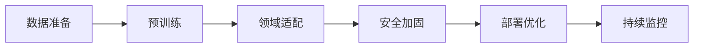
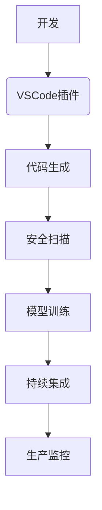

# AI模型调优与生态整合手册

## 一、调优目标体系


## 二、核心调优流程
### 1. 全生命周期调优


### 2. 调优阶段对照表
| 阶段         | 核心任务                  | 关键指标                | 工具支持          |
|--------------|--------------------------|-------------------------|------------------|
| 数据准备     | 数据清洗与增强            | 数据质量评分≥8.5        | DeepClean        |
| 预训练       | 基础能力构建              | Loss≤1.2               | PaddlePaddle     |
| 领域适配     | 领域知识注入              | 领域准确率≥92%          | PromptEngineer   |
| 安全加固     | 对抗训练与漏洞修复         | 安全测试通过率100%       | ModelSecKit      |
| 部署优化     | 量化与加速                | 推理延迟≤200ms          | Ascend Toolkit   |

## 三、领域适配方案
### 1. 领域知识注入
```python
def domain_adaptation(model, dataset):
    # 1. 领域词表扩展
    model.resize_token_embeddings(len(tokenizer))
    # 2. 领域数据训练
    trainer = Trainer(
        model=model,
        train_dataset=dataset,
        args=TrainingArguments(output_dir='./adaptation')
    )
    trainer.train()
    # 3. 领域评估
    accuracy = evaluate(model, domain_testset)
    return model, accuracy
```

### 2. 多领域适配策略
| 领域         | 数据增强方法              | 特殊处理                  | 预期提升 |
|--------------|--------------------------|--------------------------|----------|
| 金融         | 财报数据合成              | 数字敏感性处理            | +7%      |
| 医疗         | 医学术语替换              | 隐私保护强化              | +5%      |
| 法律         | 法条关联分析              | 条款准确性验证            | +6%      |

## 四、安全加固方案
### 1. 对抗训练流程
```mermaid
sequenceDiagram
    参与者 原始模型
    参与者 对抗样本生成器
    参与者 加固模型
    
    原始模型->>对抗样本生成器: 提供预测结果
    对抗样本生成器->>加固模型: 注入对抗样本
    加固模型->>原始模型: 反馈防御效果
    loop 直到通过安全测试
        原始模型->>加固模型: 参数更新
    end
```

### 2. 安全测试用例库
```yaml
- name: SQL注入测试
  desc: 检测生成代码中的SQL注入漏洞
  input: "用户输入：' OR 1=1 --"
  expect: 应过滤特殊字符
  
- name: XSS攻击测试
  desc: 验证HTML转义处理
  input: "<script>alert(1)</script>"
  expect: 输出转义后的字符串
```

## 五、性能优化方案
### 1. 量化压缩技术
```python
from paddleslim import QAT

quant_model = QAT(
    model,
    weight_bits=8,
    activation_bits=8,
    quantizable_op_type=['conv2d', 'linear']
)
quant_model.eval()
quant_model.quantize()
quant_model.save_quantized_model('./quant_models')
```

### 2. 加速方案对比
| 技术         | 压缩率 | 精度损失 | 推理加速 | 适用场景          |
|--------------|--------|----------|----------|------------------|
| FP16量化     | 50%    | <1%      | 2x       | GPU环境          |
| 动态剪枝     | 60%    | 2-3%     | 1.5x     | 高稀疏模型        |
| 知识蒸馏     | -      | <0.5%    | 1.2x     | 模型轻量化        |

## 六、监控与迭代
### 1. 生产环境监控
```json
{
  "monitoring": {
    "performance": {
      "tps": {"threshold": 1000, "severity": "critical"},
      "latency": {"threshold": 200, "severity": "warning"}
    },
    "quality": {
      "accuracy": {"threshold": 0.95, "window": "24h"},
      "error_rate": {"threshold": 0.01}
    }
  }
}
```

### 2. 持续学习框架
```python
class ContinuousLearner:
    def __init__(self, model):
        self.model = model
        self.buffer = DataBuffer(capacity=10000)
    
    def online_learn(self, new_data):
        self.buffer.add(new_data)
        if len(self.buffer) >= 1000:
            batch = self.buffer.sample(256)
            self.model.partial_fit(batch)
            
    def detect_drift(self, validation_set):
        old_acc = self.model.score(validation_set)
        new_acc = self.model.score(self.buffer)
        return abs(new_acc - old_acc) > 0.05
```

## 七、生态整合方案
### 1. 工具链集成


### 2. 知识库建设
| 知识类型     | 存储形式                | 更新机制                  | 应用场景          |
|--------------|------------------------|--------------------------|------------------|
| 代码片段     | 向量数据库              | 自动索引新提交代码         | 代码补全          |
| 最佳实践     | 图数据库                | 人工审核+自动关联          | 提示词优化        |
| 漏洞模式     | 规则引擎                | 安全事件自动提取           | 安全扫描          |

---
**附录**：
1. [调优参数速查表](/appendix/tuning_params.md)
2. [安全测试用例库](/testcases/security_cases.yaml)
3. [性能优化工具指南](/manuals/optimization_tools.pdf)

**版本记录**：
- v1.1 2024-03-25 增加生态整合方案
- v1.0 2024-03-20 初始版本
