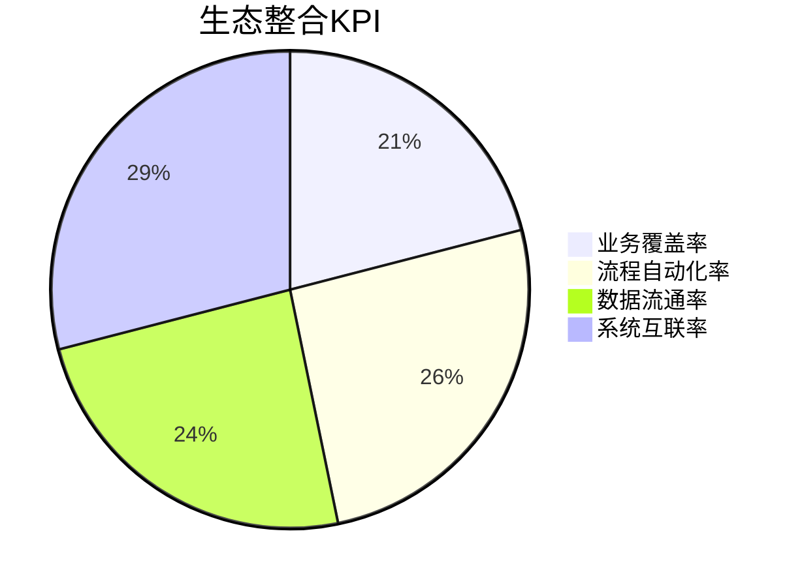
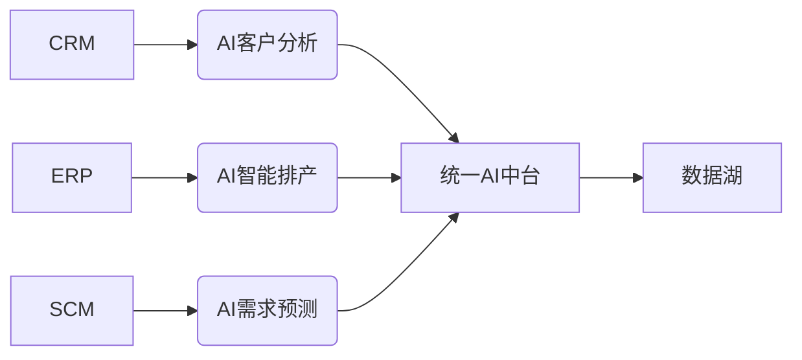
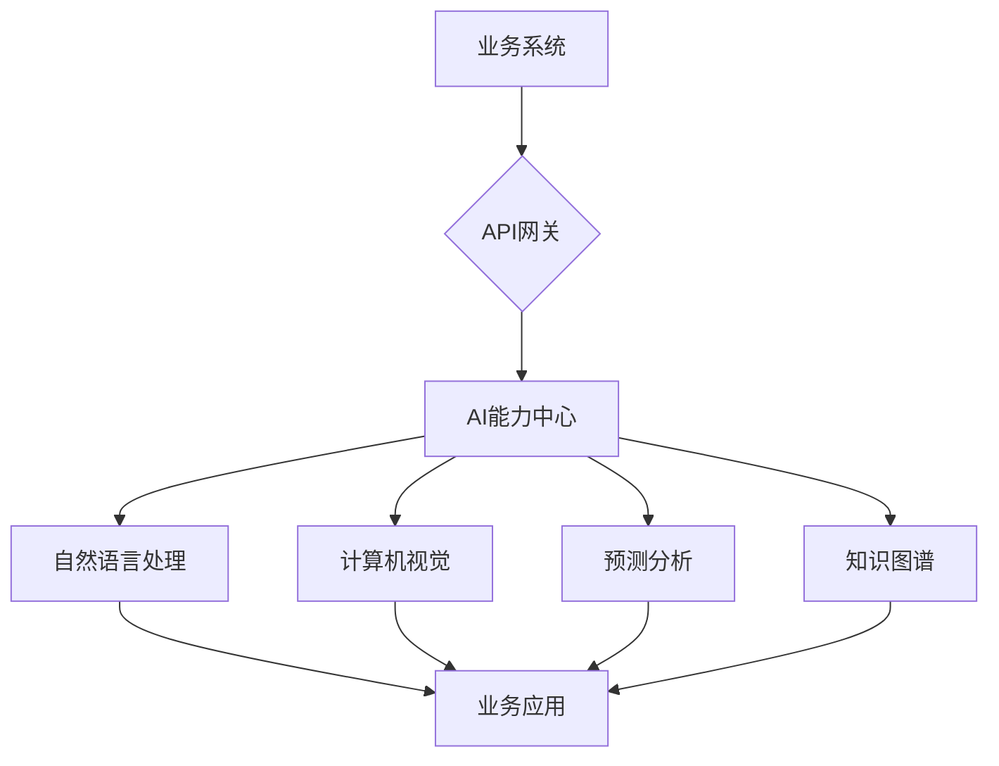
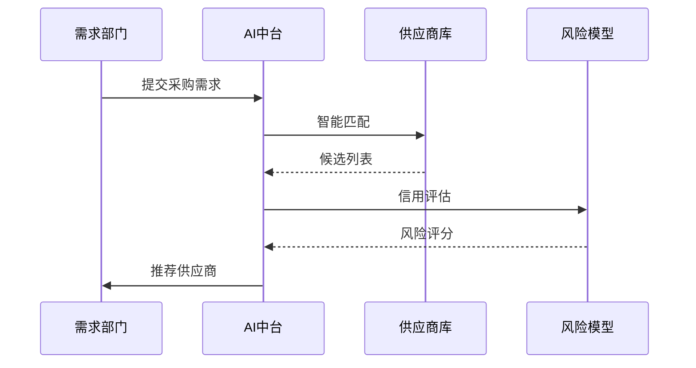
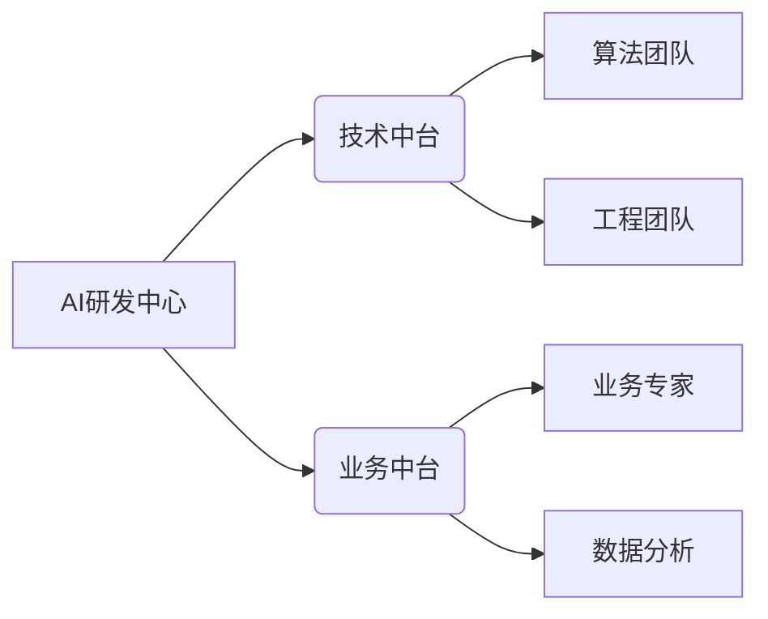
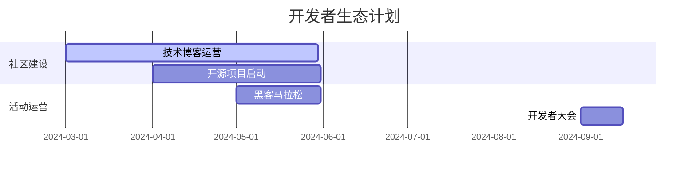
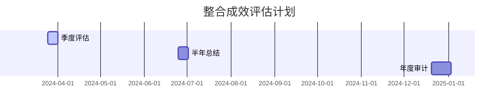

# AI与公司生态整合方案

## 一、整合目标


## 二、核心整合领域
### 1. 业务系统整合


### 2. 技术栈整合
| 系统类型       | 整合方式                  | AI赋能点                | 负责人   |
|---------------|--------------------------|------------------------|----------|
| 财务系统       | 通过API对接AI发票识别       | 自动化凭证生成           | 张伟     |
| 生产系统       | 物联网+AI质检              | 实时缺陷检测             | 李莉     |
| 人力资源       | 自然语言处理集成           | 智能简历筛选             | 王强     |
| 客户服务       | 知识图谱+对话机器人         | 24小时智能客服           | 陈晨     |

## 三、技术实施方案
### 1. 统一AI中台架构


### 2. 数据流通规范
```json
{
  "dataFlow": {
    "source": "ERP",
    "target": "AI中台",
    "format": "Avro",
    "schema": "erp.production.v1",
    "security": {
      "encryption": "SM4",
      "masking": ["price", "cost"]
    },
    "qps": 1000
  }
}
```

## 四、流程再造方案
### 1. 智能采购流程


### 2. 自动化审计流程
```python
def ai_audit(invoice_data):
    # 发票识别
    invoice_info = ocr(invoice_data)
    # 合规检查
    compliance = check_compliance(invoice_info)
    # 风险预测
    risk_score = predict_risk(invoice_info)
    # 生成报告
    report = generate_report(invoice_info, compliance, risk_score)
    return report
```

## 五、组织变革计划
### 1. 能力中心建设


### 2. 人员转型路径
| 原岗位       | 转型方向                | 培训内容                  | 时间周期 |
|-------------|------------------------|--------------------------|----------|
| 传统开发     | AI工程化               | 模型部署+性能优化          | 3个月    |
| 业务分析     | 数据产品经理            | 数据分析+AI产品设计        | 2个月    |
| 运维工程师   | AIOps工程师            | 智能监控+自动化运维        | 4个月    |

## 六、生态合作计划
### 1. 合作伙伴矩阵
| 合作类型     | 代表企业               | 合作内容                  | KPI       |
|-------------|-----------------------|--------------------------|-----------|
| 技术供应商   | 华为、商汤             | 算力支持+模型优化          | 性能提升30%|
| 行业方案商   | 用友、金蝶             | 业务系统AI改造             | 覆盖5大系统|
| 科研机构     | 清华大学AI研究院       | 前沿技术研究               | 专利10+   |

### 2. 开发者生态建设


## 七、成效评估体系
### 1. 评估指标
```math
\begin{aligned}
\text{整合度} &= 0.4 \times \frac{\text{已整合系统}}{\text{总系统}} + 0.6 \times \frac{\text{自动化流程数}}{\text{总流程数}} \\
\text{ROI} &= \frac{\text{年度成本节约}}{\text{AI投入}} \times 100\% \\
\text{创新指数} &= \log_{10}(\text{专利数} + \text{新产品数} \times 2)
\end{aligned}
```

### 2. 评估周期


---
**附件**：
1. [系统对接API规范](/specs/api-integration.md)
2. [数据安全传输指南](/security/data-flow.md)
3. [生态合作白皮书](/whitepapers/ecosystem.pdf)

**版本记录**：
- v1.1 2024-03-25 增加组织变革计划
- v1.0 2024-03-20 初始版本
