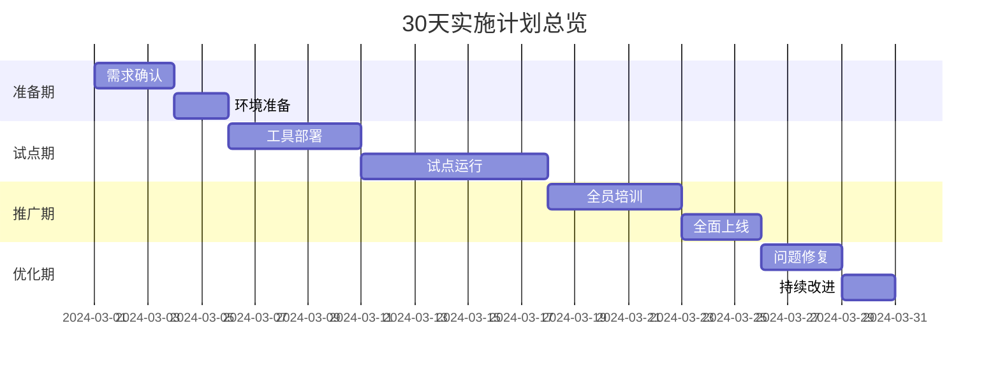

# 30天AI工具实施路线图

## 总体计划


## 每日详细计划
### 第一周：准备与部署
| 日期       | 里程碑                  | 关键任务                                                                 | 交付物                  |
|------------|-------------------------|--------------------------------------------------------------------------|-------------------------|
| 2024-03-01 | 需求确认                | 1. 与各业务部门确认AI工具需求<br>2. 确定优先试点项目                       | 需求确认书              |
| 2024-03-04 | 环境准备                | 1. 搭建开发测试环境<br>2. 部署基础监控体系                                 | 环境检查清单            |
| 2024-03-06 | 工具部署                | 1. 安装IDE插件<br>2. 配置私有模型服务                                      | 部署验收报告            |

### 第二周：试点运行
| 日期       | 里程碑                  | 关键任务                                                                 | 交付物                  |
|------------|-------------------------|--------------------------------------------------------------------------|-------------------------|
| 2024-03-11 | 试点启动                | 1. 前端/数据/测试各1个试点项目启动<br>2. 建立问题反馈通道                  | 试点项目列表            |
| 2024-03-13 | 中期检查                | 1. 收集使用反馈<br>2. 优化提示词模板                                       | 优化建议报告            |
| 2024-03-15 | 安全加固                | 1. 部署代码扫描工具<br>2. 实施首次安全审计                                 | 安全审计报告            |

### 第三周：全面推广
| 日期       | 里程碑                  | 关键任务                                                                 | 交付物                  |
|------------|-------------------------|--------------------------------------------------------------------------|-------------------------|
| 2024-03-18 | 全员培训                | 1. 开展3场技能培训<br>2. 发布操作手册                                     | 培训完成率报表          |
| 2024-03-21 | 系统集成                | 1. 对接CI/CD流水线<br>2. 实现Git提交自动扫描                               | 集成测试报告            |
| 2024-03-22 | 激励启动                | 1. 上线贡献积分系统<br>2. 发布首周激励榜单                                 | 积分系统截图            |

### 第四周：优化改进
| 日期       | 里程碑                  | 关键任务                                                                 | 交付物                  |
|------------|-------------------------|--------------------------------------------------------------------------|-------------------------|
| 2024-03-25 | 问题修复                | 1. 修复TOP5高频问题<br>2. 优化模型微调策略                                | 问题修复清单            |
| 2024-03-28 | 效果评估                | 1. 生成效率分析<br>2. 安全事件统计                                        | 效果评估报告            |
| 2024-03-29 | 持续改进                | 1. 建立优化需求池<br>2. 制定下月计划                                      | 二期规划草案            |

## 关键会议安排
```mermaid
gantt
    title 关键会议计划
    dateFormat  YYYY-MM-DD
    启动会 :crit, 2024-03-01, 1d
    日站会 :active, 2024-03-04, 15d
    周例会 : 2024-03-08, 2024-03-15, 2024-03-22, 2024-03-29
    总结会 :crit, 2024-03-29, 1d
```

## 风险应对策略
| 风险类型     | 应对措施                                                                 | 负责人   |
|--------------|--------------------------------------------------------------------------|----------|
| 员工抵触     | 1. 开展内部宣传<br>2. 设置早期采纳者奖励                                   | 王伟     |
| 性能不足     | 1. 预备备用算力资源<br>2. 建立降级方案                                     | 李莉     |
| 安全漏洞     | 1. 实施灰度发布<br>2. 准备快速回滚机制                                     | 张强     |

---
**附件**：
1. [每日任务checklist](/checklists/daily_tasks.md)
2. [会议纪要模板](/templates/meeting_minutes.md)
3. [风险登记册](/risk/risk_register.xlsx)

**版本记录**：
- v1.1 2024-03-25 增加风险应对策略
- v1.0 2024-03-20 初始版本 