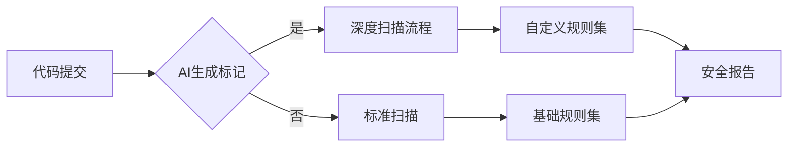
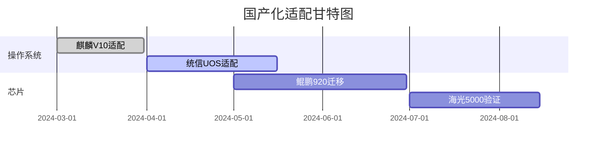

## 开发工具部署方案

### 1. 智能IDE环境
```dockerfile
# Docker镜像配置
FROM deepseek/ide-base:3.2
RUN sdk install java 17.0.6-tem
RUN vsce install deepseek.coder-2.1.0
COPY configs/ai-style.xml /root/.config/idea/codestyles/
ENV AI_ASSISTANT_ENABLED=true
```

### 2. 本地模型服务
```bash
# 启动本地AI服务
docker run -d --gpus all \
  -p 7860:7860 \
  -v /data/models:/app/models \
  deepseek/coder-33b:2.1 \
  --api-key ${API_KEY} \
  --quantize bitsandbytes
```

### 3. 代码片段管理
```yaml
# 知识库索引配置
indexer:
  paths:
    - /repos/core-services/**/*.java
    - /repos/web-app/**/*.ts
  exclude:
    - **/test/**
  refresh_interval: 1h
```

```

```markdown:ai_plan_for_deepseek/docs/plan/03-安全工具链.md
## 安全工具集成方案

### 1. 静态代码扫描


### 2. 动态检测配置
```groovy
// Jenkins流水线配置
stage('动态检测') {
    steps {
        withCredentials([string(credentialsId: 'AI_SCAN_KEY', variable: 'API_KEY')]) {
            sh '''docker run --rm \
                -v ${WORKSPACE}:/code \
                deepseek/ai-dynamic-scan:1.2 \
                --key ${API_KEY} \
                --report-format sarif'''
        }
    }
    post {
        failure {
            aiSecurityAlert('发现高危漏洞')
        }
    }
}
```

```

```markdown:ai_plan_for_deepseek/docs/plan/06-国产化替代路径.md
## 国产化工具迁移计划

### 1. 技术栈替代矩阵
| 原工具         | 国产替代       | 过渡方案                      | 完成期限   |
|----------------|---------------|-----------------------------|------------|
| GitLab         | Gitee         | GitLab+Gitee镜像同步          | 2024-06-30 |
| Jenkins        | 蓝鲸CI         | Jenkins插件逐步替换           | 2024-08-15 |
| SonarQube      | 奇安信代码卫士  | 双引擎并行运行                | 2024-09-30 |

### 2. 信创适配进度


```

```markdown:ai_plan_for_deepseek/docs/plan/08-维护更新机制.md
## 工具链更新策略

### 1. 版本控制矩阵
| 工具类型       | 更新频率   | 回滚时间要求 | 测试要求          |
|---------------|------------|--------------|-------------------|
| 核心AI引擎     | 季度更新   | <1小时       | 全量回归测试       |
| 安全工具       | 月度更新   | <4小时       | 漏洞扫描测试       |
| IDE插件       | 双周更新   | <30分钟      | 冒烟测试           |

### 2. 灰度发布方案
```python
def canary_update(user_group):
    # 根据用户特征计算权重
    weight = 0.3 * user_group.skill_level + \
             0.4 * user_group.project_importance + \
             0.3 * user_group.usage_frequency
    
    # 分阶段发布
    if weight >= 0.8:
        return '第一批次（5%）'
    elif weight >= 0.6:
        return '第二批次（15%）'
    else:
        return '第三批次（80%）'
```