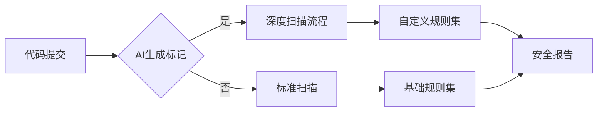

## 安全工具集成方案

### 1. 静态代码扫描


### 2. 动态检测配置
```groovy
// Jenkins流水线配置
stage('动态检测') {
    steps {
        withCredentials([string(credentialsId: 'AI_SCAN_KEY', variable: 'API_KEY')]) {
            sh '''docker run --rm \
                -v ${WORKSPACE}:/code \
                deepseek/ai-dynamic-scan:1.2 \
                --key ${API_KEY} \
                --report-format sarif'''
        }
    }
    post {
        failure {
            aiSecurityAlert('发现高危漏洞')
        }
    }
}