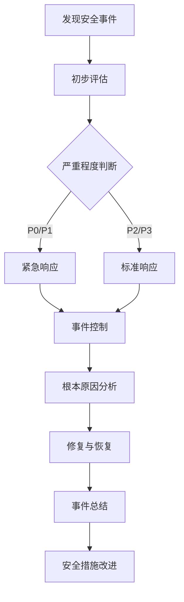

# 安全与合规

## 1. 安全总则

### 1.1 目的与适用范围

本文档旨在规范公司AI编程工具的安全使用和合规管理，确保AI技术应用符合相关法律法规和公司安全标准。适用于公司内所有使用AI编程工具的人员和项目。

### 1.2 安全责任体系

| 角色 | 主要职责 |
|------|--------|
| 安全合规委员会 | 制定安全策略，审批高风险AI应用 |
| 部门安全负责人 | 执行安全策略，监督本部门AI工具使用 |
| AI工具管理员 | 负责工具安全配置，权限管理 |
| 开发人员 | 遵守安全规范，报告安全问题 |
| 安全审计人员 | 定期进行安全审计和评估 |

## 2. 数据安全

### 2.1 数据分类与保护

#### 2.1.1 数据分类标准

| 数据级别 | 定义 | 示例 | 保护要求 |
|---------|------|------|--------|
| L0 - 公开数据 | 可公开访问的数据 | 公开API文档、开源代码 | 基本保护 |
| L1 - 内部数据 | 仅限公司内部使用 | 内部开发文档、测试数据 | 访问控制 |
| L2 - 敏感数据 | 需要特殊保护的数据 | 业务逻辑、算法实现 | 加密存储，访问审计 |
| L3 - 机密数据 | 高度敏感的核心数据 | 用户个人信息、核心算法 | 强加密，严格访问控制，全程审计 |

#### 2.1.2 数据处理原则

- **最小化原则**：仅收集和处理必要的数据
- **匿名化原则**：尽可能对数据进行匿名化处理
- **本地化原则**：敏感数据优先本地处理，避免外传
- **生命周期管理**：明确数据的收集、使用、存储和销毁流程

### 2.2 AI训练数据安全

#### 2.2.1 训练数据管理

- 建立训练数据目录，记录数据来源、用途和责任人
- 对训练数据进行安全等级划分，实施相应的保护措施
- 定期审查训练数据，确保合规使用

#### 2.2.2 数据预处理安全

- 实施数据脱敏和匿名化处理
- 使用安全的数据增强和转换方法
- 记录数据预处理流程，确保可追溯性

```python
# 数据脱敏示例
from cryptography.fernet import Fernet
import pandas as pd

def anonymize_data(df, sensitive_columns):
    """对敏感数据进行匿名化处理
    
    Args:
        df: 包含敏感数据的DataFrame
        sensitive_columns: 需要匿名化的列名列表
        
    Returns:
        处理后的DataFrame
    """
    # 生成加密密钥
    key = Fernet.generate_key()
    cipher = Fernet(key)
    
    # 复制DataFrame以避免修改原始数据
    df_safe = df.copy()
    
    # 对敏感列进行加密或哈希处理
    for col in sensitive_columns:
        if col in df.columns:
            # 将列值转换为字符串并加密
            df_safe[col] = df[col].astype(str).apply(
                lambda x: cipher.encrypt(x.encode()).decode()
            )
    
    # 记录处理日志
    log_data_processing("anonymize", sensitive_columns)
    
    return df_safe
```

### 2.3 代码与模型安全

#### 2.3.1 代码安全

- 实施代码安全扫描，检测潜在漏洞
- 避免在代码中硬编码敏感信息（API密钥、密码等）
- 使用安全的依赖管理，定期更新组件版本

#### 2.3.2 模型安全

- 防止模型逆向工程和窃取
- 实施模型加密和访问控制
- 防范模型投毒和对抗性攻击

```python
# 模型加密存储示例
import os
import torch
from cryptography.fernet import Fernet

def secure_save_model(model, path, metadata=None):
    """安全地保存模型
    
    Args:
        model: PyTorch模型
        path: 保存路径
        metadata: 模型元数据
    """
    # 创建临时文件保存模型
    temp_path = path + ".tmp"
    torch.save({
        'model_state_dict': model.state_dict(),
        'metadata': metadata,
        'timestamp': datetime.now().isoformat(),
        'checksum': compute_model_checksum(model),
    }, temp_path)
    
    # 加密模型文件
    key = get_or_create_encryption_key()
    cipher = Fernet(key)
    
    with open(temp_path, 'rb') as f:
        encrypted_data = cipher.encrypt(f.read())
    
    # 写入加密后的模型文件
    with open(path, 'wb') as f:
        f.write(encrypted_data)
    
    # 删除临时文件
    os.remove(temp_path)
    
    # 记录模型保存日志
    log_model_operation("save", path, model.__class__.__name__)
```

## 3. AI工具安全使用

### 3.1 工具安全配置

#### 3.1.1 基本安全配置

- 使用最新版本的AI工具，及时应用安全补丁
- 配置适当的资源限制，防止资源耗尽攻击
- 启用审计日志，记录关键操作

#### 3.1.2 访问控制配置

- 实施最小权限原则，根据角色分配权限
- 使用多因素认证保护关键工具访问
- 定期审查和更新权限设置

### 3.2 云端AI服务安全

#### 3.2.1 云服务选择标准

- 评估云服务提供商的安全合规认证（如ISO 27001、SOC 2）
- 确认数据存储位置和跨境数据传输合规性
- 审查服务条款和数据处理协议

#### 3.2.2 云端AI服务安全措施

- 使用加密传输和存储数据
- 配置网络安全组和访问控制列表
- 监控API调用和资源使用情况
- 实施定期安全评估和渗透测试

### 3.3 本地AI工具安全

#### 3.3.1 开发环境安全

- 隔离AI开发环境，限制外部网络访问
- 加密本地存储的敏感数据和模型
- 使用安全的包管理和依赖控制

#### 3.3.2 部署环境安全

- 使用容器化技术隔离AI应用
- 实施网络分段，限制AI系统的网络访问
- 配置资源限制，防止资源耗尽

## 4. 合规管理

### 4.1 法律法规遵从

#### 4.1.1 适用法规清单

| 法规名称 | 适用范围 | 主要要求 | 合规措施 |
|---------|---------|---------|--------|
| 《网络安全法》 | 网络运营者 | 网络安全等级保护、个人信息保护 | 实施等保测评，建立个人信息保护机制 |
| 《数据安全法》 | 数据处理活动 | 数据分类分级、重要数据保护 | 建立数据分类分级制度，保护重要数据 |
| 《个人信息保护法》 | 个人信息处理 | 告知同意、数据最小化 | 实施个人信息保护影响评估，获取明确同意 |
| 《算法推荐管理规定》 | 算法推荐服务 | 算法透明度、用户选择权 | 提供算法说明，允许用户关闭个性化推荐 |
| 《深度合成管理规定》 | 深度合成服务 | 标识义务、内容审核 | 对合成内容进行标识，建立内容审核机制 |

#### 4.1.2 行业特定合规要求

- 金融行业：遵守金融科技创新监管要求
- 医疗行业：符合医疗数据安全和患者隐私保护规定
- 教育行业：保护未成年人个人信息

### 4.2 伦理合规

#### 4.2.1 AI伦理原则

- **公平性**：确保AI系统不产生或放大偏见和歧视
- **透明性**：AI决策过程应当可解释、可理解
- **问责制**：明确AI系统的责任归属
- **隐私保护**：尊重用户隐私，最小化数据收集
- **安全可靠**：确保AI系统的安全性和可靠性

#### 4.2.2 伦理审查流程

1. **项目初审**：项目立项阶段进行伦理风险初步评估
2. **伦理评估**：对高风险AI应用进行详细的伦理影响评估
3. **专家审查**：由伦理委员会进行专业审查
4. **持续监控**：项目实施过程中持续监控伦理风险
5. **定期复审**：定期对已部署的AI系统进行伦理复审

### 4.3 知识产权管理

#### 4.3.1 AI生成内容的知识产权

- 明确AI生成内容的知识产权归属
- 建立AI生成内容的审核和标记机制
- 避免侵犯第三方知识产权

#### 4.3.2 开源合规

- 遵守开源许可证要求
- 建立开源组件使用审批流程
- 维护开源组件清单和许可证信息

## 5. 安全事件管理

### 5.1 安全事件分类

| 事件级别 | 定义 | 示例 | 响应时间要求 |
|---------|------|------|------------|
| P0 - 紧急 | 严重影响业务，造成数据泄露 | 敏感数据大规模泄露 | 立即（<1小时） |
| P1 - 高危 | 影响核心功能，存在安全隐患 | AI系统被未授权访问 | 4小时内 |
| P2 - 中危 | 影响部分功能，安全风险可控 | 非核心数据泄露 | 24小时内 |
| P3 - 低危 | 轻微影响，无实质安全风险 | 非敏感配置错误 | 72小时内 |

### 5.2 安全事件响应流程

1. **发现与报告**：及时发现并报告安全事件
2. **评估与分类**：评估事件影响，确定优先级
3. **遏制与消除**：采取措施控制事件影响
4. **恢复与验证**：恢复正常运行，验证安全性
5. **总结与改进**：分析事件原因，完善安全措施



### 5.3 安全演练

- 定期进行安全事件响应演练
- 模拟不同类型的安全事件场景
- 评估响应效果，优化响应流程

## 6. 安全审计与评估

### 6.1 常规安全审计

#### 6.1.1 审计范围与频率

| 审计类型 | 审计内容 | 频率 | 负责人 |
|---------|---------|------|-------|
| 代码安全审计 | 代码安全漏洞、敏感信息检查 | 每次提交/每周 | 安全开发负责人 |
| 配置安全审计 | 工具配置、权限设置检查 | 每月 | 工具管理员 |
| 数据安全审计 | 数据访问、处理合规性检查 | 每季度 | 数据安全负责人 |
| 综合安全审计 | 全面安全评估 | 每半年 | 安全合规委员会 |

#### 6.1.2 审计工具与方法

- 自动化代码扫描工具（如SonarQube、Fortify）
- 配置检查工具（如Chef InSpec、AWS Config）
- 渗透测试工具（如OWASP ZAP、Burp Suite）
- 人工审查和评估

### 6.2 AI特定安全评估

#### 6.2.1 模型安全评估

- 评估模型对抗性攻击的鲁棒性
- 检测模型后门和投毒风险
- 评估模型隐私泄露风险

#### 6.2.2 算法公平性评估

- 评估算法偏见和歧视风险
- 使用多样化的测试数据集
- 应用公平性指标（如统计平等、机会平等等）

```python
# 算法公平性评估示例
from aif360.metrics import BinaryLabelDatasetMetric
from aif360.datasets import BinaryLabelDataset

def evaluate_fairness(predictions, labels, protected_attribute):
    """评估模型预测的公平性
    
    Args:
        predictions: 模型预测结果
        labels: 真实标签
        protected_attribute: 受保护属性（如性别、年龄等）
        
    Returns:
        公平性评估指标
    """
    # 创建数据集
    dataset = BinaryLabelDataset(
        df=pd.DataFrame({
            'predictions': predictions,
            'labels': labels,
            'protected_attribute': protected_attribute
        }),
        label_names=['labels'],
        protected_attribute_names=['protected_attribute']
    )
    
    # 计算公平性指标
    metrics = BinaryLabelDatasetMetric(dataset, 
                                      unprivileged_groups=[{'protected_attribute': 0}],
                                      privileged_groups=[{'protected_attribute': 1}])
    
    # 统计平等差异（Statistical Parity Difference）
    spd = metrics.statistical_parity_difference()
    
    # 平均绝对得分差异（Mean Absolute Score Difference）
    masd = metrics.mean_difference()
    
    # 相等机会差异（Equal Opportunity Difference）
    eod = metrics.equal_opportunity_difference()
    
    return {
        'statistical_parity_difference': spd,
        'mean_absolute_score_difference': masd,
        'equal_opportunity_difference': eod
    }
```

## 7. 安全培训与意识

### 7.1 安全培训计划

| 培训类型 | 目标人群 | 内容 | 频率 |
|---------|---------|------|------|
| 基础安全培训 | 所有员工 | AI安全基础知识、安全意识 | 入职+每年 |
| 开发安全培训 | 开发人员 | 安全编码、漏洞防范 | 每半年 |
| 数据安全培训 | 数据处理人员 | 数据保护、隐私合规 | 每季度 |
| 高级安全培训 | 安全负责人 | 高级安全技术、风险管理 | 每年 |

### 7.2 安全文化建设

- 建立安全激励机制，奖励安全贡献
- 组织安全知识分享和研讨
- 开展安全竞赛和挑战活动
- 建立安全问题反馈渠道

## 8. 供应商安全管理

### 8.1 供应商安全评估

- 评估供应商安全控制措施和合规状况
- 审查供应商数据处理和保护政策
- 确认供应商安全事件响应能力

### 8.2 供应商安全协议

- 签订数据处理协议（DPA）
- 明确安全责任和义务
- 规定安全事件通知和处理流程
- 约定定期安全评估和审计权利

## 9. 安全合规文档管理

### 9.1 文档体系

| 文档类型 | 内容 | 更新频率 | 责任人 |
|---------|------|---------|-------|
| 安全策略 | 总体安全原则和要求 | 每年 | 安全合规委员会 |
| 安全标准 | 具体安全控制措施 | 每半年 | 安全负责人 |
| 操作指南 | 安全操作详细步骤 | 随技术变化 | 技术专家 |
| 记录表单 | 安全活动记录模板 | 按需 | 文档管理员 |

### 9.2 文档管理流程

- 文档创建和审批流程
- 文档版本控制和变更管理
- 文档访问控制和保密管理
- 文档定期审查和更新机制

## 10. 持续改进

### 10.1 安全指标监控

- 设立关键安全指标（KSI）
- 定期收集和分析安全数据
- 建立安全仪表盘，可视化安全状态

### 10.2 改进机制

- 定期安全评审会议
- 安全问题跟踪和解决机制
- 安全最佳实践分享和推广
- 安全技术和工具更新评估

## 附录

### 附录A：安全检查清单

#### AI开发安全检查清单

- [ ] 代码不包含硬编码的敏感信息
- [ ] 使用安全的API调用方式
- [ ] 实施输入验证和数据清洗
- [ ] 使用最新版本的依赖库
- [ ] 配置适当的访问控制
- [ ] 启用审计日志
- [ ] 实施错误处理和异常管理
- [ ] 进行安全测试（如模糊测试、渗透测试）

#### AI部署安全检查清单

- [ ] 使用安全的部署方式（如容器化）
- [ ] 配置网络安全控制
- [ ] 实施资源限制
- [ ] 配置监控和告警
- [ ] 建立备份和恢复机制
- [ ] 制定应急响应计划
- [ ] 进行安全漏洞扫描
- [ ] 实施安全更新机制

### 附录B：常见安全风险及对策

| 风险类型 | 风险描述 | 对策 |
|---------|---------|------|
| 数据泄露 | 敏感数据被未授权访问或窃取 | 数据加密、访问控制、数据脱敏 |
| 模型窃取 | AI模型被窃取或复制 | 模型加密、访问控制、水印技术 |
| 对抗性攻击 | 通过精心设计的输入欺骗AI系统 | 对抗训练、输入验证、异常检测 |
| 后门攻击 | 在模型中植入隐藏功能 | 模型审计、安全训练数据、异常检测 |
| 隐私泄露 | 从模型输出中推断训练数据 | 差分隐私、联邦学习、模型蒸馏 |

### 附录C：相关法规解读

#### 《个人信息保护法》要点

- 个人信息处理应当遵循合法、正当、必要和诚信原则
- 处理个人信息应当取得个人的同意
- 收集个人信息应当限于实现处理目的的最小范围
- 应当公开个人信息处理规则
- 应当确保个人信息的质量，避免因不准确、不完整对个人权益造成不利影响
- 应当采取必要措施确保个人信息安全

#### 《数据安全法》要点

- 建立数据分类分级保护制度
- 加强重要数据的保护
- 建立数据安全风险评估、报告、信息共享、监测预警机制
- 开展数据安全审计
- 建立健全数据安全应急处置机制