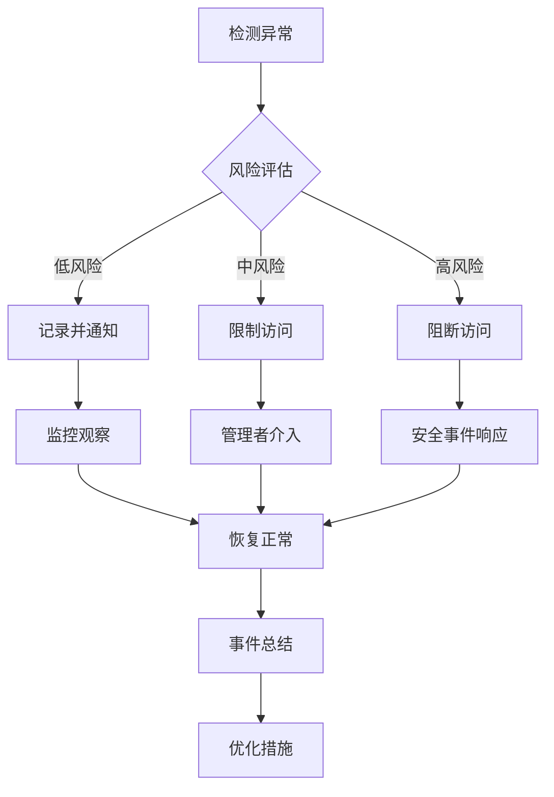

# 使用边界与权限管理

## 1. 总体原则

### 1.1 目的

本文档旨在明确公司AI编程工具的使用边界和权限管理规范，确保AI工具在合适的场景下被合理使用，防止滥用和误用，保障公司数据安全和业务稳定。

### 1.2 基本原则

- **最小权限原则**：仅授予用户完成工作所需的最小权限
- **职责分离原则**：关键操作需要多人参与，避免单点风险
- **可审计原则**：所有重要操作必须可追踪、可审计
- **分级管理原则**：根据数据敏感度和工具风险等级实施分级管理
- **动态调整原则**：根据业务需求和安全形势动态调整权限策略

## 2. AI工具使用场景边界

### 2.1 允许使用场景

| 场景类型 | 描述 | 适用工具 | 使用条件 |
|---------|------|---------|--------|
| 代码辅助 | 代码补全、生成、重构 | GitHub Copilot, Tabnine | 非核心算法、标准功能 |
| 问题解决 | 技术问题咨询、调试辅助 | ChatGPT, Claude | 不涉及敏感业务逻辑 |
| 文档生成 | 注释、文档、说明书生成 | ChatGPT, Notion AI | 通用文档、非保密内容 |
| 数据分析 | 数据处理、可视化、分析 | Jupyter + AI插件 | 脱敏数据、非核心业务数据 |
| 测试生成 | 单元测试、集成测试生成 | GitHub Copilot, TestGPT | 标准功能测试 |
| 学习培训 | 技术学习、知识获取 | 各类AI助手 | 公开技术、通用知识 |

### 2.2 限制使用场景

| 场景类型 | 限制原因 | 替代方案 | 例外条件 |
|---------|---------|---------|--------|
| 核心算法开发 | 知识产权保护、安全风险 | 人工开发、内部工具 | 经安全评估和特别授权 |
| 敏感数据处理 | 数据泄露风险、合规要求 | 内部安全工具、人工处理 | 使用私有部署且经安全评估 |
| 安全关键系统 | 系统安全风险、可靠性要求 | 传统开发方法、专用工具 | 经过严格测试和验证 |
| 关键决策系统 | 责任归属、可解释性要求 | 人工决策、规则引擎 | 仅作为辅助参考 |
| 实时控制系统 | 性能要求、稳定性要求 | 专用算法、确定性系统 | 非关键部分、有人工监督 |

### 2.3 禁止使用场景

| 场景类型 | 禁止原因 | 合规替代方案 |
|---------|---------|------------|
| 用户隐私数据处理 | 违反隐私法规、数据泄露风险 | 内部隐私计算系统、脱敏处理 |
| 金融交易决策 | 监管合规、责任风险 | 合规的金融决策系统、人工审核 |
| 安全审计与评估 | 安全风险、可靠性问题 | 专业安全工具、安全团队评估 |
| 关键基础设施控制 | 国家安全、重大风险 | 专用安全系统、人工控制 |
| 违规内容生成 | 法律风险、道德问题 | 内容审核系统、人工创作 |

## 3. 用户权限分级

### 3.1 用户角色定义

| 角色 | 描述 | 典型人员 | 权限级别 |
|------|------|---------|--------|
| 管理员 | AI工具管理与配置人员 | IT管理员、安全负责人 | L0 - 最高权限 |
| 高级开发者 | 核心技术人员 | 架构师、技术专家 | L1 - 高级权限 |
| 普通开发者 | 日常开发人员 | 程序员、测试工程师 | L2 - 标准权限 |
| 初级开发者 | 新入职或初级人员 | 初级程序员、实习生 | L3 - 基础权限 |
| 非技术人员 | 非开发岗位人员 | 产品经理、业务人员 | L4 - 有限权限 |

### 3.2 权限矩阵

| 功能/工具 | L0管理员 | L1高级开发者 | L2普通开发者 | L3初级开发者 | L4非技术人员 |
|----------|---------|------------|------------|------------|------------|
| AI工具管理配置 | ✓ | △(部分) | ✗ | ✗ | ✗ |
| 高级AI模型使用 | ✓ | ✓ | △(受限) | ✗ | ✗ |
| 代码生成与补全 | ✓ | ✓ | ✓ | ✓(审核) | ✗ |
| AI辅助问题解决 | ✓ | ✓ | ✓ | ✓ | ✓(基础) |
| 文档生成 | ✓ | ✓ | ✓ | ✓ | ✓ |
| 敏感数据处理 | ✓(审计) | △(授权) | ✗ | ✗ | ✗ |
| 模型训练与调优 | ✓ | ✓ | △(监督) | ✗ | ✗ |
| AI工具API访问 | ✓ | ✓ | ✓(限额) | △(严格限额) | ✗ |

> 图例：✓ 允许 | △ 有条件允许 | ✗ 不允许

## 4. 数据访问控制

### 4.1 数据分类与AI工具访问权限

| 数据分类 | 描述 | 示例 | AI工具访问权限 |
|---------|------|------|---------------|
| 公开数据 | 可公开获取的数据 | 开源代码、公开API | 所有用户可访问 |
| 内部数据 | 公司内部使用数据 | 内部文档、测试数据 | L0-L3用户可访问 |
| 敏感数据 | 需要保护的业务数据 | 业务逻辑、客户信息 | 仅L0-L1用户授权访问 |
| 机密数据 | 核心机密数据 | 核心算法、战略规划 | 禁止AI工具访问 |

### 4.2 数据脱敏要求

在使用AI工具处理数据时，必须遵循以下脱敏要求：

| 数据类型 | 脱敏方法 | 验证要求 |
|---------|---------|--------|
| 个人身份信息 | 假名化、令牌化 | 人工抽样检查 |
| 账号密码 | 完全移除 | 自动化扫描 |
| 业务数据 | 聚合、泛化 | 业务部门审核 |
| 位置数据 | 精度降低、区域化 | 合规部门检查 |

```python
# 数据脱敏示例代码
import hashlib
import re

def mask_sensitive_data(text, data_type):
    """对敏感数据进行脱敏处理
    
    Args:
        text: 包含敏感信息的文本
        data_type: 数据类型（'PII', 'PASSWORD', 'BUSINESS', 'LOCATION'）
        
    Returns:
        脱敏后的文本
    """
    if data_type == 'PII':
        # 对个人身份信息进行假名化处理
        # 替换邮箱
        text = re.sub(r'([a-zA-Z0-9_.+-]+@[a-zA-Z0-9-]+\.[a-zA-Z0-9-.]+)', 
                      lambda m: hashlib.md5(m.group(1).encode()).hexdigest()[:8] + '@example.com', 
                      text)
        # 替换手机号
        text = re.sub(r'(1[3-9]\d{9})', 
                      lambda m: m.group(1)[:3] + '****' + m.group(1)[-4:], 
                      text)
        
    elif data_type == 'PASSWORD':
        # 完全移除密码信息
        text = re.sub(r'password\s*[:=]\s*["\']?[^"\',;\s]+["\']?', 
                      'password=*****', 
                      text, flags=re.IGNORECASE)
        
    elif data_type == 'BUSINESS':
        # 业务数据泛化处理
        # 实际实现会更复杂，这里仅为示例
        pass
        
    elif data_type == 'LOCATION':
        # 位置数据精度降低
        # 将精确坐标替换为区域中心点
        text = re.sub(r'(\d+\.\d{6,},\s*\d+\.\d{6,})', 
                      lambda m: re.sub(r'\d{6,}', lambda x: x.group(0)[:2] + '0000', m.group(1)), 
                      text)
    
    return text
```

## 5. 工具使用限制

### 5.1 使用频率与配额

| 用户级别 | API调用限制 | 批量处理限制 | 模型复杂度限制 |
|---------|------------|------------|-------------|
| L0管理员 | 无限制 | 无限制 | 无限制 |
| L1高级开发者 | 10000次/日 | 100MB/次 | 高复杂度模型 |
| L2普通开发者 | 5000次/日 | 50MB/次 | 中复杂度模型 |
| L3初级开发者 | 1000次/日 | 10MB/次 | 低复杂度模型 |
| L4非技术人员 | 500次/日 | 5MB/次 | 仅基础模型 |

### 5.2 资源使用限制

| 资源类型 | 限制方式 | 超限处理 | 例外申请流程 |
|---------|---------|---------|------------|
| 计算资源 | 按角色设置配额 | 自动降级或排队 | 提交资源申请表，经理审批 |
| 存储资源 | 设置存储上限 | 自动清理临时文件 | 提交扩容申请，IT审批 |
| 并发请求 | 限制并发数 | 请求排队 | 特殊项目申请，技术总监审批 |
| 敏感操作 | 操作频率限制 | 要求二次确认 | 安全评估，安全负责人审批 |

### 5.3 时间限制

| 限制类型 | 适用范围 | 限制规则 | 目的 |
|---------|---------|---------|------|
| 工作时间限制 | 非关键岗位 | 工作日8:00-20:00 | 防止滥用、控制成本 |
| 批量处理时段 | 大规模处理 | 非工作时间 | 避免影响正常业务 |
| 模型训练时段 | 资源密集型任务 | 指定时间窗口 | 优化资源分配 |
| 维护窗口 | 所有用户 | 定期维护时段 | 系统维护和更新 |

## 6. 审计与监控

### 6.1 使用日志记录

所有AI工具使用必须记录以下日志信息：

- 用户身份和角色
- 访问时间和持续时间
- 工具/功能类型
- 操作类型和参数
- 输入数据摘要（非敏感信息）
- 输出结果类型
- 资源使用情况

```json
// AI工具使用日志示例
{
  "log_id": "ai-tool-20230615-123456",
  "timestamp": "2023-06-15T10:30:45Z",
  "user": {
    "id": "user123",
    "name": "Zhang San",
    "role": "L2普通开发者",
    "department": "产品研发部"
  },
  "tool": {
    "name": "GitHub Copilot",
    "version": "1.2.5",
    "function": "代码补全"
  },
  "operation": {
    "type": "code_generation",
    "context_lines": 15,
    "file_type": "python"
  },
  "input": {
    "content_hash": "a1b2c3d4e5f6",
    "content_type": "code_snippet",
    "content_size": 256
  },
  "output": {
    "content_type": "code_snippet",
    "content_size": 512,
    "suggestions_count": 3
  },
  "resources": {
    "api_calls": 1,
    "tokens": 350,
    "processing_time_ms": 450
  },
  "compliance": {
    "data_classification": "内部数据",
    "policy_checks": ["no_sensitive_data", "allowed_time_period"],
    "violations": []
  }
}
```

### 6.2 监控指标

| 监控维度 | 关键指标 | 告警阈值 | 响应措施 |
|---------|---------|---------|--------|
| 使用频率 | API调用次数/时间 | 用户配额的90% | 提醒用户、自动限流 |
| 资源消耗 | 计算资源使用率 | 分配资源的85% | 优化分配、扩容 |
| 异常行为 | 短时间大量请求 | 正常模式偏离3σ | 临时限流、安全审查 |
| 敏感操作 | 敏感数据访问尝试 | 任何未授权访问 | 阻断访问、安全告警 |
| 合规违规 | 违反使用策略 | 任何违规行为 | 记录违规、通知管理者 |

### 6.3 定期审计

| 审计类型 | 频率 | 审计内容 | 负责人 |
|---------|------|---------|-------|
| 常规使用审计 | 每月 | 使用模式、资源消耗 | 部门管理者 |
| 权限合规审计 | 每季度 | 权限分配、越权行为 | 安全团队 |
| 数据安全审计 | 每季度 | 敏感数据处理合规性 | 数据安全官 |
| 全面安全审计 | 每年 | 整体安全态势评估 | 外部审计方 |

## 7. 异常处理

### 7.1 异常行为定义

| 异常类型 | 定义 | 检测方法 | 风险等级 |
|---------|------|---------|--------|
| 越权访问 | 尝试访问未授权功能 | 权限检查、行为分析 | 高 |
| 敏感数据泄露 | 向AI工具提交敏感数据 | 内容扫描、模式匹配 | 高 |
| 资源滥用 | 超量使用系统资源 | 资源监控、使用分析 | 中 |
| 异常使用模式 | 偏离正常使用模式 | 行为分析、统计模型 | 中 |
| 批量自动化操作 | 使用脚本批量调用 | 请求模式分析 | 低 |

### 7.2 响应流程

1. **检测**：通过监控系统检测异常行为
2. **评估**：评估异常行为的风险级别
3. **响应**：根据风险级别采取相应措施
   - 低风险：记录并通知用户
   - 中风险：临时限制访问，通知管理者
   - 高风险：立即阻断访问，启动安全事件响应
4. **调查**：分析异常原因和影响范围
5. **处置**：实施纠正措施，恢复正常访问
6. **总结**：记录事件处理过程，优化防护措施



## 8. 权限申请与变更

### 8.1 权限申请流程

1. **需求提出**：用户提交权限申请表，说明需求和理由
2. **主管审批**：直接主管审核需求合理性
3. **安全评估**：安全团队评估安全风险
4. **最终审批**：根据权限级别由相应管理层审批
5. **权限配置**：IT管理员配置权限
6. **通知确认**：通知用户权限已生效
7. **记录存档**：记录申请和审批过程

### 8.2 临时权限管理

| 临时权限类型 | 最长期限 | 审批流程 | 监控要求 |
|------------|---------|---------|--------|
| 紧急访问 | 24小时 | 主管审批+事后安全审核 | 全程操作记录 |
| 项目临时权限 | 项目周期 | 标准申请流程 | 定期审核使用情况 |
| 试用权限 | 30天 | 简化审批流程 | 使用效果评估 |
| 顾问访问 | 合同期限 | 合同管理+安全评估 | 严格访问控制 |

### 8.3 权限回收

以下情况必须及时回收用户权限：

- 员工离职或岗位变动
- 项目结束或角色变更
- 临时权限到期
- 发现权限滥用行为
- 长期未使用（超过90天）

## 9. 边界管理技术实现

### 9.1 技术控制措施

| 控制类型 | 实现方式 | 适用场景 | 效果评估 |
|---------|---------|---------|--------|
| 网络隔离 | VLAN、防火墙 | 高敏感度环境 | 有效阻断未授权访问 |
| 访问控制 | IAM、SSO系统 | 所有AI工具访问 | 精确控制用户权限 |
| 内容过滤 | DLP、内容扫描 | 数据传输和处理 | 有效防止敏感数据泄露 |
| 行为分析 | UEBA系统 | 用户操作监控 | 可检测异常行为模式 |
| 资源限制 | 容器技术、配额系统 | 计算资源管理 | 有效防止资源滥用 |

### 9.2 API网关控制

通过API网关实现以下控制：

- 统一认证和授权
- 请求限流和配额管理
- 内容过滤和敏感信息检测
- 日志记录和审计
- 请求验证和输入清洗

```yaml
# API网关配置示例（Kong Gateway）
services:
  - name: ai-code-assistant
    url: https://ai-code-service.internal
    plugins:
      - name: rate-limiting
        config:
          minute: 60
          hour: 1000
          day: 10000
          policy: local
      - name: acl
        config:
          allow: ["ai-developers", "senior-devs"]
      - name: request-transformer
        config:
          remove:
            headers: ["sensitive-data"]
      - name: request-size-limiting
        config:
          allowed_payload_size: 2
      - name: file-log
        config:
          path: /var/log/kong/ai-requests.log
          reopen: true
```

### 9.3 沙箱环境

对于高风险操作，应使用沙箱环境进行隔离：

- 独立的运行环境
- 资源使用限制
- 网络访问控制
- 文件系统隔离
- 操作审计记录

## 10. 合规与治理

### 10.1 合规要求

| 合规领域 | 关键要求 | 实施措施 | 验证方法 |
|---------|---------|---------|--------|
| 数据保护 | 个人数据保护 | 数据脱敏、访问控制 | 合规审计、渗透测试 |
| 知识产权 | 保护公司IP | 代码审查、使用限制 | 代码扫描、使用监控 |
| 行业监管 | 行业特定要求 | 行业规范实施 | 监管合规检查 |
| 内部治理 | 公司政策遵从 | 政策宣导、培训 | 内部审计、合规检查 |

### 10.2 治理框架

| 治理层面 | 负责机构 | 主要职责 | 工作机制 |
|---------|---------|---------|--------|
| 战略层 | AI治理委员会 | 制定战略、审批政策 | 季度会议、重大决策 |
| 管理层 | AI管理办公室 | 政策执行、资源协调 | 月度会议、日常管理 |
| 执行层 | 各部门AI负责人 | 具体实施、反馈问题 | 周例会、日常执行 |
| 监督层 | 审计与合规团队 | 合规检查、风险评估 | 定期审计、问题跟踪 |

### 10.3 持续优化

- **定期评审**：每季度评审边界和权限设置
- **反馈机制**：建立用户反馈渠道，收集优化建议
- **最佳实践**：总结和推广使用最佳实践
- **技术更新**：跟踪AI技术发展，及时调整管理策略

## 附录

### 附录A：权限申请表模板

```markdown
# AI工具权限申请表

## 基本信息
- 申请人：
- 部门/团队：
- 职位：
- 申请日期：

## 权限需求
- 申请工具/功能：
- 权限级别：
- 使用期限：□ 永久 □ 临时（起止日期：_______）

## 业务理由
- 使用目的：
- 预期成果：
- 替代方案评估：

## 数据使用说明
- 将处理的数据类型：
- 数据敏感度级别：
- 数据保护措施：

## 审批流程
- 直接主管：□ 同意 □ 不同意 签名：_____ 日期：_____
- 安全评估：□ 通过 □ 不通过 签名：_____ 日期：_____
- 最终审批：□ 批准 □ 拒绝 签名：_____ 日期：_____

## 权限配置（由IT管理员填写）
- 配置人员：
- 配置日期：
- 权限到期日期：
- 权限记录ID：
```

### 附录B：常见问题与解答

**Q1: 如何判断某项任务是否适合使用AI工具？**

A1: 评估以下因素：数据敏感度、任务复杂度、安全要求、合规要求、创新程度。如果数据不敏感、任务相对标准化、无特殊安全要求，通常适合使用AI工具。

**Q2: 临时需要更高权限怎么办？**

A2: 走紧急权限申请流程，说明紧急原因和使用时长，获得主管审批后可临时提升权限，但会加强使用监控，并在使用后进行审核。

**Q3: 如何处理AI工具生成的不当内容？**

A3: 立即停止使用该内容，报告给AI工具管理员，记录相关信息（但不保存不当内容本身），调整提示或使用方式避免再次发生。

**Q4: 外部合作方需要访问我们的AI系统怎么办？**

A4: 必须签署保密协议，走特殊访问审批流程，分配有限的临时权限，全程监控访问行为，项目结束后立即回收权限。

### 附录C：边