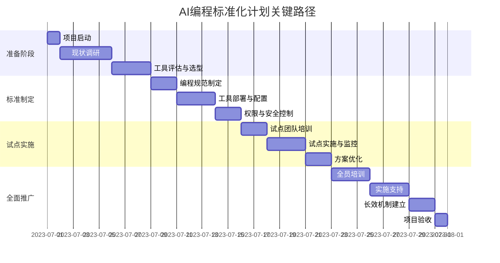

# 实施计划与时间表

## 1. 总体规划

### 1.1 实施目标

在一个月内完成公司AI编程工具的标准化工作，建立完善的AI编程生态系统，提高开发效率和代码质量，确保AI工具的安全合规使用。

### 1.2 实施原则

- **渐进式推进**：分阶段实施，确保每个阶段都有可交付成果
- **重点突破**：优先解决关键问题和高价值领域
- **全员参与**：鼓励全公司参与，收集多方反馈
- **敏捷调整**：根据实施过程中的反馈及时调整计划
- **可持续发展**：建立长效机制，确保标准化成果可持续

### 1.3 实施团队

| 角色 | 职责 | 人员组成 |
|------|------|--------|
| 指导委员会 | 战略决策、资源保障 | CTO、技术总监、安全负责人 |
| 项目管理团队 | 计划制定、进度跟踪、协调沟通 | 项目经理、技术经理 |
| 技术实施团队 | 工具评估、配置部署、技术支持 | 架构师、高级工程师、DevOps工程师 |
| 培训团队 | 培训材料开发、培训实施 | 技术培训师、文档工程师 |
| 安全合规团队 | 安全评估、合规审查 | 安全专家、合规专员 |
| 部门代表 | 需求收集、反馈传递、推广应用 | 各部门技术骨干 |

## 2. 分阶段实施计划

### 2.1 第一周：准备与评估阶段（第1-7天）

#### 2.1.1 主要任务

- 成立项目团队，明确职责分工
- 开展现状调研，评估现有AI工具使用情况
- 收集各部门需求和痛点
- 制定详细实施计划和评估指标
- 准备必要的基础设施和环境

#### 2.1.2 具体活动与时间表

| 时间 | 活动 | 负责人 | 交付物 |
|------|------|-------|-------|
| 第1天 | 启动会议，成立项目团队 | CTO | 项目章程，团队名单 |
| 第1-2天 | 现状调研问卷设计与发放 | 项目经理 | 调研问卷 |
| 第2-4天 | 各部门访谈，收集需求 | 项目团队 | 需求文档 |
| 第3-5天 | AI工具评估与选型 | 技术实施团队 | 工具评估报告 |
| 第5-6天 | 基础设施需求分析与规划 | DevOps工程师 | 基础设施规划 |
| 第6-7天 | 制定详细实施计划 | 项目管理团队 | 详细实施计划 |
| 第7天 | 评估阶段总结会议 | 项目经理 | 阶段总结报告 |

#### 2.1.3 里程碑

- 完成AI编程工具现状评估报告
- 确定AI编程标准化的范围和目标
- 完成详细的实施计划

### 2.2 第二周：标准制定与工具部署阶段（第8-14天）

#### 2.2.1 主要任务

- 制定AI编程规范和标准
- 配置和部署选定的AI工具
- 建立权限管理和安全控制机制
- 开发培训材料和文档
- 选择试点项目和团队

#### 2.2.2 具体活动与时间表

| 时间 | 活动 | 负责人 | 交付物 |
|------|------|-------|-------|
| 第8天 | 编程规范制定工作坊 | 技术实施团队 | 编程规范初稿 |
| 第8-9天 | AI工具部署环境准备 | DevOps工程师 | 部署环境 |
| 第9-10天 | AI工具配置与部署 | 技术实施团队 | 已部署的工具 |
| 第10-11天 | 权限模型设计与实施 | 安全合规团队 | 权限管理方案 |
| 第11-12天 | 安全控制机制实施 | 安全合规团队 | 安全控制文档 |
| 第12-13天 | 培训材料和文档开发 | 培训团队 | 培训材料 |
| 第13-14天 | 试点项目和团队选择 | 项目管理团队 | 试点计划 |
| 第14天 | 标准与部署阶段总结会议 | 项目经理 | 阶段总结报告 |

#### 2.2.3 里程碑

- 完成AI编程规范和标准文档
- AI工具成功部署并通过基本测试
- 权限管理和安全控制机制建立
- 培训材料和文档完成

### 2.3 第三周：试点与优化阶段（第15-21天）

#### 2.3.1 主要任务

- 在试点团队中实施AI编程标准
- 开展试点团队培训
- 收集试点反馈并优化方案
- 准备全面推广的计划
- 建立监控和评估机制

#### 2.3.2 具体活动与时间表

| 时间 | 活动 | 负责人 | 交付物 |
|------|------|-------|-------|
| 第15天 | 试点团队启动会议 | 项目经理 | 试点启动报告 |
| 第15-16天 | 试点团队培训 | 培训团队 | 培训记录 |
| 第16-18天 | 试点实施与监控 | 技术实施团队 | 实施日志 |
| 第18-19天 | 试点反馈收集与分析 | 项目管理团队 | 反馈分析报告 |
| 第19-20天 | 方案优化与调整 | 技术实施团队 | 优化方案 |
| 第20-21天 | 全面推广计划制定 | 项目管理团队 | 推广计划 |
| 第21天 | 试点与优化阶段总结会议 | 项目经理 | 阶段总结报告 |

#### 2.3.3 里程碑

- 试点团队成功应用AI编程标准
- 收集并分析试点反馈
- 优化后的AI编程标准和工具配置
- 全面推广计划就绪

### 2.4 第四周：全面推广与持续改进阶段（第22-30天）

#### 2.4.1 主要任务

- 全公司范围内推广AI编程标准
- 开展全员培训和宣导
- 建立支持和反馈机制
- 实施激励和考核措施
- 建立长效运行机制

#### 2.4.2 具体活动与时间表

| 时间 | 活动 | 负责人 | 交付物 |
|------|------|-------|-------|
| 第22天 | 全公司推广启动会 | CTO | 推广启动报告 |
| 第22-24天 | 分批次全员培训 | 培训团队 | 培训记录 |
| 第24-26天 | 各部门实施支持 | 技术实施团队 | 支持日志 |
| 第26-27天 | 激励和考核方案实施 | 项目管理团队 | 激励考核方案 |
| 第27-28天 | 反馈收集与问题解决 | 项目管理团队 | 问题解决记录 |
| 第28-29天 | 长效机制建立 | 指导委员会 | 长效机制文档 |
| 第30天 | 项目总结与验收会议 | CTO | 项目总结报告 |

#### 2.4.3 里程碑

- 全公司范围内推广AI编程标准
- 完成全员培训
- 建立长效运行机制
- 项目验收通过

## 3. 关键路径与依赖关系

### 3.1 关键路径

### 3.2 关键依赖关系

| 任务 | 依赖任务 | 风险点 | 应对措施 |
|------|---------|-------|--------|
| 工具部署 | 工具评估与选型 | 工具兼容性问题 | 提前进行兼容性测试，准备备选方案 |
| 试点实施 | 编程规范制定、工具部署 | 规范执行困难 | 简化初始规范，逐步完善 |
| 全员培训 | 试点优化完成 | 培训资源不足 | 准备在线培训材料，分批次培训 |
| 长效机制建立 | 全面推广经验 | 持续性挑战 | 指定专人负责，定期评估和调整 |

## 4. 资源规划

### 4.1 人力资源

| 角色 | 所需人数 | 投入比例 | 主要工作阶段 |
|------|---------|---------|------------|
| 项目经理 | 1 | 100% | 全程 |
| 架构师 | 2 | 50% | 准备与标准制定阶段 |
| 高级工程师 | 3 | 70% | 标准制定与试点阶段 |
| DevOps工程师 | 2 | 50% | 工具部署阶段 |
| 安全专家 | 1 | 30% | 安全控制实施阶段 |
| 培训讲师 | 2 | 50% | 培训材料开发与培训实施 |
| 部门技术代表 | 5-8 | 20% | 需求收集与试点阶段 |

### 4.2 技术资源

| 资源类型 | 用途 | 数量/规格 | 获取方式 |
|---------|------|----------|--------|
| 服务器 | AI工具部署 | 4-8台（视工具需求） | 内部资源池调配 |
| 开发环境 | 工具测试与集成 | 每位工程师1套 | 现有资源升级 |
| 协作平台 | 文档共享与协作 | 企业级账号 | 现有系统 |
| 培训环境 | 培训实施 | 25人容量 | 会议室+在线平台 |
| 监控系统 | 工具使用监控 | 企业级方案 | 新增或升级现有系统 |

### 4.3 预算规划

| 预算项目 | 预估费用 | 说明 |
|---------|---------|------|
| 工具许可 | ¥200,000 - 500,000 | 根据选型和规模确定 |
| 基础设施 | ¥50,000 - 100,000 | 服务器、存储、网络等 |
| 培训费用 | ¥30,000 - 50,000 | 培训材料、场地、讲师 |
| 外部咨询 | ¥50,000 - 100,000 | 专业咨询服务（如需） |
| 激励奖金 | ¥20,000 - 50,000 | 试点和推广阶段激励 |
| 应急预备 | 总预算的15% | 应对未预见情况 |

## 5. 风险管理

### 5.1 风险识别与应对

| 风险类别 | 风险描述 | 影响程度 | 发生概率 | 应对策略 |
|---------|---------|---------|---------|--------|
| 技术风险 | AI工具兼容性问题 | 高 | 中 | 提前测试，准备备选方案 |
| 进度风险 | 关键任务延期 | 高 | 中 | 设置缓冲时间，关键路径监控 |
| 资源风险 | 核心人员时间不足 | 中 | 高 | 明确优先级，必要时临时增援 |
| 接受度风险 | 员工抵触新工具和流程 | 高 | 中 | 加强宣传培训，展示价值 |
| 安全风险 | 数据泄露或安全漏洞 | 高 | 低 | 严格安全评估，分级实施 |
| 成本风险 | 预算超支 | 中 | 中 | 分阶段投入，定期评估 |

### 5.2 应急预案

| 紧急情况 | 触发条件 | 应急措施 | 责任人 |
|---------|---------|---------|-------|
| 关键工具故障 | 工具不可用超过4小时 | 启用备选工具，通知用户 | 技术实施负责人 |
| 安全事件 | 发现数据泄露或安全漏洞 | 立即隔离系统，启动安全响应 | 安全负责人 |
| 重大进度延误 | 关键任务延期超过3天 | 调整计划，增加资源，必要时缩小范围 | 项目经理 |
| 关键人员离职 | 核心团队成员离职 | 启动知识交接，临时调配人员 | 项目经理 |
| 预算严重超支 | 超出预算20% | 重新评估范围，优先保障核心功能 | CTO |

## 6. 沟通与汇报计划

### 6.1 例行会议

| 会议类型 | 频率 | 参与人员 | 主要内容 |
|---------|------|---------|--------|
| 项目启动会 | 项目开始 | 全体相关人员 | 项目目标、计划、分工 |
| 每日站会 | 每工作日 | 核心实施团队 | 进度更新、问题协调 |
| 周进度会 | 每周 | 项目团队+部门代表 | 周进度回顾、下周计划 |
| 阶段总结会 | 每阶段结束 | 项目团队+指导委员会 | 阶段成果、问题、调整