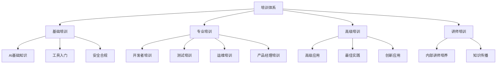

# 培训与赋能

## 1. 培训体系概述

### 1.1 培训目标

建立全面的AI编程工具培训体系，旨在：

- 提升全员对AI编程工具的认知和理解
- 培养员工熟练使用AI编程工具的能力
- 建立AI编程最佳实践和知识共享机制
- 形成持续学习和技能提升的文化氛围
- 支持公司AI编程标准化的全面实施

### 1.2 培训原则

- **分层分类**：根据不同岗位、角色和技能水平，提供差异化培训
- **理论结合实践**：强调实际操作和项目应用，避免纯理论培训
- **循序渐进**：从基础到进阶，逐步提升技能水平
- **持续更新**：及时更新培训内容，跟进AI技术和工具发展
- **效果导向**：关注培训效果和实际应用，持续优化培训方式
- **内外结合**：结合内部讲师和外部专家资源，提供多元化培训

### 1.3 培训体系架构

## 2. 培训对象与需求分析

### 2.1 培训对象分类

| 分类 | 人员构成 | 培训需求 | 培训重点 |
|------|---------|---------|--------|
| 管理层 | 高管、部门经理、项目经理 | 战略理解、价值认知、管理指导 | AI战略价值、管理方法、资源规划 |
| 技术骨干 | 架构师、技术负责人、高级工程师 | 深度技术、最佳实践、团队指导 | 高级应用、架构设计、性能优化 |
| 开发人员 | 程序员、开发工程师 | 工具使用、编程技巧、实际应用 | 编码辅助、代码生成、调试技巧 |
| 测试人员 | 测试工程师、QA | 测试策略、质量保障 | 测试用例生成、自动化测试、质量评估 |
| 运维人员 | 运维工程师、SRE | 部署维护、监控管理 | 自动化脚本、问题诊断、系统优化 |
| 产品人员 | 产品经理、产品设计师 | 产品创新、需求分析 | 需求生成、原型设计、用户体验 |
| 非技术人员 | 市场、销售、人力等 | 基础认知、简单应用 | AI概念、基础操作、辅助工具 |

### 2.2 技能等级划分

| 等级 | 定义 | 能力要求 | 培训目标 |
|------|------|---------|--------|
| L1 - 入门级 | 了解AI工具基本概念和用途 | 在指导下使用基本功能 | 掌握基础操作，理解使用场景 |
| L2 - 应用级 | 能独立使用AI工具完成日常任务 | 熟练操作，解决常见问题 | 提高使用效率，形成使用习惯 |
| L3 - 进阶级 | 深入理解AI工具原理和高级功能 | 优化使用方法，处理复杂问题 | 掌握高级技巧，提升应用质量 |
| L4 - 专家级 | 精通AI工具全部功能和最佳实践 | 创新应用，指导他人，解决疑难问题 | 成为内部专家，推动创新应用 |
| L5 - 讲师级 | 系统掌握AI工具知识体系 | 培训授课，内容开发，方法创新 | 培养内部讲师，建立知识传承 |

### 2.3 需求调研方法

- **问卷调查**：面向全员开展AI工具使用现状和培训需求调查
- **焦点访谈**：与各部门代表进行深入访谈，了解具体需求
- **技能评估**：通过测试评估员工当前AI工具使用水平
- **项目分析**：分析现有项目中AI工具的应用情况和痛点
- **行业对标**：研究行业最佳实践和培训标准

## 3. 培训课程体系

### 3.1 基础课程（面向全员）

| 课程名称 | 课程内容 | 时长 | 授课方式 | 适用对象 |
|---------|---------|------|---------|--------|
| AI编程概述 | AI编程发展历程、基本概念、应用场景 | 2小时 | 线上/线下讲座 | 全员 |
| AI工具伦理与安全 | 伦理准则、安全风险、合规要求 | 2小时 | 线上课程+案例讨论 | 全员 |
| AI编程规范入门 | 公司AI编程规范解读、基本要求 | 2小时 | 线上课程+测试 | 技术人员 |
| AI工具基础操作 | 常用AI工具介绍、基本功能演示 | 4小时 | 实操培训 | 技术人员 |

### 3.2 专业课程（面向技术人员）

#### 3.2.1 开发者课程

| 课程名称 | 课程内容 | 时长 | 授课方式 | 适用对象 |
|---------|---------|------|---------|--------|
| AI辅助编码实战 | 代码补全、代码生成、重构技巧 | 6小时 | 实操工作坊 | 开发人员 |
| 提示工程基础 | 提示编写方法、优化技巧、常见问题 | 4小时 | 实操+案例分析 | 开发人员 |
| AI代码审查与优化 | 代码质量分析、性能优化、安全检查 | 4小时 | 实操+案例分析 | 开发人员 |
| 特定语言的AI应用 | 针对Java/Python/前端等的专项培训 | 4小时 | 实操工作坊 | 相关开发人员 |
| AI与设计模式 | AI辅助设计模式实现、架构优化 | 6小时 | 工作坊+项目实践 | 高级开发人员 |

#### 3.2.2 测试人员课程

| 课程名称 | 课程内容 | 时长 | 授课方式 | 适用对象 |
|---------|---------|------|---------|--------|
| AI辅助测试用例生成 | 测试用例设计、自动生成技巧 | 4小时 | 实操工作坊 | 测试人员 |
| AI自动化测试脚本开发 | 测试脚本生成、优化和维护 | 6小时 | 实操+项目实践 | 测试人员 |
| AI测试数据生成 | 测试数据构造、边界条件生成 | 4小时 | 实操工作坊 | 测试人员 |
| AI辅助缺陷分析 | 缺陷模式识别、根因分析 | 4小时 | 案例分析+实操 | 测试人员 |

#### 3.2.3 运维人员课程

| 课程名称 | 课程内容 | 时长 | 授课方式 | 适用对象 |
|---------|---------|------|---------|--------|
| AI辅助运维脚本开发 | 自动化脚本生成、优化技巧 | 4小时 | 实操工作坊 | 运维人员 |
| AI日志分析与问题诊断 | 日志模式识别、异常检测 | 4小时 | 案例分析+实操 | 运维人员 |
| AI辅助配置管理 | 配置生成、验证和优化 | 4小时 | 实操工作坊 | 运维人员 |

#### 3.2.4 产品人员课程

| 课程名称 | 课程内容 | 时长 | 授课方式 | 适用对象 |
|---------|---------|------|---------|--------|
| AI辅助需求分析 | 需求提取、分析和优化 | 4小时 | 案例分析+实操 | 产品经理 |
| AI原型设计 | 界面原型生成、交互设计 | 4小时 | 实操工作坊 | 产品设计师 |
| AI用户研究方法 | 用户数据分析、洞察生成 | 4小时 | 案例分析+实操 | 产品经理 |

### 3.3 高级课程（面向技术骨干）

| 课程名称 | 课程内容 | 时长 | 授课方式 | 适用对象 |
|---------|---------|------|---------|--------|
| AI编程高级技巧 | 复杂场景应用、性能优化、安全防护 | 8小时 | 高级工作坊 | 技术骨干 |
| AI工具定制与扩展 | 工具配置优化、插件开发、API集成 | 8小时 | 高级工作坊 | 技术骨干 |
| AI编程最佳实践 | 行业最佳实践、案例分析、方法论 | 6小时 | 研讨会+案例分享 | 技术骨干 |
| AI与传统开发融合 | 混合开发模式、工作流优化 | 6小时 | 研讨会+实践 | 技术骨干 |
| AI创新应用工作坊 | 创新思维、前沿应用、实验方法 | 8小时 | 创新工作坊 | 技术骨干 |

### 3.4 管理课程（面向管理层）

| 课程名称 | 课程内容 | 时长 | 授课方式 | 适用对象 |
|---------|---------|------|---------|--------|
| AI战略与价值 | AI战略规划、价值评估、趋势分析 | 4小时 | 高管研讨会 | 高管 |
| AI团队管理 | 团队转型、绩效评估、资源规划 | 4小时 | 管理研讨会 | 部门经理 |
| AI项目管理 | 项目规划、风险控制、质量保障 | 6小时 | 工作坊+案例分析 | 项目经理 |
| AI投资回报分析 | 成本效益分析、价值衡量方法 | 4小时 | 研讨会+案例分析 | 高管、部门经理 |

### 3.5 讲师培训课程

| 课程名称 | 课程内容 | 时长 | 授课方式 | 适用对象 |
|---------|---------|------|---------|--------|
| AI培训讲师认证 | 培训技巧、内容开发、授课方法 | 16小时 | 讲师培训营 | 内部讲师候选人 |
| 培训内容开发 | 课程设计、教材开发、案例编写 | 8小时 | 工作坊 | 认证讲师 |
| 高级授课技巧 | 互动教学、问题处理、效果评估 | 8小时 | 高级工作坊 | 认证讲师 |

## 4. 培训实施方案

### 4.1 培训形式多样化

| 培训形式 | 适用场景 | 优势 | 注意事项 |
|---------|---------|------|--------|
| 线下课堂培训 | 重要课程、实操培训、团队建设 | 互动性强、反馈及时 | 场地、时间协调 |
| 线上直播培训 | 大规模培训、基础知识普及 | 覆盖面广、成本低 | 互动性、专注度 |
| 录播课程 | 基础知识、自学内容 | 灵活学习、重复观看 | 内容更新、学习监督 |
| 实操工作坊 | 技能培训、实际应用 | 实践性强、效果好 | 设备准备、人数控制 |
| 项目实战 | 综合能力提升、实际应用 | 真实场景、深度学习 | 项目选择、指导跟进 |
| 导师制 | 个性化指导、深度培养 | 针对性强、效果好 | 导师资源、匹配度 |
| 技术沙龙 | 经验分享、交流讨论 | 氛围轻松、思想碰撞 | 主题选择、引导控制 |
| 竞赛活动 | 激励学习、创新应用 | 趣味性强、激励效果好 | 规则设计、公平性 |

### 4.2 培训资源建设

#### 4.2.1 培训内容资源

- **课程教材**：系统化的课程讲义、PPT、练习题
- **视频资源**：录制的课程视频、操作演示、案例解析
- **实践项目**：精心设计的实操项目、案例库
- **知识库**：AI编程知识库、常见问题解答、最佳实践
- **工具指南**：各类AI工具使用手册、快速参考

#### 4.2.2 培训平台建设

- **学习管理系统(LMS)**：课程管理、学习跟踪、评估考核
- **知识共享平台**：文档共享、经验交流、问答社区
- **实践环境**：AI工具实验环境、沙箱系统
- **移动学习应用**：随时随地学习、微课程、提醒

#### 4.2.3 讲师团队建设

- **内部讲师选拔**：从技术骨干中选拔培训讲师
- **讲师培养计划**：系统培训、认证、激励机制
- **外部专家资源**：聘请行业专家、工具厂商讲师
- **讲师社区**：讲师交流、资源共享、能力提升

### 4.3 培训实施路径

#### 4.3.1 分阶段实施计划

| 阶段 | 时间 | 主要任务 | 关键成果 |
|------|------|---------|--------|
| 准备阶段 | 第1-7天 | 需求调研、课程设计、资源准备 | 培训计划、初版课程 |
| 试点阶段 | 第8-14天 | 讲师培训、试点课程、反馈收集 | 培训讲师、优化课程 |
| 推广阶段 | 第15-21天 | 全面课程开展、培训监控 | 培训覆盖、学习氛围 |
| 评估优化 | 第22-30天 | 效果评估、持续优化、长效机制 | 评估报告、改进计划 |

#### 4.3.2 培训实施步骤

1. **需求分析**：收集培训需求，确定优先级
2. **计划制定**：制定详细培训计划，包括内容、时间、人员
3. **资源准备**：开发培训材料，准备培训环境
4. **讲师培训**：选拔和培训内部讲师
5. **试点培训**：在小范围内开展试点培训
6. **反馈优化**：收集反馈，优化培训内容和方式
7. **全面推广**：分批次开展全员培训
8. **效果评估**：评估培训效果，总结经验
9. **持续改进**：建立长效机制，持续优化培训

### 4.4 培训保障措施

#### 4.4.1 组织保障

- 成立培训工作组，明确职责分工
- 建立培训协调机制，协调各部门配合
- 高管参与和支持，提供必要资源

#### 4.4.2 资源保障

- 配置必要的培训场地和设备
- 提供充足的培训预算
- 确保培训时间，减少工作冲突

#### 4.4.3 激励保障

- 将培训纳入绩效考核
- 设立学习激励机制
- 提供学习认证和晋升通道

## 5. 培训效果评估

### 5.1 评估维度与指标

| 评估维度 | 评估指标 | 评估方法 | 目标值 |
|---------|---------|---------|-------|
| 培训覆盖率 | 参训人数/总人数 | 培训记录统计 | ≥90% |
| 知识掌握度 | 测试通过率 | 知识测试 | ≥85% |
| 技能应用度 | 工具使用频率、应用案例数 | 使用数据分析、案例收集 | 每周≥3次 |
| 效率提升度 | 开发效率提升比例 | 前后对比、问卷调查 | ≥20% |
| 质量提升度 | 代码质量改善比例 | 代码审查、缺陷率分析 | 缺陷率降低≥15% |
| 创新应用度 | 创新应用案例数 | 案例收集、创新评审 | 每月≥5个 |
| 满意度 | 培训满意度评分 | 满意度调查 | ≥4.2/5分 |

### 5.2 评估方法

#### 5.2.1 定量评估

- **知识测试**：课程结束后的测试评估
- **技能考核**：实操任务完成情况评估
- **数据分析**：AI工具使用数据分析
- **效率测量**：任务完成时间对比分析
- **质量分析**：代码质量指标分析

#### 5.2.2 定性评估

- **满意度调查**：培训满意度问卷
- **深度访谈**：抽样深度访谈
- **案例分析**：优秀应用案例收集分析
- **观察反馈**：管理者观察和反馈
- **同行评价**：同事互评和反馈

### 5.3 评估流程

1. **培训前评估**：基线测试，了解起点水平
2. **培训中评估**：过程监控，及时调整
3. **培训后评估**：即时效果评估
4. **延迟评估**：培训后1-3个月跟踪评估
5. **综合评估**：多维度综合分析

### 5.4 评估结果应用

- **培训优化**：根据评估结果优化培训内容和方式
- **个人发展**：为员工提供个性化发展建议
- **团队提升**：识别团队能力差距，有针对性提升
- **激励机制**：作为激励和认可的依据
- **ROI分析**：评估培训投资回报

## 6. 知识共享与社区建设

### 6.1 知识管理体系

#### 6.1.1 知识分类

- **基础知识**：AI编程基本概念、原理、方法
- **工具知识**：各类AI工具使用方法、技巧
- **实践知识**：应用案例、最佳实践、经验教训
- **创新知识**：创新方法、前沿应用、研究成果

#### 6.1.2 知识获取

- **内部沉淀**：项目经验总结、实践案例收集
- **外部引进**：行业最佳实践、专家知识引入
- **创新生成**：研究探索、创新实验

#### 6.1.3 知识组织

- **知识地图**：构建AI编程知识体系地图
- **知识库**：建立结构化的知识库
- **案例库**：收集和整理典型应用案例

### 6.2 知识共享机制

#### 6.2.1 共享平台

- **技术文档平台**：Wiki、文档库
- **代码共享平台**：代码库、片段库
- **问答社区**：技术问答、经验交流
- **视频分享平台**：技术讲解、操作演示

#### 6.2.2 共享活动

- **技术沙龙**：定期技术分享会
- **实践分享会**：项目经验分享
- **专题研讨会**：特定技术专题研讨
- **创新工作坊**：创新方法和应用探索

### 6.3 社区建设

#### 6.3.1 社区类型

- **兴趣社区**：基于共同兴趣的学习小组
- **实践社区**：基于实际项目的协作团队
- **专家社区**：高级技术专家交流圈
- **创新社区**：探索创新应用的实验小组

#### 6.3.2 社区运营

- **社区组织**：设立社区负责人和核心成员
- **活动策划**：定期组织社区活动
- **激励机制**：设立贡献奖励机制
- **资源支持**：提供必要的资源支持

#### 6.3.3 社区互动

- **线上互动**：在线讨论、问答、分享
- **线下活动**：面对面交流、工作坊
- **跨团队协作**：促进不同团队间的交流
- **外部交流**：与外部社区和专家交流

## 7. 持续学习机制

### 7.1 个人学习路径

#### 7.1.1 能力模型

- 建立AI编程能力模型，明确各级能力要求
- 设计能力评估方法，帮助员工了解自身水平
- 提供个性化能力提升建议

#### 7.1.2 学习地图

- 设计不同角色的学习路径图
- 提供阶段性学习目标和内容
- 建立学习进度跟踪机制

#### 7.1.3 自主学习资源

- 提供丰富的自学资源
- 建立学习资源推荐机制
- 支持个性化学习计划

### 7.2 团队学习机制

#### 7.2.1 学习型团队

- 建立团队学习目标
- 组织团队学习活动
- 促进团队内知识共享

#### 7.2.2 导师制

- 建立导师-学员配对机制
- 设计导师指导流程和方法
- 评估导师指导效果

#### 7.2.3 项目学习

- 将学习融入实际项目
- 设计项目复盘机制
- 沉淀项目经验和教训

### 7.3 创新学习机制

#### 7.3.1 创新实验

- 设立创新实验项目
- 提供创新实验资源
- 建立创新成果分享机制

#### 7.3.2 前沿探索

- 跟踪AI技术前沿发展
- 组织前沿技术分享
- 尝试前沿技术应用

#### 7.3.3 跨界学习

- 促进跨领域知识交流
- 引入多元化视角
- 探索跨界创新应用

## 8. 激励与认可机制

### 8.1 学习激励

#### 8.1.1 学习积分制

- 设立学习积分规则
- 学习活动积分奖励
- 积分兑换机制

#### 8.1.2 学习竞赛

- 组织技能竞赛
- 设立学习挑战
- 团队学习比拼

#### 8.1.3 学习奖励

- 设立学习之星
- 提供学习奖金
- 学习成果展示机会

### 8.2 应用激励

#### 8.2.1 应用案例奖

- 优秀应用案例评选
- 创新应用奖励
- 应用效果奖励

#### 8.2.2 贡献激励

- 知识贡献奖励：对分享有价值知识的员工给予奖励
- 经验分享激励：鼓励分享AI工具使用经验和案例
- 创新方法奖：奖励开发创新AI应用方法的员工

#### 8.2.3 效能激励

- 效率提升奖：奖励通过AI工具显著提高工作效率的员工
- 质量改进奖：奖励利用AI工具提高代码质量的员工
- 成本节约奖：奖励通过AI工具降低开发成本的项目团队

### 8.3 认可机制

#### 8.3.1 荣誉体系

- AI编程专家认证：设立不同级别的AI编程专家认证
- AI创新大使：选拔和表彰AI应用创新者
- 年度AI之星：评选年度AI工具应用标杆

#### 8.3.2 晋升通道

- 将AI工具应用能力纳入晋升考核指标
- 为AI应用专家提供技术专家晋升通道
- 设立AI创新专项职位

#### 8.3.3 展示平台

- 提供成果展示平台和机会
- 组织AI应用成果分享会
- 在公司内外宣传优秀案例和个人

## 9. 国产化替代与工具演进

### 9.1 国产AI工具评估

#### 9.1.1 评估维度

| 评估维度 | 评估指标 | 评估方法 | 权重 |
|---------|---------|---------|------|
| 功能完备性 | 功能覆盖率、核心功能支持度 | 功能对比测试 | 25% |
| 性能效率 | 响应速度、资源占用、稳定性 | 性能测试、压力测试 | 20% |
| 安全合规 | 数据安全、隐私保护、合规性 | 安全审计、合规评估 | 20% |
| 生态支持 | 社区活跃度、更新频率、文档完善度 | 生态调研、用户反馈 | 15% |
| 使用体验 | 易用性、学习曲线、界面友好度 | 用户测试、满意度调查 | 10% |
| 成本效益 | 采购成本、维护成本、ROI | 成本分析、效益评估 | 10% |

#### 9.1.2 替代策略

- **全面替代**：功能完备且性能优越的国产工具
- **部分替代**：在特定场景下使用国产工具
- **混合使用**：国产与国外工具结合使用
- **渐进替代**：按计划逐步替换国外工具

### 9.2 工具演进管理

#### 9.2.1 版本更新管理

- 建立AI工具版本评估机制
- 制定版本更新策略和流程
- 新版本测试和验证机制

#### 9.2.2 新工具引入流程

- 新工具评估标准和流程
- 试点应用和反馈收集
- 全面推广决策机制

#### 9.2.3 工具退出机制

- 工具退出标准和评估
- 数据迁移和过渡方案
- 用户转换培训

## 10. 总结与展望

### 10.1 培训体系价值

- **能力提升**：全面提升员工AI编程能力
- **文化建设**：形成学习创新的组织文化
- **效能提升**：通过AI工具应用提高开发效率和质量
- **创新驱动**：促进AI技术在业务中的创新应用
- **人才吸引**：打造AI技术应用的人才高地

### 10.2 持续优化方向

- **内容更新**：持续更新培训内容，跟进技术发展
- **形式创新**：探索更有效的培训形式和方法
- **深度融合**：将AI工具深度融入开发流程和文化
- **生态建设**：构建完善的AI编程学习和应用生态
- **价值衡量**：完善培训效果评估和价值衡量体系

### 10.3 未来展望

随着AI技术的快速发展，AI编程工具将持续演进，培训体系也需要不断适应和更新。未来，我们将：

- 更加注重AI与传统开发方法的深度融合
- 关注AI编程伦理和责任问题的培训
- 探索AI驱动的个性化学习路径
- 建立更加开放和协作的学习社区
- 推动AI编程能力成为每个开发者的基本素养

通过持续完善的培训与赋能体系，我们将帮助公司在AI时代保持技术领先优势，培养具有AI思维和能力的高素质技术团队，为公司的创新发展提供坚实的人才保障。