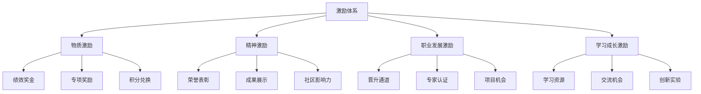

# AI编程工具激励机制

## 1. 激励机制概述

### 1.1 激励目标

建立全面的AI编程工具激励机制，旨在：

- 提高员工使用AI编程工具的积极性和主动性
- 促进AI编程工具在日常开发中的广泛应用
- 鼓励员工探索AI工具的创新应用方式
- 形成良性竞争和学习氛围
- 加速AI编程标准化在公司的全面落地

### 1.2 激励原则

- **价值导向**：激励与实际创造的价值挂钩
- **公平公正**：建立客观、透明的评价体系
- **多元化**：提供物质和精神的多种激励方式
- **及时性**：及时认可和奖励优秀表现
- **可持续**：建立长效激励机制
- **全员参与**：覆盖不同岗位和技能水平的员工

### 1.3 激励体系架构

## 2. 物质激励措施

### 2.1 绩效奖金

| 激励项目 | 激励对象 | 激励标准 | 发放周期 |
|---------|---------|---------|--------|
| AI应用绩效奖 | 全体技术人员 | 根据AI工具应用情况纳入绩效考核，提高绩效系数 | 季度/年度 |
| 效率提升奖 | 通过AI工具提高效率的团队/个人 | 根据效率提升幅度，给予额外奖金 | 项目结束后 |
| 质量改进奖 | 通过AI工具提高质量的团队/个人 | 根据质量改进指标，给予额外奖金 | 项目结束后 |
| 创新应用奖 | 开发创新AI应用方法的员工 | 根据创新价值评估，给予专项奖金 | 不定期 |

### 2.2 专项奖励

| 奖励名称 | 奖励内容 | 评选周期 | 评选标准 |
|---------|---------|---------|--------|
| AI应用之星 | 现金奖励+荣誉证书 | 月度/季度 | AI工具应用频率、效果和创新性 |
| AI创新项目奖 | 团队奖金+项目展示机会 | 季度/年度 | 项目中AI工具的创新应用和价值创造 |
| AI最佳实践奖 | 现金奖励+最佳实践推广 | 季度 | AI工具应用的规范性和示范性 |
| AI知识贡献奖 | 知识贡献积分+奖金 | 月度 | 分享AI应用经验、编写教程、解答问题的数量和质量 |

### 2.3 积分兑换机制

#### 2.3.1 积分获取渠道

- **学习积分**：参与AI相关培训、通过技能测试
- **应用积分**：日常工作中使用AI工具的频率和效果
- **分享积分**：分享AI应用经验、编写教程文档
- **创新积分**：提出AI工具创新应用方法
- **辅导积分**：帮助同事学习和应用AI工具

#### 2.3.2 积分兑换项目

- **学习资源**：付费课程、技术书籍、会议门票
- **专业设备**：开发设备升级、外设改善
- **工作福利**：弹性工作时间、远程工作机会
- **休闲礼品**：公司周边、电子产品、生活用品
- **特权服务**：优先使用新工具、参与创新项目

## 3. 精神激励措施

### 3.1 荣誉表彰

#### 3.1.1 荣誉称号

- **AI编程专家**：分为初级、中级、高级、资深四个等级
- **AI创新大使**：在AI创新应用方面表现突出的员工
- **AI知识传播者**：在知识分享方面贡献突出的员工
- **年度AI之星**：年度AI应用表现最优秀的员工

#### 3.1.2 表彰方式

- 公司全员大会表彰
- 内部网站和通讯录特别标识
- 办公区域荣誉墙展示
- 公司社交媒体宣传

### 3.2 成果展示

#### 3.2.1 展示平台

- **AI应用案例库**：收集和展示优秀AI应用案例
- **技术博客**：在公司技术博客发表AI应用文章
- **分享会**：定期举办AI应用成果分享会
- **技术沙龙**：组织AI技术沙龙，展示创新应用

#### 3.2.2 外部影响力

- 推荐参加行业技术大会分享
- 支持发表技术文章和论文
- 参与开源社区贡献
- 代表公司参加技术竞赛

### 3.3 社区影响力

#### 3.3.1 内部社区

- 设立内部AI技术社区版主和专家
- 给予活跃贡献者特殊标识和权限
- 建立内部技术影响力排行榜

#### 3.3.2 外部社区

- 支持员工以公司名义在外部社区活动
- 鼓励员工成为外部AI社区的意见领袖
- 资助优秀员工创建技术社区和活动

## 4. 职业发展激励

### 4.1 晋升通道

#### 4.1.1 技术晋升

- 将AI工具应用能力纳入技术职级评定标准
- 为AI应用专家提供快速晋升通道
- 设立AI技术专家岗位

#### 4.1.2 管理晋升

- 优先提拔具备AI思维和应用能力的管理者
- 将团队AI应用推广情况纳入管理者评价

### 4.2 专家认证

#### 4.2.1 内部认证

- 建立AI编程能力认证体系
- 设立不同级别的专家认证
- 认证结果与薪酬、晋升挂钩

#### 4.2.2 外部认证

- 资助员工获取外部AI相关认证
- 奖励获得权威认证的员工
- 建立认证激励机制

### 4.3 项目机会

- 优先为AI应用积极者提供创新项目机会
- 组建AI创新专项团队，吸纳优秀人才
- 提供参与高价值、高挑战项目的机会

## 5. 学习成长激励

### 5.1 学习资源

#### 5.1.1 培训资源

- 提供高质量的AI工具培训课程
- 资助参加外部AI技术培训和会议
- 建立AI学习资源库

#### 5.1.2 学习时间

- 提供专门的AI学习时间
- 设立创新日/黑客马拉松，专注AI创新
- 弹性工作安排，支持深度学习

### 5.2 交流机会

#### 5.2.1 内部交流

- 组织AI技术沙龙和研讨会
- 建立跨团队AI学习小组
- 设立导师计划，促进经验传承

#### 5.2.2 外部交流

- 资助参加行业AI技术大会
- 组织与AI领先企业的技术交流
- 邀请外部专家进行分享和指导

### 5.3 创新实验

- 设立AI创新实验室，提供资源支持
- 允许员工使用工作时间进行AI创新实验
- 对有价值的实验成果提供商业化支持

## 6. 团队激励措施

### 6.1 团队评比

- 设立团队AI应用评比机制
- 评选AI应用标杆团队
- 团队间良性竞争和学习

### 6.2 团队奖励

- 为AI应用优秀团队提供团队奖金
- 提供团队建设经费支持
- 授予团队荣誉称号

### 6.3 资源倾斜

- 为AI应用积极的团队提供更多资源支持
- 优先配置先进设备和工具
- 提供更多创新项目和机会

## 7. 激励实施保障

### 7.1 组织保障

- 成立激励机制实施工作组
- 明确各部门职责和配合机制
- 高管层支持和参与

### 7.2 制度保障

- 制定详细的激励实施细则
- 建立公平、透明的评价机制
- 定期审视和优化激励政策

### 7.3 资金保障

- 设立专项激励预算
- 确保激励资金及时到位
- 建立激励投入产出评估机制

## 8. 激励效果评估

### 8.1 评估维度

| 评估维度 | 评估指标 | 评估方法 | 目标值 |
|---------|---------|---------|-------|
| 参与度 | AI工具使用人数比例 | 使用数据统计 | ≥90% |
| 应用深度 | 人均AI工具使用频率 | 使用数据分析 | 每周≥10次 |
| 效率提升 | 开发效率提升比例 | 前后对比分析 | ≥20% |
| 质量改善 | 代码质量提升指标 | 质量分析工具 | 缺陷率降低≥15% |
| 创新应用 | 创新应用案例数 | 案例收集统计 | 每月≥8个 |
| 知识分享 | 分享内容数量和质量 | 内容统计和评价 | 每周≥5篇 |
| 员工满意度 | 激励机制满意度评分 | 满意度调查 | ≥4.0/5分 |

### 8.2 评估方法

#### 8.2.1 定量评估

- 使用数据统计和分析
- 效率和质量指标测量
- 创新案例和分享内容统计

#### 8.2.2 定性评估

- 员工满意度调查
- 深度访谈和反馈收集
- 管理者观察和评价

### 8.3 评估周期

- 月度：基础数据收集和分析
- 季度：综合评估和调整
- 年度：全面评估和优化

## 9. 激励机制优化

### 9.1 反馈收集

- 建立激励机制反馈渠道
- 定期收集员工对激励机制的建议
- 分析激励效果与期望的差距

### 9.2 动态调整

- 根据反馈和评估结果调整激励措施
- 针对不同阶段设定不同激励重点
- 保持激励机制的新鲜感和吸引力

### 9.3 持续创新

- 研究行业最佳激励实践
- 尝试创新激励方式
- 个性化激励措施探索

## 10. 总结与展望

通过建立全面、多元的AI编程工具激励机制，我们将有效促进AI工具在公司的广泛应用，提高开发效率和质量，培养创新文化，最终实现AI编程标准化的目标。激励机制将与培训体系、考核标准等其他措施协同作用，形成完整的AI编程生态系统，持续推动公司技术能力的提升和创新发展。

未来，我们将根据技术发展和实施效果，不断优化激励机制，探索更有效的激励方式，确保激励机制始终保持活力和吸引力，持续推动AI编程工具的深入应用和创新发展。