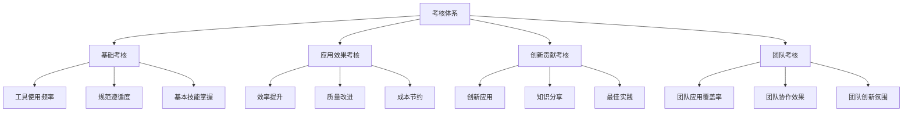

# AI编程工具考核标准

## 1. 考核标准概述

### 1.1 考核目标

建立全面的AI编程工具考核标准，旨在：

- 客观评估员工AI编程工具的使用情况和效果
- 引导员工正确、高效地应用AI编程工具
- 识别AI工具应用的优秀实践和改进空间
- 为激励机制提供客观依据
- 促进AI编程标准化的持续改进

### 1.2 考核原则

- **客观公正**：采用定量与定性相结合的评估方法
- **过程与结果并重**：关注使用过程和实际效果
- **差异化考核**：根据不同岗位和角色设定差异化标准
- **持续改进**：考核结果用于指导改进，而非单纯奖惩
- **透明开放**：考核标准和结果公开透明
- **实用性**：考核内容与实际工作紧密结合

### 1.3 考核体系架构

## 2. 考核对象与分类

### 2.1 考核对象分类

| 分类 | 人员构成 | 考核重点 | 考核特点 |
|------|---------|---------|--------|
| 管理层 | 高管、部门经理、项目经理 | 战略推动、资源支持、团队引导 | 注重整体效果和团队表现 |
| 技术骨干 | 架构师、技术负责人、高级工程师 | 深度应用、创新实践、技术引领 | 注重高级应用和创新贡献 |
| 开发人员 | 程序员、开发工程师 | 工具使用、效率提升、质量改进 | 注重日常应用和实际效果 |
| 测试人员 | 测试工程师、QA | 测试效率、质量保障 | 注重测试场景应用 |
| 运维人员 | 运维工程师、SRE | 自动化程度、问题解决 | 注重运维场景应用 |
| 产品人员 | 产品经理、产品设计师 | 需求分析、原型设计 | 注重产品设计场景应用 |

### 2.2 考核等级划分

| 等级 | 定义 | 评分区间 | 表现特征 |
|------|------|---------|--------|
| A - 卓越 | 全面掌握并创新应用 | 90-100分 | 深度应用、创新贡献、引领他人 |
| B - 优秀 | 熟练应用并有所创新 | 80-89分 | 熟练应用、有效提升、积极分享 |
| C - 良好 | 正确应用并取得效果 | 70-79分 | 规范使用、效果明显、持续改进 |
| D - 基本达标 | 基本掌握并初步应用 | 60-69分 | 基本应用、效果一般、需要提升 |
| E - 需改进 | 应用不足或效果欠佳 | <60分 | 应用不足、效果不明显、亟需提升 |

## 3. 考核维度与指标

### 3.1 基础考核维度

#### 3.1.1 工具使用频率与广度

| 考核指标 | 计算方法 | 数据来源 | 权重 |
|---------|---------|---------|------|
| AI工具使用频率 | 每周平均使用次数 | 工具使用日志 | 30% |
| AI工具覆盖率 | 使用工具种类/推荐工具总数 | 工具使用统计 | 30% |
| 使用场景多样性 | 应用场景数量和分布 | 使用场景记录 | 20% |
| 使用持续性 | 连续使用周期和稳定性 | 使用时间分析 | 20% |

#### 3.1.2 规范遵循度

| 考核指标 | 计算方法 | 数据来源 | 权重 |
|---------|---------|---------|------|
| AI编程规范符合度 | 符合规范的操作比例 | 代码审查、操作日志 | 40% |
| 安全合规性 | 安全合规操作比例 | 安全审计记录 | 30% |
| 文档完整性 | AI使用相关文档完整度 | 文档审查 | 15% |
| 流程规范性 | 按规定流程操作的比例 | 流程审计 | 15% |

#### 3.1.3 基本技能掌握

| 考核指标 | 计算方法 | 数据来源 | 权重 |
|---------|---------|---------|------|
| 技能测试成绩 | 技能测试得分 | 技能测试结果 | 40% |
| 提示工程能力 | 提示质量评估得分 | 提示质量分析 | 30% |
| 问题解决能力 | 使用AI解决问题的效率 | 问题解决记录 | 20% |
| 学习进步度 | 技能提升幅度 | 前后测试对比 | 10% |

### 3.2 应用效果考核维度

#### 3.2.1 效率提升

| 考核指标 | 计算方法 | 数据来源 | 权重 |
|---------|---------|---------|------|
| 开发速度提升 | (AI辅助开发时间-传统开发时间)/传统开发时间 | 项目时间记录 | 40% |
| 代码生成效率 | AI生成代码量/总代码量 | 代码统计分析 | 30% |
| 问题解决速度 | AI辅助解决问题的平均时间 | 问题跟踪系统 | 20% |
| 工作流优化度 | 工作流程优化比例 | 流程分析 | 10% |

#### 3.2.2 质量改进

| 考核指标 | 计算方法 | 数据来源 | 权重 |
|---------|---------|---------|------|
| 缺陷率降低 | (传统缺陷率-AI辅助缺陷率)/传统缺陷率 | 缺陷跟踪系统 | 35% |
| 代码质量提升 | 代码质量评分提升比例 | 代码质量分析工具 | 35% |
| 技术债减少 | 技术债务减少比例 | 技术债务分析 | 20% |
| 用户满意度 | 用户对产品质量的满意度评分 | 用户反馈 | 10% |

#### 3.2.3 成本节约

| 考核指标 | 计算方法 | 数据来源 | 权重 |
|---------|---------|---------|------|
| 人力成本节约 | 节约的人力工时价值 | 工时记录和分析 | 40% |
| 维护成本降低 | 维护成本降低比例 | 维护成本记录 | 30% |
| 资源使用优化 | 计算资源使用效率提升 | 资源使用监控 | 20% |
| 工具投资回报率 | 收益/AI工具投入成本 | 财务分析 | 10% |

### 3.3 创新贡献考核维度

#### 3.3.1 创新应用

| 考核指标 | 计算方法 | 数据来源 | 权重 |
|---------|---------|---------|------|
| 创新应用案例数 | 提出的创新应用数量 | 创新案例记录 | 30% |
| 创新价值评估 | 创新应用带来的价值评分 | 价值评估 | 40% |
| 创新复杂度 | 创新应用的技术复杂度评分 | 技术评审 | 20% |
| 创新推广度 | 创新应用的采纳和推广程度 | 应用统计 | 10% |

#### 3.3.2 知识分享

| 考核指标 | 计算方法 | 数据来源 | 权重 |
|---------|---------|---------|------|
| 分享内容数量 | 发布的文章、教程数量 | 内容统计 | 30% |
| 分享内容质量 | 内容质量评分 | 内容评审 | 40% |
| 分享影响力 | 阅读量、点赞数、采纳率 | 平台数据 | 20% |
| 辅导他人 | 辅导同事的次数和效果 | 辅导记录和反馈 | 10% |

#### 3.3.3 最佳实践

| 考核指标 | 计算方法 | 数据来源 | 权重 |
|---------|---------|---------|------|
| 最佳实践提炼 | 提炼的最佳实践数量 | 最佳实践库 | 30% |
| 实践应用价值 | 最佳实践的应用价值评分 | 价值评估 | 40% |
| 实践推广度 | 最佳实践的采纳度 | 应用统计 | 20% |
| 实践创新性 | 最佳实践的创新程度评分 | 创新评审 | 10% |

### 3.4 团队考核维度

#### 3.4.1 团队应用覆盖率

| 考核指标 | 计算方法 | 数据来源 | 权重 |
|---------|---------|---------|------|
| 团队成员应用比例 | 使用AI工具的成员/总成员数 | 使用统计 | 40% |
| 团队应用深度 | 团队平均应用深度评分 | 应用深度评估 | 40% |
| 应用均衡性 | 团队成员应用水平的均衡度 | 应用水平分析 | 20% |

#### 3.4.2 团队协作效果

| 考核指标 | 计算方法 | 数据来源 | 权重 |
|---------|---------|---------|------|
| AI协作模式建立 | AI协作模式完善度评分 | 协作模式评估 | 35% |
| 知识共享机制 | 团队知识共享机制有效性 | 共享机制评估 | 35% |
| 协作效率提升 | 团队协作效率提升比例 | 效率分析 | 30% |

#### 3.4.3 团队创新氛围

| 考核指标 | 计算方法 | 数据来源 | 权重 |
|---------|---------|---------|------|
| 创新提案数量 | 团队提出的AI创新提案数 | 提案记录 | 30% |
| 实验项目数量 | 团队开展的AI实验项目数 | 项目记录 | 30% |
| 创新激励机制 | 团队内创新激励机制有效性 | 机制评估 | 20% |
| 创新文化评分 | 团队创新文化评分 | 文化评估 | 20% |

## 4. 考核方法与工具

### 4.1 数据收集方法

#### 4.1.1 自动化数据收集

- **工具使用监控**：部署AI工具使用监控插件，自动收集使用数据
- **代码分析工具**：使用代码分析工具评估AI生成代码的质量和比例
- **项目管理系统**：从项目管理系统获取效率和进度数据
- **缺陷跟踪系统**：从缺陷跟踪系统获取质量相关数据

#### 4.1.2 手动数据收集

- **自评报告**：员工定期提交AI工具使用自评报告
- **同行评审**：组织同行评审，评估AI工具应用情况
- **案例收集**：收集和整理AI应用案例
- **访谈调研**：定期开展访谈，了解应用情况和效果

### 4.2 评估工具

#### 4.2.1 量化评估工具

- **AI应用评分卡**：设计标准化的评分卡，量化评估应用情况
- **效率对比工具**：开发效率对比分析工具，测量效率提升
- **质量分析工具**：使用代码质量分析工具，评估质量改进
- **价值计算模型**：建立价值计算模型，评估AI应用价值

#### 4.2.2 定性评估工具

- **专家评审表**：设计专家评审表，用于定性评估
- **案例分析框架**：建立案例分析框架，系统分析应用案例
- **创新评估矩阵**：开发创新评估矩阵，评估创新价值和可行性
- **反馈收集工具**：设计反馈收集工具，获取多方面反馈

### 4.3 考核流程

#### 4.3.1 个人考核流程

1. **自评**：员工进行自我评估和总结
2. **数据收集**：收集相关数据和证据
3. **主管评估**：直接主管进行评估
4. **交叉评审**：相关同事进行交叉评审
5. **综合评定**：综合各方评估结果，形成最终评定
6. **反馈沟通**：与员工沟通评估结果和改进建议

#### 4.3.2 团队考核流程

1. **团队自评**：团队进行自我评估和总结
2. **数据分析**：分析团队整体数据
3. **上级评估**：上级管理者进行评估
4. **跨团队评审**：组织跨团队评审
5. **综合评定**：综合各方评估结果，形成最终评定
6. **团队反馈**：与团队沟通评估结果和改进方向

## 5. 考核周期与实施

### 5.1 考核周期设置

| 考核类型 | 周期 | 考核内容 | 结果应用 |
|---------|------|---------|--------|
| 日常监测 | 实时/每周 | 基础使用数据、关键指标 | 及时反馈、指导改进 |
| 月度评估 | 每月 | 基础考核维度、应用效果初步评估 | 月度激励、调整方向 |
| 季度考核 | 每季度 | 全面考核、重点关注应用效果 | 季度奖金、资源分配 |
| 年度评估 | 每年 | 全面深入评估、创新贡献、团队表现 | 年度奖金、晋升依据 |

### 5.2 考核权重分配

#### 5.2.1 不同角色的考核权重

| 角色 | 基础考核 | 应用效果 | 创新贡献 | 团队表现 |
|------|---------|---------|---------|--------|
| 管理层 | 20% | 30% | 20% | 30% |
| 技术骨干 | 20% | 30% | 40% | 10% |
| 开发人员 | 30% | 50% | 15% | 5% |
| 测试人员 | 30% | 50% | 15% | 5% |
| 运维人员 | 30% | 50% | 15% | 5% |
| 产品人员 | 30% | 40% | 25% | 5% |

#### 5.2.2 不同阶段的考核权重

| 阶段 | 基础考核 | 应用效果 | 创新贡献 | 团队表现 |
|------|---------|---------|---------|--------|
| 初始阶段(1-3个月) | 60% | 30% | 5% | 5% |
| 发展阶段(4-6个月) | 40% | 40% | 10% | 10% |
| 成熟阶段(7-12个月) | 20% | 40% | 25% | 15% |
| 创新阶段(12个月后) | 10% | 30% | 40% | 20% |

### 5.3 考核实施步骤

1. **考核准备**：制定详细考核计划，准备考核工具和表格
2. **宣传动员**：向全员宣传考核标准和方法
3. **数据收集**：按计划收集考核数据
4. **评估分析**：对收集的数据进行分析和评估
5. **结果确认**：确认考核结果，处理异议
6. **结果应用**：将考核结果应用于激励和改进
7. **总结反馈**：总结考核经验，优化考核方法

## 6. 考核结果应用

### 6.1 个人层面应用

#### 6.1.1 激励与奖励

- 将考核结果与绩效奖金挂钩
- 优秀者获得额外奖励和认可
- 提供学习和发展机会

#### 6.1.2 能力提升

- 根据考核结果制定个人提升计划
- 针对性提供培训和指导
- 设立个人改进目标

#### 6.1.3 职业发展

- 考核结果作为晋升的重要依据
- 优秀者获得更多职业发展机会
- 纳入个人职业发展规划

### 6.2 团队层面应用

#### 6.2.1 团队激励

- 优秀团队获得团队奖励
- 提供团队建设资源
- 团队荣誉和认可

#### 6.2.2 资源分配

- 根据考核结果调整资源分配
- 优先支持表现优秀的团队
- 为创新团队提供特殊资源

#### 6.2.3 团队建设

- 识别团队优势和不足
- 制定团队能力提升计划
- 优化团队协作模式

### 6.3 组织层面应用

#### 6.3.1 标准优化

- 根据考核结果优化AI编程标准
- 调整工具选型和推荐
- 完善最佳实践库

#### 6.3.2 培训改进

- 优化培训内容和方法
- 调整培训重点和深度
- 开发新的培训课程

#### 6.3.3 文化建设

- 强化AI创新文化
- 推广优秀案例和经验
- 建设学习型组织

## 7. 考核保障措施

### 7.1 组织保障

- 成立考核工作组，负责考核实施
- 明确各级管理者在考核中的职责
- 提供必要的组织支持和资源

### 7.2 技术保障

- 开发和部署考核支持工具
- 建立数据收集和分析平台
- 确保数据安全和准确性

### 7.3 制度保障

- 制定详细的考核实施细则
- 建立考核申诉和复议机制
- 确保考核过程公平透明

## 8. 考核标准优化

### 8.1 反馈收集

- 建立考核标准反馈渠道
- 定期收集各方对考核标准的意见
- 分析考核过程中的问题和挑战

### 8.2 动态调整

- 根据反馈和实施效果调整考核标准
- 适应不同阶段的需求变化
- 保持考核标准的时效性和适用性

### 8.3 持续改进

- 定期评估考核标准的有效性
- 研究行业最佳考核实践
- 创新考核方法和工具

## 9. 与其他机制的协同

### 9.1 与培训体系协同

- 考核结果指导培训需求分析
- 培训效果通过考核验证
- 形成培训-应用-考核-改进的闭环

### 9.2 与激励机制协同

- 考核结果作为激励的客观依据
- 激励机制促进考核标准的落实
- 共同推动AI工具的应用和创新

### 9.3 与持续改进机制协同

- 考核发现的问题纳入改进计划
- 改进成效通过考核验证
- 持续优化AI编程生态系统

## 10. 总结与展望

通过建立科学、全面的AI编程工具考核标准，我们将客观评估AI工具的应用情况和效果，引导员工正确、高效地使用AI工具，促进AI编程标准化的持续改进。考核标准将与培训体系、激励机制等其他措施协同作用，形成完整的AI编程生态系统，持续推动公司技术能力的提升和创新发展。

未来，随着AI技术的发展和应用的深入，我们将持续优化考核标准，探索更科学、更有效的评估方法，确保考核标准始终能够准确反映AI工具应用的真实情况和价值，为公司的AI编程标准化工作提供有力支持。