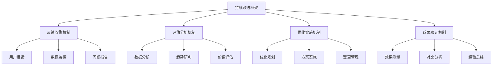

# AI编程工具持续改进机制

## 1. 持续改进概述

### 1.1 持续改进的意义

AI编程工具技术发展迅速，企业需求不断变化，建立持续改进机制对于AI编程标准化工作的长期成功至关重要，具有以下意义：

- **适应技术变革**：AI技术快速迭代，持续改进确保标准与技术同步发展
- **满足业务需求**：随着业务发展，开发需求变化，需要不断优化工具和方法
- **提升使用体验**：基于用户反馈持续优化，提高工具接受度和使用效率
- **保持竞争优势**：通过持续改进，保持技术领先性和创新能力
- **优化投资回报**：不断评估和调整，确保AI工具投入产出最大化

### 1.2 持续改进原则

- **数据驱动**：基于客观数据和事实进行决策和改进
- **用户中心**：以用户需求和体验为核心，持续优化
- **全员参与**：鼓励全员提供反馈和建议，共同推动改进
- **循环迭代**：采用PDCA（计划-执行-检查-行动）循环持续改进
- **系统思维**：从整体视角考虑改进措施，避免局部优化
- **价值导向**：关注改进措施带来的实际价值和效益

### 1.3 持续改进框架

## 2. 反馈收集机制

### 2.1 用户反馈渠道

#### 2.1.1 主动反馈渠道

| 反馈渠道 | 适用场景 | 收集方式 | 处理流程 |
|---------|---------|---------|--------|
| 反馈平台 | 功能建议、问题报告 | 在线表单、问题跟踪系统 | 分类、评估、分配、跟踪 |
| 用户调研 | 深度需求、满意度评估 | 问卷调查、访谈 | 数据分析、报告生成、改进建议 |
| 讨论社区 | 经验分享、创意讨论 | 论坛、聊天群组 | 定期总结、价值提炼、方案转化 |
| 改进工作坊 | 集中讨论、头脑风暴 | 线下/线上研讨会 | 记录整理、方案形成、任务分配 |

#### 2.1.2 被动反馈渠道

| 反馈渠道 | 收集数据 | 收集方式 | 分析方法 |
|---------|---------|---------|--------|
| 使用监控 | 使用频率、功能偏好 | 埋点统计、日志分析 | 趋势分析、模式识别 |
| 性能监控 | 响应时间、资源占用 | 性能监控工具 | 瓶颈分析、异常检测 |
| 错误日志 | 异常情况、崩溃报告 | 日志收集系统 | 根因分析、频率统计 |
| 行为分析 | 用户操作路径、停留时间 | 行为跟踪工具 | 行为模式分析、热点图 |

### 2.2 反馈分类与优先级

#### 2.2.1 反馈分类框架

- **功能类反馈**：功能缺失、功能改进、新功能需求
- **性能类反馈**：响应速度、资源占用、稳定性
- **体验类反馈**：界面设计、操作流程、易用性
- **集成类反馈**：与其他工具集成、工作流适配
- **安全类反馈**：安全隐患、数据保护、合规问题
- **其他类反馈**：文档、培训、支持服务等

#### 2.2.2 优先级评估矩阵

| 优先级 | 定义 | 评估标准 | 响应时间 |
|------|------|---------|--------|
| P0 - 紧急 | 严重影响工作，需立即解决 | 导致系统不可用或数据安全风险 | 24小时内 |
| P1 - 高 | 显著影响效率，需尽快解决 | 主要功能受影响，有替代方案 | 3个工作日内 |
| P2 - 中 | 一般影响，计划性解决 | 次要功能问题，不影响主要工作 | 2周内 |
| P3 - 低 | 轻微影响，可延后解决 | 体验优化、非核心功能改进 | 1-2个月内 |
| P4 - 建议 | 改进建议，纳入规划考虑 | 新功能建议、长期改进方向 | 纳入产品规划 |

### 2.3 反馈处理流程

#### 2.3.1 反馈接收与记录

- 建立统一的反馈管理系统
- 对反馈进行标准化记录
- 自动分类和初步分析
- 生成反馈跟踪编号

#### 2.3.2 反馈分析与评估

- 技术团队初步评估
- 确定优先级和分类
- 评估解决方案和资源需求
- 决定处理方式（立即解决/纳入迭代/长期规划）

#### 2.3.3 反馈处理与跟踪

- 分配责任人和处理团队
- 制定解决方案和时间表
- 实施解决方案
- 跟踪处理进度和状态

#### 2.3.4 反馈闭环与沟通

- 向反馈提供者通报处理结果
- 收集处理结果的满意度
- 总结经验教训
- 更新知识库和最佳实践

## 3. 评估分析机制

### 3.1 数据收集维度

#### 3.1.1 使用数据

| 数据类型 | 收集指标 | 收集方法 | 分析价值 |
|---------|---------|---------|--------|
| 使用频率 | 日/周/月活跃用户数、使用次数 | 用户行为跟踪 | 了解工具普及度和活跃度 |
| 功能使用 | 各功能模块使用频率和时长 | 功能调用统计 | 识别核心功能和冷门功能 |
| 使用场景 | 使用工具的业务场景分布 | 场景标记、用户日志 | 了解工具应用场景分布 |
| 使用深度 | 高级功能使用比例、功能组合 | 功能路径分析 | 评估用户熟练度和深度应用情况 |

#### 3.1.2 效果数据

| 数据类型 | 收集指标 | 收集方法 | 分析价值 |
|---------|---------|---------|--------|
| 效率提升 | 任务完成时间、代码生成速度 | 前后对比测试、用户报告 | 评估工具对效率的实际提升 |
| 质量改进 | 缺陷率、代码质量评分 | 质量分析工具、缺陷统计 | 评估工具对质量的实际影响 |
| 成本节约 | 人力成本节约、资源使用优化 | 成本核算、资源监控 | 评估工具的经济效益 |
| 创新贡献 | 创新案例数、创新应用价值 | 案例收集、价值评估 | 评估工具对创新的促进作用 |

#### 3.1.3 体验数据

| 数据类型 | 收集指标 | 收集方法 | 分析价值 |
|---------|---------|---------|--------|
| 满意度 | 用户满意度评分、NPS评分 | 满意度调查、评分系统 | 了解用户整体满意程度 |
| 易用性 | 操作步骤数、学习曲线斜率 | 用户测试、行为分析 | 评估工具的易用性水平 |
| 问题数量 | 报告问题数、求助频率 | 问题跟踪系统、支持请求 | 识别工具的痛点和难点 |
| 用户留存 | 持续使用率、放弃率 | 用户行为跟踪、使用统计 | 评估工具的长期价值 |

### 3.2 分析方法

#### 3.2.1 定量分析

- **趋势分析**：跟踪关键指标随时间的变化趋势
- **对比分析**：与基准数据或竞品数据进行对比
- **相关性分析**：分析不同指标间的相关关系
- **分层分析**：按团队、角色、项目等维度分层分析
- **异常检测**：识别数据中的异常模式和离群值

#### 3.2.2 定性分析

- **主题分析**：识别反馈中的主要主题和关注点
- **情感分析**：分析反馈中的情感倾向和强度
- **案例研究**：深入分析典型应用案例
- **专家评审**：组织专家对工具进行系统评审
- **用户访谈**：深入了解用户体验和需求

### 3.3 评估报告

#### 3.3.1 定期评估报告

| 报告类型 | 频率 | 主要内容 | 目标受众 |
|---------|------|---------|--------|
| 月度简报 | 每月 | 关键指标、主要问题、短期趋势 | 技术团队、直接管理者 |
| 季度报告 | 每季度 | 综合分析、改进建议、中期趋势 | 部门管理层、相关团队 |
| 年度评估 | 每年 | 全面评估、战略建议、长期规划 | 高层管理者、全公司 |

#### 3.3.2 专项评估报告

- **工具升级评估**：新版本或新工具的评估报告
- **问题专题分析**：针对特定问题的深入分析
- **价值实现评估**：AI工具价值实现情况的评估
- **最佳实践总结**：优秀应用案例和最佳实践总结

## 4. 优化实施机制

### 4.1 优化决策流程

#### 4.1.1 决策层级

| 决策级别 | 决策范围 | 决策主体 | 决策流程 |
|---------|---------|---------|--------|
| 战略级 | 整体方向、重大调整、资源配置 | 高层管理团队 | 季度/年度战略会议 |
| 战术级 | 工具选型、标准调整、流程优化 | 部门管理层、技术专家 | 月度优化会议 |
| 操作级 | 具体问题修复、小功能优化 | 技术团队、工具管理员 | 敏捷迭代、日常决策 |

#### 4.1.2 决策标准

- **价值导向**：优先考虑能带来显著价值的改进
- **成本效益**：评估改进投入与预期收益的比例
- **实施难度**：考虑技术可行性和实施复杂度
- **影响范围**：评估改进对用户和系统的影响范围
- **战略一致**：确保与公司整体技术战略一致

### 4.2 优化实施方法

#### 4.2.1 渐进式优化

- **小步快跑**：采用小批量、高频率的优化方式
- **试点验证**：先在小范围内试点，验证效果后推广
- **滚动规划**：定期调整优化计划，保持灵活性
- **持续集成**：将优化无缝集成到日常工作中

#### 4.2.2 项目式优化

- **适用场景**：大规模改进、系统性调整、工具升级
- **项目管理**：采用正规项目管理方法
- **资源配置**：专门分配资源和团队
- **里程碑管理**：设定明确的阶段目标和验收标准

### 4.3 变更管理

#### 4.3.1 变更沟通

- **沟通计划**：制定详细的变更沟通计划
- **多渠道沟通**：通过多种渠道传达变更信息
- **分层沟通**：针对不同角色采用不同沟通策略
- **双向沟通**：建立反馈渠道，收集变更意见

#### 4.3.2 培训支持

- **培训材料更新**：及时更新培训材料和文档
- **专项培训**：针对重大变更开展专项培训
- **在线资源**：提供自学资源和参考材料
- **专家支持**：安排专家提供技术支持和指导

#### 4.3.3 过渡策略

- **平滑过渡**：设计平滑过渡方案，避免突变
- **兼容支持**：在过渡期保持对旧版本的支持
- **回退机制**：建立问题出现时的回退机制
- **渐进推广**：分批次、分阶段推广变更

## 5. 效果验证机制

### 5.1 验证维度与指标

#### 5.1.1 直接效果验证

| 验证维度 | 关键指标 | 验证方法 | 目标值 |
|---------|---------|---------|-------|
| 问题解决 | 问题解决率、复发率 | 问题跟踪分析 | 解决率≥95%，复发率≤5% |
| 功能改进 | 功能完成度、符合度 | 功能测试、用户验收 | 完成度≥98%，符合度≥90% |
| 性能提升 | 响应时间、资源占用改善率 | 性能测试、对比分析 | 响应时间提升≥20% |
| 体验优化 | 操作步骤减少、满意度提升 | 用户测试、满意度调查 | 满意度提升≥15% |

#### 5.1.2 间接效果验证

| 验证维度 | 关键指标 | 验证方法 | 目标值 |
|---------|---------|---------|-------|
| 使用率变化 | 活跃用户增长、使用频率提升 | 使用数据分析 | 活跃用户增长≥10% |
| 效率影响 | 开发效率提升、时间节约 | 效率测量、项目数据分析 | 效率提升≥15% |
| 质量影响 | 代码质量提升、缺陷率降低 | 质量分析、缺陷统计 | 缺陷率降低≥10% |
| 创新影响 | 创新应用增长、创新价值提升 | 案例统计、价值评估 | 创新应用增长≥20% |

### 5.2 验证方法

#### 5.2.1 技术验证

- **功能测试**：验证功能是否按预期工作
- **性能测试**：测量性能指标的变化
- **兼容性测试**：验证与其他系统的兼容性
- **安全测试**：评估安全性和合规性

#### 5.2.2 用户验证

- **用户测试**：组织用户进行实际测试
- **满意度调查**：收集用户对改进的满意度
- **使用观察**：观察用户实际使用情况
- **反馈收集**：收集用户对改进的反馈

#### 5.2.3 业务验证

- **效益分析**：评估改进带来的业务效益
- **成本分析**：计算改进的成本和回报
- **风险评估**：评估改进带来的风险变化
- **战略适配**：评估与业务战略的适配度

### 5.3 验证流程

#### 5.3.1 验证计划

- 制定详细的验证计划和时间表
- 确定验证范围、方法和标准
- 准备验证环境和工具
- 组建验证团队和分配职责

#### 5.3.2 验证实施

- 按计划执行验证活动
- 收集验证数据和结果
- 记录问题和观察结果
- 进行中期评估和调整

#### 5.3.3 验证评估

- 分析验证结果和数据
- 与预期目标进行对比
- 识别成功点和不足之处
- 形成验证结论和建议

#### 5.3.4 验证闭环

- 根据验证结果决定后续行动
- 解决验证中发现的问题
- 总结经验教训
- 更新改进方法和标准

## 6. 持续学习与创新

### 6.1 技术趋势跟踪

#### 6.1.1 趋势监控渠道

- **行业报告**：定期研读AI和软件开发行业报告
- **技术社区**：参与技术社区和开源项目
- **学术研究**：关注AI编程相关学术进展
- **竞品分析**：持续分析竞争对手和领先企业
- **技术会议**：参加行业技术会议和展会

#### 6.1.2 趋势分析框架

- **技术雷达**：建立AI编程技术雷达，分级跟踪技术
- **影响评估**：评估新技术对现有实践的影响
- **应用场景**：识别新技术的潜在应用场景
- **采纳策略**：制定新技术的评估和采纳策略

### 6.2 最佳实践共享

#### 6.2.1 实践收集

- **内部案例**：收集公司内部的成功应用案例
- **外部借鉴**：学习行业最佳实践和成功经验
- **创新实验**：鼓励团队进行创新实验并记录
- **问题解决**：记录典型问题的解决方案

#### 6.2.2 实践共享

- **知识库**：建立AI编程最佳实践知识库
- **分享会**：定期组织最佳实践分享会
- **案例文档**：编写详细的案例文档和教程
- **导师制**：建立经验传授的导师机制

### 6.3 创新机制

#### 6.3.1 创新激励

- **创新基金**：设立AI编程创新专项基金
- **创新竞赛**：定期举办创新应用竞赛
- **创新时间**：提供专门的创新实验时间
- **创新奖励**：对创新成果给予奖励和认可

#### 6.3.2 创新孵化

- **创新工作坊**：组织创新思维工作坊
- **原型开发**：支持创新想法的原型开发
- **试点应用**：为有潜力的创新提供试点机会
- **推广机制**：建立成功创新的推广机制

## 7. 组织保障

### 7.1 组织架构

#### 7.1.1 持续改进工作组

- **组成**：技术专家、用户代表、管理者代表
- **职责**：统筹持续改进工作，评估改进效果
- **运作**：定期会议，持续跟踪，协调资源

#### 7.1.2 技术支持团队

- **组成**：工具专家、开发人员、集成专家
- **职责**：提供技术支持，解决技术问题，实施改进
- **运作**：日常支持，问题响应，技术实现

#### 7.1.3 用户代表团队

- **组成**：各部门和角色的用户代表
- **职责**：提供用户视角，收集反馈，参与验证
- **运作**：定期反馈，参与测试，代表用户声音

### 7.2 资源保障

#### 7.2.1 人力资源

- 配备专职改进协调员
- 分配技术实施人员
- 确保管理层参与和支持

#### 7.2.2 财务资源

- 设立持续改进专项预算
- 建立灵活的资金使用机制
- 进行投资回报评估

#### 7.2.3 时间资源

- 在工作计划中预留改进时间
- 建立定期改进活动机制
- 平衡日常工作和改进活动

### 7.3 文化建设

#### 7.3.1 学习文化

- 鼓励持续学习和知识分享
- 容许试错和从失败中学习
- 建立学习型组织氛围

#### 7.3.2 改进文化

- 倡导持续改进的价值观
- 鼓励质疑和创新思维
- 认可和奖励改进贡献

## 8. 持续改进路线图

### 8.1 短期改进计划（1-3个月）

- **建立基础机制**：搭建反馈平台，建立数据收集系统
- **解决紧急问题**：优先解决高优先级问题和痛点
- **快速迭代优化**：实施小规模、高频率的优化
- **培养改进意识**：开展宣传和培训，建立改进文化

### 8.2 中期改进计划（3-6个月）

- **系统性优化**：基于数据分析进行系统性优化
- **标准化改进**：建立标准化的改进流程和方法
- **扩大应用范围**：将成功经验推广到更多团队和项目
- **深化用户参与**：增强用户在改进过程中的参与度

### 8.3 长期改进计划（6-12个月）

- **战略性调整**：根据业务发展进行战略性调整
- **创新突破**：探索AI编程工具的创新应用
- **生态建设**：构建完善的AI编程工具生态系统
- **文化深化**：将持续改进融入组织文化和DNA

## 9. 效果评估与报告

### 9.1 评估维度

| 评估维度 | 评估指标 | 评估方法 | 目标值 |
|---------|---------|---------|-------|
| 改进活动 | 改进提案数、实施率 | 改进跟踪系统 | 实施率≥70% |
| 问题解决 | 问题解决率、平均解决时间 | 问题跟踪分析 | 解决率≥85% |
| 用户满意 | 满意度评分、NPS评分 | 满意度调查 | 满意度≥4.0/5 |
| 业务价值 | 效率提升、质量改进、成本节约 | 业务指标分析 | ROI≥200% |

### 9.2 报告机制

#### 9.2.1 定期报告

- **月度简报**：改进活动进展、关键指标变化
- **季度报告**：综合评估、趋势分析、经验总结
- **年度总结**：全面评估、战略调整、未来规划

#### 9.2.2 专题报告

- **问题专题**：针对特定问题的分析和解决报告
- **创新专题**：创新实践和成果报告
- **价值实现**：AI编程工具价值实现分析报告

### 9.3 持续优化